import Dict from '../../../../shared/components/Dict.astro';
import Person from '../../../../shared/components/Person.astro';
import Original from '../../../../shared/components/Original.astro';
import ImgProc from '../../../../shared/components/ImgProc.astro';

Excerpts from Draft Number 27. The content I am currently publishing online comprises only about one tenth of the entirety of Draft Number 27.

{/* version-notice */}

## TABLE OF CONTENTS

<ul class="toc">
  <li><a href="#tldr-executive-summary">TLDR; EXECUTIVE SUMMARY</a></li>
  <li><a href="#preamble">Preamble</a></li>

  <li>
    <a href="#introduction-crime-report-written-under-duress">(I) Introduction: This Crime Report is Written Under Duress</a>
    <ul>
      <li><a href="#introduction-witness-tampering-and-threats-received">(I)(A) Witness Tampering and the (Death?) Threats I Have Received</a></li>
      <li><a href="#the-christian-duty-to-report-wrongdoing">(I)(B) The Christian Duty to Report Wrongdoing</a></li>
      <li>
        <a href="#key-witness-analyst-whistleblower-explained">(I)(C) Key Witness, Analyst, Whistleblower, and Now Whistleblower x 2</a>
        <ul>
          <li><a href="#definition-and-role-of-a-whistleblower">(I)(C)(a) Definition and Role of a Whistleblower</a></li>
          <li><a href="#evolution-of-my-role-as-a-whistleblower">(I)(C)(b) Evolution of My Role as a Whistleblower</a></li>
          <li><a href="#amplified-role-following-the-gag-order">(I)(C)(c) Amplified Role Following the Gag Order</a></li>
          <li><a href="#understanding-my-analytical-role-under-the-dodd-frank-act">(I)(C)(d) Understanding My Analytical Role Under the Dodd-Frank Act</a></li>
        </ul>
      </li>
      <li><a href="#brief-introduction-to-understand-the-money-laundering-aspect-of-the-mcdonalds-case">(I)(D) A Brief and Non-Exhaustive Explanation to Understand the Money Laundering Aspect of This Case and Why It Matters</a></li>
      <li>
        <a href="#brief-non-exhaustive-timeline-of-some-key-events">(I)(E) A Brief and Non-Exhaustive Timeline of Some of the Key Events</a>
        <ul>
          <li><a href="#timeline-introduction">(I)(E)(a) Introduction</a></li>
          <li><a href="#1987-monopoly-sweepstakes">(I)(E)(b) 1987: The Downward Spiral Begins: The 1987 Monopoly Sweepstakes</a></li>
          <li><a href="#2002-mcdonalds-v-simon-marketing">(I)(E)(c) 2002: McDonald's Corporation v. Simon Marketing</a></li>
          <li><a href="#2011-beginning-discovery-crimes">(I)(E)(d) 2011: Beginning of My Discovery of the Crimes</a></li>
          <li><a href="#key-legal-insights-mcdonalds-bankruptcy">(I)(E)(e) Key Legal Insights: the Implications for McDonald's Bankruptcy</a></li>
          <li><a href="#2012-mcdonalds-france-continued-crimes">(I)(E)(f) 2012 McDonald's France Continued its Organized Criminal Activities</a></li>
          <li><a href="#2015-alerting-mcdonalds-corporation">(I)(E)(g) In 2015, I Started Alerting McDonald's Corporation Directly</a></li>
          <li><a href="#2016-alerting-mcdonalds-new-crimes">(I)(E)(h) In 2016, I Kept Alerting McDonald's Corporation of New Crimes</a></li>
          <li><a href="#2017-alerting-mcdonalds-new-crimes">(I)(E)(i) In 2017, I Kept Alerting McDonald's Corporation of yet New Crimes</a></li>
          <li><a href="#key-legal-insights-money-laundering">(I)(E)(j) Key Legal Insights: Money Laundering and the Implications for McDonald's Bankruptcy</a></li>
          <li><a href="#recurring-pattern-falsifying-documents">(I)(E)(k) 2012 Until Now: the Recurring Pattern of doctoring/falsifying/forging court/public/legal/official documents</a></li>
          <li><a href="#2016-2018-sham-trial">(I)(E)(l) The 2016-2018 Sham Trial: A Pyrrhic Victory</a></li>
          <li><a href="#2019-witness-tampering-cedric-villani">(I)(E)(m) 2019: Witness Tampering by French Elected Official Cédric Villani</a></li>
          <li><a href="#2019-french-anti-corruption-association">(I)(E)(n) 2019: Official Reply from a French Anti-Corruption Association</a></li>
          <li><a href="#2019-mcdonalds-ceo-fired">(I)(E)(o) 2019: McDonald's Corporation CEO is Abruptly Fired</a></li>
          <li><a href="#2020-witness-tampering-french-police">(I)(E)(p) 2020: Witness Tampering by the French Police</a></li>
          <li><a href="#witness-tampering-nicole-belloubet-minister">(I)(E)(q) 2018|2019-2021: Witness Tampering by the French Minister of Justice Nicole Belloubet</a></li>
          <li><a href="#2021-police-confirmation-investigation">(I)(E)(r) 2021: Police Confirmation a Criminal Investigation Has Started in 2019</a></li>
          <li><a href="#2021-2022-witness-tampering-blackmail">(I)(E)(s) 2021-2022: Witness Tampering, Blackmail, Extortion Attempt, Presumably by the French Government</a></li>
          <li><a href="#2022-sec-whistleblower-complaint">(I)(E)(t) 2022: 2nd Complaint To the S.E.C. Office of the Whistleblower</a></li>
          <li><a href="#2023-billions-fraudulent-transactions">(I)(E)(u) 2023: Beyond a Shadow of a Doubt, Billions of Fraudulent Transactions Proven</a></li>
          <li><a href="#2023-informally-gag-ordered">(I)(E)(v) 2023: I Am Informally Gag Ordered</a></li>
          <li><a href="#2023-doj-employee-top-secret-clearance">(I)(E)(w) 2023: Contacted by a U.S. DOJ Employee With an Active Top Secret Clearance Regarding an S.E.C. FOIA/FOPA Request</a></li>
        </ul>
      </li>
      <li><a href="#2023-informal-gag-order-doj-knew">(I)(F) The 2023 Informal Gag Order: the U.S. Department of Justice Knew or Ought to Have Known Since 2019</a></li>
      <li><a href="#important-notes-transparency">(I)(G) Important Notes in the Interest of Transparency</a></li>
      <li><a href="#showing-mercy-towards-criminals">(I)(H) Should We Show Mercy Towards some of the Criminals?</a></li>
      <li><a href="#message-local-law-enforcement">(I)(I) Message To Local Law Enforcement Officials: Together, You Hold More Power Than the Federal Government!</a></li>
      <li>
        <a href="#non-exhaustive-list-suspects">(I)(J) Non-exhaustive List of the Suspects</a>
        <ul>
          <li><a href="#suspects-individual-states-usa">(I)(J)(a) Suspects Within Individual States of United States</a></li>
          <li><a href="#suspects-european-union">(I)(J)(b) Suspects Within Individual Member State of the European Union</a></li>
          <li><a href="#suspects-united-kingdom">(I)(J)(c) Suspects Within the United Kingdom</a></li>
          <li><a href="#suspects-global-level">(I)(J)(d) Suspects at Global Level</a></li>
          <li><a href="#suspects-us-foreign-governments">(I)(J)(e) Suspects Within the U.S. and Foreign Governments</a></li>
          <li><a href="#suspects-elected-officials">(I)(J)(f) Suspects Among Elected Officials</a></li>
        </ul>
      </li>
      <li><a href="#section-i-k-optional">(I)(K) OPTIONAL</a></li>
    </ul>
  </li>

  <li>
    <a href="#mcdonalds-frauds-vs-volkswagen-emissions-scandal">(II) How Does the McDonald's Frauds Scandal Compare to the Volkswagen Emissions Scandal: a Call For Equitable Accountability</a>
    <ul>
      <li><a href="#the-volkswagen-emissions-scandal">(II)(A) A Reminder of the Volkswagen Emissions Scandal and its Implications for Corporate Accountability</a></li>
      <li><a href="#mcdonalds-corporation-and-its-accomplices-are-architects-of-mortality">(II)(B) Drawing Parallels, McDonald's Corporation and its Accomplices are Architects of Mortality: They Have Probably Already Caused, or Will Certainly Cause in the Future, Far More Premature Deaths Than Volkswagen</a></li>
      <li><a href="#will-there-be-equal-accountability-between-mcdonalds-and-volkswagen">(II)(C) Will German Automobile Manufacturer Volkswagen and American Fast Food Chain McDonald's Corporation Be Held Accountable to the Same Standard by the American Judicial System?</a></li>
    </ul>
  </li>

  <li>
    <a href="#mcdonalds-influence-and-power-to-corrupt">(III) Understanding McDonald's Influence and Its Power to Corrupt</a>
    <ul>
      <li><a href="#">(III)(A) Beware of False Appearances! McDonald's Is a True and a Very Powerful Criminal Organization With Deep Political Connections</a></li>
      <li><a href="#">(III)(B) McDonald's Corporation and its Accomplices are Major Donors to Politicians</a></li>
      <li><a href="#">(III)(C) Has McDonald's Corporation Corrupted Washington D.C.?</a></li>
      <li><a href="#">(III)(D) Have the Accomplices of McDonald's Corporation Corrupted U.S. States and Local Officials?</a></li>
      <li><a href="#">(III)(E) Has the Miami-Dade Police Force Been Corrupted Already?</a></li>
      <li><a href="#us-officials-return-donations-rico">(III)(F) Will All of the U.S. Officials Agree to Return Donations Originating From a Criminal RICO Enterprise?</a></li>
      <li><a href="#can-us-state-officials-be-impartial">(III)(G) Can U.S. and State Officials Still Be Impartial?</a></li>
      <li><a href="#">(III)(H) In France</a></li>
      <li><a href="#threats-from-high-level-french-officials">(III)(I) Simply Look at the Threats from High Level French Officials</a></li>
      <li><a href="#mcdonalds-corrupted-law-enforcement-officials">(III)(J) McDonald's Corporation and/or Their Accomplices Seem to Have Already Corrupted Some Law Enforcement Officials</a></li>
      <li><a href="#owner-operators-power-to-corrupt">(III)(K) Individual Owner-Operators Also Have the Power to Corrupt, for Example</a></li>
      <li><a href="#corruption-through-suppliers-institutional-investors">(III)(L) Corruption Might Also Happen Through the Suppliers, and/or Some Major Institutional Investors, of McDonald's Corporation</a></li>
    </ul>
  </li>

  <li>
    <a href="#list-of-crimes-committed-by-mcdonalds">(IV) Non-exhaustive List of Confirmed Crimes Committed by McDonald's Corporation and its Accomplices, and Persons who Became Accessories After the Fact, in the United States and/or Other Countries, and Non-Exhaustive List of Alleged Crimes</a>
    <ul>
      <li><a href="#quick-introduction-non-exhaustive-list-rico-pattern">(IV)(A) Quick Introduction about this non-exhaustive list and why the criminal activity, the RICO pattern of racketeering activity as defined under 18 U.S.C. § 1961(5), is continuous and has not concluded</a></li>
      <li><a href="#ongoing-witness-tampering-officials">(IV)(B) Ongoing Crime of Witness Tampering by Officials and Elected Officials. Gag Order, Threats, and Potential Death Threats</a></li>
      <li><a href="#ongoing-witness-tampering-mcdonalds">(IV)(C) Ongoing Crime of Witness Tampering by McDonald's Corporation and/or its Accomplices</a></li>
      <li><a href="#money-laundering-mcdonalds-chicago">(IV)(D) Money Laundering of Worldwide Criminal Proceeds by the Headquarters, McDonald's Corporation, in Chicago, Illinois, U.S.A.</a></li>
      <li><a href="#mcdonalds-france-monopoly-first-1-in-4-fraud-year-2011">(IV)(E) The First "1 in 4" McDonald's Monopoly Mass-Marketing Fraud in France for the Year 2011</a></li>
      <li><a href="#mcdonalds-usa-monopoly-first-1-in-4-fraud-year-2011">(IV)(F) The First "1 in 4" McDonald's Monopoly Mass-Marketing Fraud in the United States for the Year 2011</a></li>
      <li><a href="#mcdonalds-usa-monopoly-first-1-in-4-fraud-year-2012">(IV)(G) The First "1 in 4" McDonald's Monopoly Mass-Marketing Fraud in the United States for the Year 2012</a></li>
      <li><a href="#mcdonalds-australia-monopoly-1-in-4-fraud-year-2022">(IV)(H) The "1 in 4" McDonald's Monopoly Mass-Marketing Fraud in Australia for the Year 2022</a></li>
      <li><a href="#mcdonalds-usa-second-fraud-1-in-4-year-2011">(IV)(I) You Can Now Understand the Second Fraud in the "1 in 4" McDonald's Monopoly Mass-Marketing Fraud in the United States for the Year 2011</a></li>
      <li><a href="#mcdonalds-france-second-fraud-1-in-4-year-2011">(IV)(J) Bis Repetita: Same for France the Second Fraud in the "1 in 4" McDonald's Monopoly Mass-Marketing Fraud in France for the Year 2011</a></li>
      <li><a href="#mcdonalds-50-to-100-mass-marketing-frauds-worldwide">(IV)(K) There are At Least 50 to 100 Mass-Marketing Frauds Worldwide, AT LEAST. Potentially Hundreds of Mass-Marketing Frauds Worldwide. Sometimes, Multiple Frauds Within 1 Edition: McDonald's is Bankrupt! (If the Rule of Law is Upheld)</a></li>
      <li><a href="#obstruction-justice-witness-tampering-philippe-mouricou">(IV)(L) Obstruction of Justice: Witness Tampering, by Philippe Mouricou, and Accessory After the Fact to a RICO Criminal Enterprise</a></li>
      <li><a href="#obstruction-justice-witness-tampering-cedric-villani">(IV)(M) Obstruction of Justice: Witness Tampering, by French Elected Official Cédric Villani, Accessory After the Fact to a RICO Criminal Enterprise</a></li>
      <li><a href="#mcdonalds-france-collect-to-win-fraud-year-2011">(IV)(N) The "Collect-to-Win" McDonald's Monopoly Mass-Marketing Fraud in France for the Year 2011</a></li>
      <li><a href="#mcdonalds-france-collect-to-win-fraud-year-2012">(IV)(O) The "Collect-to-Win" McDonald's Monopoly Mass-Marketing Fraud in France for the Year 2012</a></li>
      <li><a href="#mcdonalds-france-collect-to-win-fraud-year-2015">(IV)(P) The "Collect-to-Win" McDonald's Monopoly Mass-Marketing Fraud in France for the Year 2015</a></li>
      <li><a href="#aiding-abetting-rico-pechenard-associes">(IV)(Q) Aiding and Abetting a Criminal RICO Enterprise by the Law Firm Péchenard & Associés (Founded by the Parents of the Head of the French National Police)</a></li>
      <li><a href="#mcdonalds-france-monopoly-fraud-2016">(IV)(R) The McDonald's Monopoly Mass-Marketing Fraud in France in 2016</a></li>
      <li><a href="#witness-tampering-allen-overy">(IV)(S) High Likelihood of Witness Tampering by Allen & Overy (Deletion of a Crucial Testimony)</a></li>
      <li><a href="#obstruction-justice-conspiracy-mcdonalds-allen-overy">(IV)(T) Obstruction of Justice and Conspiracy to Commit Obstruction of Justice by McDonald's Corporation, McDonald's Europe, McDonald's France, Allen & Overy</a></li>
      <li><a href="#mcdonalds-france-monopoly-fraud-2017">(IV)(U) McDonald's Monopoly Mass-Marketing Fraud in France in 2017</a></li>
      <li><a href="#corruption-foreign-officials-french-police">(IV)(V) Extremely High Likelihood of Corruption of Foreign Officials (Head of the French National Police)</a></li>
      <li><a href="#witness-tampering-nicole-belloubet">(IV)(W) Witness Tampering by Nicole Belloubet and Willful Blindness, Accessory After the Facts to a RICO Criminal Enterprise</a></li>
      <li><a href="#mini-cultural-genocide">(IV)(X) Mini-Cultural Genocide</a></li>
      <li><a href="#mcdonalds-usa-collect-to-win-fraud-1987">(IV)(Y) "Collect-to-Win" Mass-Marketing Fraud in the United States in the Year 1987</a></li>
      <li><a href="#crimes-specific-franchisee-mctruth">(IV)(Z) Possible Crimes Committed by a Specific Franchisee of McDonald's in the United States (Mc"Truth")</a></li>
      <li><a href="#3rd-example-fraud-collect-to-win-mcdonalds-corporation">(IV)(AA) 3rd Example of Fraud: the "Collect-to-Win" Fraud by McDonald's Corporation and Accomplices: A Case of Fraudulent Misrepresentation and Outright Fraud</a></li>
      <li><a href="#4th-example-fraud-2011-collect-to-win-mcdonalds-france">(IV)(BB) 4th Example of Fraud: the 2011 "Collect-to-Win" Fraud by McDonald's France and Accomplices</a></li>
      <li><a href="#mcdonalds-france-2012-collect-to-win-fraud">(IV)(CC) 5th Example of Fraud: the 2012 "Collect-to-Win" Fraud by McDonald's France and Accomplices</a></li>
      <li><a href="#mcdonalds-france-2015-collect-to-win-fraud">(IV)(DD) 6th Example of Fraud: the 2015 "Collect-to-Win" Fraud by McDonald's France and Accomplices, Crimes Condoned by McDonald's Corporation</a></li>
      <li><a href="#mcdonalds-france-2016-fraud">(IV)(EE) 7th Example of Fraud: the 2016 Fraud by McDonald's France and Accomplices, Crimes Condoned, Again, by McDonald's Corporation</a></li>
      <li><a href="#8th-example-fraud-2017-mcdonalds-france">(IV)(FF) 8th Example of Fraud: the 2017 Fraud by McDonald's France and their Accomplices, and Condoned, Again, by McDonald's Corporation</a></li>
      <li><a href="#9th-example-fraud-china-2019">(IV)(GG) 9th Example of Fraud: China 2019</a></li>
      <li><a href="#11th-example-fraud-ireland">(IV)(HH) 11th Example of Fraud: Ireland XXXX</a></li>
      <li><a href="#12th-example-illegal-lottery-usa-2016">(IV)(II) 12th Example: Illegal Lottery in the United States in 2016</a></li>
      <li><a href="#misprision-of-felony">(IV)(JJ) Misprision of Felony: 18 U.S. Code Section 4</a></li>
    </ul>
  </li>

  <li>
    <a href="#urgent-recommendations-addressing-crimes-committed-by-mcdonalds-and-accomplices">(V) Urgent Recommendations for Addressing the Crimes Committed by McDonald's Corporation and its Accomplices</a>
    <ul>
      <li><a href="#wake-up-look-at-the-facts">(V)(A) With the Utmost Respect: Wake Up! Look at the Facts! You Must Analyze the Facts!</a></li>
      <li><a href="#long-term-consequences-organized-crime-money-laundering">(V)(B) Understand the Long-Term Consequences of Organized Crime and Money Laundering</a></li>
      <li><a href="#be-ready-biggest-frauds-in-history">(V)(C) Be Ready! It's One of the Biggest Frauds in History: You Must Have a Plan</a></li>
      <li><a href="#hold-press-conferences">(V)(D) Hold Press Conferences or Journalists Might be Afraid to Publish</a></li>
      <li><a href="#victim-information-website">(V)(E) Victim Information Website for Consumers and Small Business Owners</a></li>
      <li><a href="#investigators-no-financial-stake">(V)(F) Make Sure Investigators Investigating This Case Don't Have a Financial Stake in This Criminal Enterprise</a></li>
      <li><a href="#determine-corrupted-officials">(V)(G) Try to Determine Which Officials Might be Corrupted</a></li>
      <li><a href="#estimate-loss-for-victims">(V)(H) Estimate the Loss for the Victims</a></li>
      <li><a href="#estimate-book-value-mcdonalds">(V)(I) Estimate the Book Value of McDonald's Corporation</a></li>
      <li><a href="#initiate-asset-forfeiture-measures-against-the-attorneys-of-this-criminal-rico-enterprise">(V)(J) Immediately Initiate Asset Forfeiture Measures Against the Attorneys of this Criminal RICO Enterprise</a></li>
      <li><a href="#initiate-asset-forfeiture-measures-against-mcdonalds-corporation-and-complicit-parties">(V)(K) Immediately Initiate Asset Forfeiture Measures Against McDonald's Corporation and Any Complicit Parties</a></li>
      <li><a href="#asset-forfeiture-mcdonalds-subsidiary-companies">(V)(L) Asset Forfeiture of McDonald's Corporation and their Subsidiary Companies</a></li>
      <li><a href="#arrest-warrants-restaurants-franchisees">(V)(M) Then Start Issuing Arrest Warrants for All Individual Restaurants Including All the Franchisees</a></li>
      <li><a href="#interrogate-restaurant-managers-owner-operators">(V)(N) Interrogate Restaurant Managers and Owner-Operators to Determine the Extent of Their Participation in This Criminal RICO Enterprise</a></li>
      <li><a href="#asset-forfeiture-suppliers-marketing-store">(V)(O) Asset Forfeiture of McDonald's Suppliers and Accomplices like The Marketing Store</a></li>
      <li><a href="#monitor-top-100-institutional-investors">(V)(P) Monitor the Top 100 Institutional Investors in McDonald's Corporation</a></li>
      <li><a href="#asset-forfeiture-investment-companies">(V)(Q) Asset Forfeiture of Investment Companies Financing this Criminal Enterprise</a></li>
      <li><a href="#return-donations-mcdonalds">(V)(R) Urgent Call to American Politicians and Parties: Return Donations from McDonald's Corporation and Its Accomplices</a></li>
      <li><a href="#safeguard-preserve-evidence">(V)(S) Safeguard/Preserve the Evidence Given the History of McDonald's Corporation of Destroying Evidence</a></li>
      <li><a href="#international-coordination-interpol-eurojust">(V)(T) International Coordination with INTERPOL and Eurojust</a></li>
      <li><a href="#coordinate-european-court-human-rights">(V)(U) Coordinate With the European Court of Human Rights</a></li>
      <li><a href="#us-senate-senatorial-inquiry">(V)(V) For U.S. Senate: Start Senatorial Inquiry</a></li>
      <li><a href="#investigate-who-alerted-mcdonalds-2019">(V)(W) Investigate and Try to Find Out Who Alerted Someone Within McDonald's Corporation, Maybe the Chairman of the Board, in 2019</a></li>
      <li><a href="#consider-deal-gloria-santona-steve-easterbrook">(V)(X) A Chain is Only as Strong as Its Weakest Link: Consider Cutting a Deal With Gloria Santona and/or Steve Easterbrook</a></li>
      <li><a href="#criminal-investigation-ufc-que-choisir">(V)(Y) Launch a Criminal Investigation Against the French Consumer Association UFC-Que Choisir</a></li>
      <li><a href="#investigate-french-president-marketing-store-mckinsey">(V)(Z) Investigate the French President and Its Political Party's Connection With The Marketing Store and Even McKinsey</a></li>
      <li><a href="#monitor-institutional-investors-financing-criminal-enterprise">(V)(AA) Start Monitoring Institutional Investors Who Would Knowingly Keep Financing this Criminal Enterprise and Benefiting from it</a></li>
      <li><a href="#extradition-requests-mouricou-villani-belloubet">(V)(BB) Start Issuing Extradition Requests for Philippe Mouricou and Cédric Villani and Nicole Belloubet and Jean-Pierre Petit and Nawfal Trabelsi and Françoise de Borda and Pénichon and Malcolm Hicks and Anyone Who Partook in this Criminal RICO Enterprise</a></li>
      <li><a href="#withhold-passports-flight-risks">(V)(CC) Withhold Passports of Steve Easterbrook, Consider Carine Smith Ihenacho, Guillaume Huin and Any Potential Flight Risks</a></li>
    </ul>
  </li>

  <li><a href="#truth-is-power-mathematics-is-power">(VI) Truth is Power: Mathematics is Power</a></li>

  <li>
    <a href="#relevant-laws-and-regulations">(VII) Relevant Laws and Regulations</a>
    <ul>
      <li><a href="#understanding-key-legal-concepts-france-europe">(VII)(A) Understanding Some Key Legal Concepts in France and Europe</a></li>
      <li><a href="#justice-manual">(VII)(B) Justice Manual</a></li>
    </ul>
  </li>

  <li>
    <a href="#key-considerations">(VIII) Key Considerations: Helpful Pointers to Keep in Mind</a>
    <ul>
      <li><a href="#strategy-force-franchisees-to-choose-a-side">(VIII)(A) Strategy: Force the Franchisees to Choose a Side</a></li>
      <li><a href="#kahneman-behavioral-economics-exploitation">(VIII)(B) How the Con Artists McDonald's Corporation and Their Accomplices Exploited Kahneman's Behavioral Economics Theories for Mass-Marketing Frauds</a></li>
      <li><a href="#consumer-psychology-fine-print-fraud">(VIII)(C) "Consumer Psychology and the Problem of Fine Print Fraud"</a></li>
      <li><a href="#mcdonalds-executives-knew-about-frauds">(VIII)(D) McDonald's Corporation, Their Subsidiary Companies, Their Respective Executives, Their Lawyers, All Knew They Were Committing Massive Mass-Marketing Frauds and Money Laundering. Even Some Employees Knew!</a></li>
      <li><a href="#mcdonalds-virtually-bankrupt">(VIII)(E) McDonald's Corporation Is Currently Virtually Bankrupt: A Rough Estimation of Their Current Liabilities</a></li>
      <li><a href="#market-capitalization-vs-book-value">(VIII)(F) Understanding the Financial Core: Market Capitalization vs. Book Value (a.k.a. Shareholder's Equity), and McDonald's Massive Shares Buybacks</a></li>
      <li><a href="#mcdonalds-ponzi-scheme-traits">(VIII)(G) Does McDonald's Corporation Have the Traits of a Ponzi Scheme? I Believe Yes, Something Along These Lines.</a></li>
      <li><a href="#money-laundering-mcdonalds">(VIII)(H) Money Laundering by McDonald's Corporation and Their Subsidiary Companies</a></li>
      <li><a href="#foreign-corrupt-practices-act">(VIII)(I) The Foreign Corrupt Practices Act (FCPA)</a></li>
      <li><a href="#rico-act-mcdonalds-pattern">(VIII)(J) The Racketeer Influenced and Corrupt Organizations (RICO) Act and McDonald's Corporation Pattern of Racketeering Activity (18 U.S. Code §1961)</a></li>
      <li><a href="#fbi-federal-crime-victims-rights">(VIII)(K) The FBI and Federal Crime Victims' Rights</a></li>
      <li><a href="#concerns-for-sec">(VIII)(L) Concerns for the U.S. Securities and Exchange Commission</a></li>
      <li><a href="#concerns-for-irs">(VIII)(M) Concerns for the Internal Revenue Service (IRS)</a></li>
      <li><a href="#concerns-for-state-revenue-authorities">(VIII)(N) Concerns for State Revenue Authorities</a></li>
      <li><a href="#conspiracy-to-defraud-united-states">(VIII)(O) 18 U.S.C. § 371—CONSPIRACY TO DEFRAUD THE UNITED STATES</a></li>
      <li><a href="#concerns-for-european-revenue-authorities">(VIII)(P) Concerns for European Countries Revenue Authorities</a></li>
      <li><a href="#conspiracy-to-defraud-european-union">(VIII)(Q) CONSPIRACY TO DEFRAUD THE EUROPEAN UNION AND COUNTRIES WITHIN THE EUROPEAN UNION</a></li>
      <li><a href="#concerns-for-third-countries-revenue-authorities">(VIII)(R) Concerns for Third Countries Revenue Authorities</a></li>
      <li><a href="#conspiracy-to-defraud-third-countries">(VIII)(S) CONSPIRACY TO DEFRAUD THIRD COUNTRIES (e.g. Australia, Brazil, China, Singapore etc)</a></li>
      <li><a href="#headline-table-of-contents">(VIII)(T) Headline Table of Contents</a></li>
      <li><a href="#about-this-crime-report">(VIII)(U) About This Crime Report</a></li>
    </ul>
  </li>

  <li><a href="#brief-timeline">(IX) Brief Timeline</a></li>

  <li>
    <a href="#uncategorized-yet">(X) Uncategorized Yet</a>
    <ul>
      <li><a href="#uncategorized-criminal">(X)(A) Criminal</a></li>
    </ul>
  </li>

  <li>
    <a href="#other">(XI) Other</a>
    <ul>
      <li><a href="#criminal-activity-continuous">(XI)(A) Criminal Activity Is Continuous and Has Not Concluded</a></li>
      <li><a href="#witness-tampering">(XI)(B) Witness Tampering</a></li>
      <li><a href="#mcdonalds-anti-american-wolf-in-sheeps-clothing">(XI)(C) McDonald's Corporation, an Anti-American Company, a Wolf in Sheep's Clothing, the Work of the Devil</a></li>
      <li><a href="#christian-duty-to-report-wrongdoing">(XI)(D) The Christian Duty to Report Wrongdoing</a></li>
    </ul>
  </li>
</ul>

{/*  ## TABLE OF CONTENTS {id="table-of-contents"}

[TLDR; EXECUTIVE SUMMARY](#tldr-executive-summary)

[Preamble](#preamble)

[(I) Introduction: This Crime Report is Written Under Duress](#introduction-crime-report-written-under-duress)

[(I)(A) Witness Tampering and the (Death?) Threats I Have Received](#introduction-witness-tampering-and-threats-received)

[(I)(B) The Christian Duty to Report Wrongdoing](#the-christian-duty-to-report-wrongdoing)

[(I)(C) Key Witness, Analyst, Whistleblower, and Now Whistleblower x 2](#key-witness-analyst-whistleblower-explained)

[(I)(C)(a) Definition and Role of a Whistleblower](#definition-and-role-of-a-whistleblower)

[(I)(C)(b) Evolution of My Role as a Whistleblower](#evolution-of-my-role-as-a-whistleblower)

[(I)(C)(c) Amplified Role Following the Gag Order](#amplified-role-following-the-gag-order)

[(I)(C)(d) Understanding My Analytical Role Under the Dodd-Frank Act](#understanding-my-analytical-role-under-the-dodd-frank-act)

[(II) How Does the McDonald’s Frauds Scandal Compare to the Volkswagen Emissions Scandal: a Call For Equitable Accountability](#mcdonalds-frauds-vs-volkswagen-emissions-scandal)

[(III) Understanding McDonald’s Influence and Its Power to Corrupt](#mcdonalds-influence-and-power-to-corrupt)

[(IV) Non-exhaustive List of the Crimes and Sometimes Alleged Crimes, Committed by McDonald's Corporation and its Accomplices, and Persons who Became Accessories After the Fact, in the United States and/or Other Countries](#list-of-crimes-committed-by-mcdonalds)

[(IV)(E) The First “1 in 4” McDonald’s Monopoly Mass-Marketing Fraud in France for the Year 2011](#mcdonalds-france-monopoly-first-1-in-4-fraud-year-2011)

[(IV)(F) The First "1 in 4" McDonald's Monopoly Mass-Marketing Fraud in the United States for the Year 2011](#mcdonalds-usa-monopoly-first-1-in-4-fraud-year-2011)

[(IV)(CC) 5th Example of Fraud: the 2012 "Collect-to-Win" Fraud by McDonald's France and Accomplices](#mcdonalds-france-2012-collect-to-win-fraud)

[(IV)(DD) 6th Example of Fraud: the 2015 "Collect-to-Win" Fraud by McDonald's France and Accomplices, Crimes Condoned by McDonald's Corporation](#mcdonalds-france-2015-collect-to-win-fraud)

[(IV)(EE) 7th Example of Fraud: the 2016 Fraud by McDonald's France and Accomplices, Crimes Condoned, Again, by McDonald's Corporation](#mcdonalds-france-2016-fraud)

[(V) Urgent Recommendations for Addressing the Crimes Committed by McDonald's Corporation and its Accomplices](#urgent-recommendations-addressing-crimes-committed-by-mcdonalds-and-accomplices)  */}

<h2 id="tldr-executive-summary">TLDR; EXECUTIVE SUMMARY:</h2>
(1)&emsp;McDonald’s Corporation and its accomplices have engaged in a pattern of racketeering activity as defined under the Racketeer Influenced and Corrupt Organizations (RICO) Act in Title 18 of the United States Code, Section 1961(5).

(2)&emsp;This crime report is written under duress. So far, I have received multiple serious threats, thereby constituting the crime of witness tampering as defined under Title 18, Section 1512 of the U.S. Code. Whether death threats were hinted at, potentially targeting me and/or my family members, remains to be clarified.

(3)&emsp;I have been informally, and therefore illegally, gag ordered. As a result, and for reasons I won't and/or can't detail now—due to the gag order—I firmly believe, beyond a reasonable doubt, that the U.S. Department of Justice knew or ought to have known since the summer/fall of 2019 that McDonald’s Corporation and its accomplices have been engaging in criminal activities.

(4)&emsp;I have notified the European Court of Human Rights and requested interim measures (Rule 39 of the Court) in the case V.L.C. v. France 50552/22. Due to the <em>extreme sensitivity</em> of some information related to the McDonald's case, the Court's records have been sealed. However, given the grave nature of the ongoing white-collar, criminally organized financial crimes, and in the interest of public awareness, I have decided to start publishing selected documents online around April 24, 2024. These documents are carefully redacted to protect sensitive information while informing the public.

(5)&emsp;I also started notifying two United States Senators: [Mitt Romney](https://www.usa-v-mcdonalds.org/open-letters/formal-notice-sent-to-senator-mitt-romney-2024-03-08/)[^TLDR-1-open-letter-Romney] and [Chuck Grassley](https://www.usa-v-mcdonalds.org/open-letters/formal-notice-sent-to-senator-chuck-grassley-2024-03-08/)[^TLDR-2-open-letter-Grassley].

(6)&emsp;Some of the crimes committed by McDonald’s Corporation and its accomplices include mass-marketing frauds, money laundering, corruption of foreign officials, corruption and/or corruption attempt of American law enforcement officers, and violations of securities laws stemming from their ongoing failures to disclose significant legal challenges that have jeopardized the company's survival. If the rule of law is upheld, McDonald’s Corporation is currently, for all intents and purposes, virtually bankrupt.

(7)&emsp;There are billions of fraudulent transactions spanning multiple countries. It’s global case.

(8)&emsp;Here is one, and only one, example of the many frauds which were committed: in the United States, McDonald's Corporation and its thousands of accomplices, which include among other persons, the franchisees, defrauded consumers, the victims, who include millions of innocent child-victims, by falsely claiming that they had a per attempt probability, in which 1 attempt was 1 game stamp, of 1 in 4 chance to win instantly. It was a vicious lie and a vicious fraud: this wasn't the probability of winning instantly per attempt. It was, in reality, the result of the sum of what we call in probability theory the probability mass function (PMF) of the hypergeometric distribution for obtaining at least $k$ successes, summing from $i=k$ to the minimum of $n$ and $K$, each term calculating the probability of exactly $i$ successes in a sample of size $n$ from a population of $N$ with $K$ successes and represented by the following expression:

$$P_{N, K, n}(X \geq k) = \sum_{i=k}^{\min(n, K)} \frac{{\binom{K}{i} \cdot \binom{N-K}{n-i}}}{{\binom{N}{n}}}$$

(9)&emsp;McDonald’s Corporation and their accomplices lied when they fraudulently claimed consumers had “1 in 4” chances of winning instantly. The real probability of winning was in fact “1 in 8.” Please keep in mind that this is only one of their many frauds.

(10)&emsp;If the real probability per attempt is approximately 2.84% of chance of winning, with 10 attempts, you end up having approximately 1 in 4 chance to win instantly:

$$P_{10,\frac{2.84}{100}}(X \geq 1) \approx \frac{1}{4}$$

(11)&emsp;It’s like saying: First part: “You attempt 1 time […]” Second part: “[…] 10 attempts with a 2.84% of chance of success per attempt […]” Third part: “[…] and the probability of a success is about 25%, or 1 in 4.” But McDonald’s fraudulently omits the second part: “[…] 10 attempts with a 2.84% of chance of success per attempt […]” and as a result, they end up making the following fraudulent, by omission, statement: “You attempt 1 time and the probability of a success is about 25%, or 1 in 4.”

(12)&emsp;McDonald’s fraudulently claimed that it’s the result of a probability, while it was in reality the probability mass function (PMF) of the hypergeometric distribution for obtaining at least $k$ successes, summing from $i=k$ to the minimum of $n$ and $K$, each term calculating the probability of exactly $i$ successes in a sample of size $n$ from a population of $N$ with $K$ successes. Furthermore, by never telling all the parameters to the consumers, it was impossible for them to just guess.

(13)&emsp;Important note: please remember that it's the probability mass function of the hypergeometric distortion and not the binomial distribution but that I am displaying, however, the binomial distribution formula because it's close enough, to demonstrate this fraud, and it can help the reader visualize the Machiavellian fraud committed by McDonald’s Corporation and their accomplices. Let me give you other examples:

(14)&emsp;If the real probability per attempt is 1 in 200, or 0.5% (half a percent) of chance of winning, with 57 attempts, you end up having 1 in 4 chance to win instantly:

$$P_{57,\frac{1}{200}}(X \geq 1) \approx \frac{1}{4}$$

(15)&emsp;If the real probability per attempt is 1 in 500, with 144 attempts, you end up having approximately 1 in 4 chance to win instantly:

$$P_{144,\frac{1}{500}}(X \geq 1) \approx \frac{1}{4}$$

(16)&emsp;If the real probability per attempt is 1 in a million (1,000,000), with 287,682 attempts, you end up having 1 in 4 chance to win instantly:

$$P_{287682,\frac{1}{1000000}}(X \geq 1) \approx \frac{1}{4}$$

(17)&emsp;McDonald’s Corporation and their accomplices lied when they fraudulently claimed consumers had “1 in 4” chances of winning instantly. The real probability of winning was in fact “1 in 8.” Please keep in mind that this is only one of their many frauds.

(18)&emsp;The real probability of winning, “1 in 8,” was never told to consumers, the victims. The number “1 in 4” is, in fact, the result of a complex calculation driven from a binomial distribution function. It’s the result if, and only if, the consumers (the victims) were to attempt their chances multiple times.

(19)&emsp;But consumers (the victims, including millions of child-victims), couldn’t have easily guessed since the criminal entity McDonald’s Corporation, and their accomplices, among other persons, the franchisees, fraudulently claimed, with emphasis in upper case and bold characters that more attempts, i.e. purchases, wouldn’t increase the chances of winning.

(20)&emsp;Here is an example and a fact: if the real probability of winning is 1 in a million (1,000,000) per attempt, the probability of winning after 287,682 attempts is “1 in 4.”

(21)&emsp;Fact and yet another example: if the real probability of winning is “1 in 500” per attempt, the probability of winning after 144 attempts is “1 in 4.”

(22)&emsp;McDonald’s could have made up almost any numbers using such fraudulent methods.

(23)&emsp;I received a kind of gag order, and I am potentially (not sure) currently being blackmailed. As a result, I can’t discuss certain aspects of this case publicly any longer.

(24)&emsp;I want to trust the FBI and the DOJ 100%. But there will be lots of pressure on Washington D.C.: many financial institutions, financing, through stock ownership, the criminal entity McDonald’s Corporation, are bound to lose a lot of money if it goes bankrupt. Yet, the law is the law and McDonald’s Corporation and its accomplices are not above the law.

(25)&emsp;However local officials at municipal, county, and state level, don’t need to wait for the green light from Washington D.C. and can start prosecuting McDonald’s Corporation and their accomplices, that is, among other persons, the franchisees, right now.

(26)&emsp;These predators made tens of millions of victims in the United States alone, including millions of child-victims. Among the victims are not only consumers but other businesses who can’t possibly compete fairly with a criminal organization which has engaged in a pattern of racketeering activity (RICO) through frauds and money laundering.

(27)&emsp;Criminal activity is continuous and has not concluded.

(28)&emsp;If you don’t understand, I am here to help. Email me at [vincent@ecthrwatch.org](vincent@ecthrwatch.org)

[Return to the Table of Contents ↩︎](#table-of-contents)

<h2 id="preamble">Preamble</h2>
(29)&emsp;This document serves as a non-exhaustive crime report against McDonald’s Corporation and its various accomplices, encompassing a spectrum of allegations that span from direct involvement in criminal activities at local levels to federal criminal activities, including but not limited to money laundering and violations under the Racketeer Influenced and Corrupt Organizations (RICO) Act. While certain aspects of these allegations necessitate federal investigation and even international cooperation with judicial systems of other countries affected by this criminal enterprise, it is crucial to recognize the integral role of state and municipal law enforcement in addressing the implicated crimes at the local level.

(30)&emsp;It’s indeed apparent that the franchisees, through their complicity or direct involvement, have participated in actions that contribute to the operation of a criminal RICO enterprise.

(31)&emsp;Law enforcement officials at all levels are implored to consider the breadth of their jurisdictional authority in the context of this report. Municipal and state law enforcement agencies are equipped with the legal mandate to investigate crimes committed by McDonald’s franchisees and local outlets within their respective jurisdictions. Such investigations are not only within their purview but are essential for comprehensively addressing the scope of this criminal network and its impact on local communities.

(32)&emsp;Therefore, while this report may warrant the attention and action of federal entities like the FBI, it should not be exclusively escalated to federal authorities without concurrent local action. The collaborative efforts of law enforcement at every level are paramount in ensuring a thorough and effective response to the allegations presented herein. It is with the intention of fostering a multi-faceted law enforcement approach that this report is submitted, urging officials at the municipal, state, and federal levels to undertake a coordinated investigation into the crimes committed by McDonald’s Corporation and its accomplices.

(33)&emsp;Furthermore, authorities in other countries where McDonald’s operates are also called to scrutinize the crimes of McDonald’s entities within their jurisdictions. The global nature of McDonald’s Corporation, positioned at the apex of this criminal enterprise, implies a systemic influence that extends beyond the borders of the United States. Foreign law enforcement agencies must therefore also investigate the extent to which McDonald’s Corporation and its accomplices have engaged in criminal activities that violate local laws.

(34)&emsp;For authorities in countries where specific fraudulent activities have not been identified, it is crucial to consider the broader implications of affiliation with a corporation involved in a pattern of racketeering activity, as defined under the RICO Act. Indeed, even in the absence of direct mass-marketing fraud within a particular country, the overarching power and influence of McDonald’s Corporation does have adverse effects on local markets and competition. Small business owners and competitors are effectively forced to contend with an entity whose global operations are tainted by criminal conduct and more specifically money laundering. This situation creates an uneven playing field, disadvantaging those who endeavor to compete fairly. Law enforcement and regulatory authorities worldwide are therefore urged to assess the impact of McDonald’s operations on local business ecosystems, considering the indirect victimization of competitors and the integrity of the market.

(35)&emsp;As a document, “[MONEY LAUNDERING: A PRACTICE MANUAL FOR STATE PROSECUTORS](https://www.ojp.gov/pdffiles1/Digitization/155129NCJRS.pdf)”, found on the website of the Office of Justice Programs of the U.S. Department of Justice[^Preamble-1-Money-Laundering] explains:

(36)&emsp;“Money laundering also distorts the economy. Honest businesses lose out to those bankrolled by organized crime. As a member of the Italian parliament and former prosecutor observed, ‘How would you like to be a company competing against \[businesses taking dirty money\] when you have to carry a debt load of 25 percent and your competition has zero?’ With such a competitive advantage, it is no wonder that dirty money quickly penetrates and dominates entire industries.” (emphasis added) (PART I INTRODUCTION TO MONEY LAUNDERING, CHAPTER ONE -- MONEY LAUNDERING: OVERVIEW OF THE PROBLEM, SECTION B. MONEY LAUNDERING DISTORTS THE ECONOMY AND CORRUPTS SOCIETY).

(37)&emsp;That's precisely what McDonald's Corporation is: a criminal entity orchestrating a criminal enterprise which has dominated the fast-food industry because they’ve engaged, for decades, in a pattern of racketeering activities as defined in the Racketeer Influenced and Corrupt Organizations (RICO) Act (see Title 18 of the United States Code, Section 1961(5)).

[Return to the Table of Contents ↩︎](#table-of-contents)

<h2 id="introduction-crime-report-written-under-duress">(I) Introduction: This Crime Report is Written Under Duress</h2>
<h3 id="introduction-witness-tampering-and-threats-received">(I)(A) Witness Tampering and the (Death?) Threats I Have Received</h3>
(38)&emsp;Dear Sir or Madam,

(39)&emsp;I wish to bring to your attention a series of local, national, and transnational criminal activities involving McDonald’s Corporation and its accomplices. McDonald’s Corporation and its accomplices have engaged in a pattern of racketeering activity as defined under the Racketeer Influenced and Corrupt Organizations (RICO) Act in Title 18 of the United States Code, Section 1961(5). I am a key witness, analyst, and whistleblower, in this criminal RICO case targeting McDonald’s Corporation and its accomplices.

(40)&emsp;In order to protect McDonald’s Corporation from bankruptcy, there might currently be attempts by both the United States and the French government to cover up these serious crimes, which I am exposing in this crime report.

(41)&emsp;That’s why if you are a part of the local law enforcement community and have not fully read the preamble of this report, which briefly explain the scope of this criminal network and the necessity for a layered investigative approach, I strongly urge you to review it now to fully understand the roles and responsibilities that local jurisdictions hold in addressing these serious allegations.

(42)&emsp;I must first emphasize that this crime report is written under duress since I've received multiple threats including being witness tampered with and blackmailed.

(43)&emsp;Furthermore, I’ve been informally gag ordered since June 2023, potentially, but not necessarily, as an attempt to silence me.

(44)&emsp;Since there is no such thing as an informal gag order, at least from a legal point of view, such an informal gag order might be construed as an act of witness tampering (18 U.S. Code § 1512) and even as potential death threats.

(45)&emsp;I could publicly detail why the informal gag order I've been subjected to might be construed as encompassing death threats, but to do so would require me to violate the very gag order that has been informally imposed upon me. This places me in a classic catch-22 situation. For those unfamiliar, a catch-22 is a paradoxical scenario where an individual cannot avoid a problem because of contradictory constraints or rules. Essentially, the resolution of the problem is dependent upon an action that is forbidden by the problem itself, creating a no-win situation where every potential solution is blocked by the terms of the predicament itself. Thus, I am compelled to remain silent about specifics that could potentially illustrate and expose these threats, as doing so would itself be a breach of the gag order.

(46)&emsp;That's the reason why, despite the European Court of Human Rights (ECtHR) having granted me anonymity in November 2022, I decided to temporarily lift my anonymity at the end of August 2023. This decision was made not only for my own safety but also, more importantly, for the safety of my loved ones. In December 2023, I filed additional requests for interim measures with the ECtHR, case V.L.C. v. France (50552/22). The Court's records pertaining to this case have been sealed to protect sensitive information, specifically including details related to the informal gag order I have received, which was notified to me in an unofficial manner.

(47)&emsp;I have also taken the initiative to inform two U.S. Senators about these developments, ensuring that key policymakers are aware of the situation. Additionally, I will continue to actively submit evidence to the FBI and other relevant authorities to aid in the investigation of this global case. Recognizing the international scope of the issues at hand, I have begun notifying a member of the House of Lords in the United Kingdom, aiming to engage support and action from influential figures across different jurisdictions. This approach underscores my commitment to pursuing justice and safeguarding the rights and safety of all involved parties, transcending national boundaries to address the criminal activities comprehensively.

(48)&emsp;For a long time now, I have faced multiple threats for trying to raise public awareness about the crimes committed by McDonald’s Corporation and its accomplices, as well as for my efforts to report these activities to the relevant authorities. For example, in the summer/fall of 2019, shortly before the abrupt dismissal of McDonald’s Corporation CEO Steve Easterbrook, I was threatened and blackmailed by Cédric Villani, a high-profile French elected official who was in a position to confirm the serious crimes McDonald’s has committed.

(49)&emsp;This incident is one of many pivotal moments in this case. Cédric Villani, before turning to politics, was awarded the Fields Medal—often regarded as the Nobel Prize of Mathematics. His profound expertise in mathematics enabled him to quickly understand the extent of McDonald’s crimes. This expertise is one of the reasons I reached out to him initially.

(50)&emsp;However, instead of fulfilling his duties as an elected official, Villani, through his director of communication Philippe Mouricou, resorted to threats and blackmail in an attempt to silence me. Moreover, based on statements made by his director of communication, there is probable cause to believe that McDonald’s pressured French elected official Cédric Villani. If confirmed, such actions by McDonald’s would not only fall under the scope of the Foreign Corrupt Practices Act (FCPA) but also constitute another predicate act in the pattern of racketeering activity that McDonald’s Corporation and its accomplices have engaged in for decades.

(51)&emsp;All this underscores the need for a comprehensive overview of the events that have unfolded. Before delving into a brief, non-exhaustive timeline to illustrate the broader context of this case, it is crucial to first address my Christian duty to report these wrongdoings. Additionally, I will clarify my role as a “key witness, analyst, whistleblower,” and now, given the complexities and increased risks I face, as “whistleblower x2.” These sections will set the foundation for understanding the ethical and personal imperatives that drive my actions.

[Return to the Table of Contents ↩︎](#table-of-contents)

<h3 id="the-christian-duty-to-report-wrongdoing">(I)(B) The Christian Duty to Report Wrongdoing</h3>
(52)&emsp;In light of the scriptural commands and my own Christian convictions, reporting wrongdoing is not merely a legal obligation but a divine mandate. The Scriptures make it clear, as stated in Exodus 20:16: “You shall not bear false witness against your neighbor.” This commandment not only prohibits lying but also compels us to speak out against falsehood and injustice wherever they may arise.

(53)&emsp;Similarly, Isaiah 59:4 paints a vivid picture of a society overwhelmed by deceit and injustice: 

     “No one enters suit justly; 

             no one goes to law honestly; 

       they rely on empty pleas, they speak lies, 

             they conceive mischief and give birth to iniquity.”

(54)&emsp;This passage, like many others in the prophetic books, is not only a critique of current misdeeds but also a call to amend our ways and seek justice and truth earnestly.

(55)&emsp;In my efforts to expose the malpractices at McDonald’s Corporation, I am driven by these biblical injunctions. The decision to report their actions stems from a commitment to uphold the principles of truth and justice, foundational to both societal wellbeing and Christian doctrine. Reporting such activities aligns with the biblical imperative to protect the innocent and ensure that justice prevails. It is a reflection of my duty, not to spread rumors or engage in gossip, but to act responsibly and courageously in the face of wrongdoing.

(56)&emsp;This commitment to truth is further underscored by the Christian belief that God is law and justice. As I challenge the attempts by any entity, whether corporate or governmental, to silence this truth through a gag order, I stand firm on the promise that “the truth will set you free” (John 8:32). My pursuit is not motivated by personal gain but by a sincere desire to see justice served and integrity restored in accordance with God’s law.

(57)&emsp;While the crimes committed by McDonald’s Corporation and its accomplices on a global scale are already exceptionally serious, any attempt by the American and/or French governments to cover up these crimes would constitute an even graver category of offenses.

(58)&emsp;Guarantee of Disclosure:

(59)&emsp;It is important to clarify that my earlier pursuits may have been influenced by personal circumstances, including financial distress and my wife's health concerns. Initially, any potential settlement with McDonald's might have alleviated these personal hardships. However, the focus of my actions has evolved significantly, particularly after being blackmailed, threatened, spied upon by the French government, and now informally served with a gag order—an action that could be seen as a further instance of blackmail and threat. Today, my commitment to exposing the truth is driven by a desire to prevent further harm to others and to seek justice for the irreversible damages caused by this criminal enterprise. High-level officials from France have already partaken in these activities, at the very least through serious criminal negligence, as I have [detailed in a communication submitted to the European Court of Human Rights](https://www.ecthrwatch.org/timeline/ecthr-request-for-interim-measures-fax-submission-2023-12-15/)[^IB8].

(60)&emsp;Should there be any attempts by governmental entities to protect or obscure the serious crimes committed by McDonald’s Corporation and its accomplices, I assure all stakeholders that these efforts will be met with heightened vigilance and escalated actions to ensure maximum scrutiny and public awareness. I am committed to full and thorough disclosure of the facts surrounding these cases. My resolve is to bring transparency to these proceedings, ensuring that justice is served openly and without interference. The involvement of any government in protecting McDonald’s would be utterly unacceptable, compounding the gravity of the original offenses and betraying public trust.

(61)&emsp;I won’t act against conscience.

(62)&emsp;“Better is a little with righteousness than great revenues with injustice.” (Proverbs 16:8)

[Return to the Table of Contents ↩︎](#table-of-contents)

<h3 id="key-witness-analyst-whistleblower-explained">(I)(C) Key Witness, Analyst, Whistleblower, and Now Whistleblower x 2</h3>
<h4 id="definition-and-role-of-a-whistleblower">(I)(C)(a) Definition and Role of a Whistleblower</h4>
(63)&emsp;In this section of my crime report, it’s essential to clarify my position as a key witness, analyst, whistleblower, and, following the gag order I've received, a whistleblower times two (x2). This classification is not arbitrary but deeply rooted in the definitions and circumstances surrounding my interactions with McDonald’s Corporation, McDonald’s Europe, McDonald’s France, and the non-public information I have in my possession.

(64)&emsp;Firstly, it is crucial to establish that my use of the term "whistleblower" is consistent with accepted definitions, despite never having been an employee of McDonald’s. A whistleblower is generally understood as someone who exposes information on illegal activities or dangers to public health and safety, which otherwise might not have come to light. The National Whistleblower Center provides a clear definition[^I-C-a-3]:

(65)&emsp;“On the simplest level, a whistleblower is someone who reports waste, fraud, abuse, corruption, or dangers to public health and safety to someone who is in the position to rectify the wrongdoing. A whistleblower typically works inside of the organization where the wrongdoing is taking place; however, being an agency or company ‘insider’ is not essential to serving as a whistleblower. What matters is that the individual discloses information about wrongdoing that otherwise would not be known.”

(66)&emsp;This definition encapsulates my situation. Initially, my involvement began not as an insider but as a victim of McDonald’s Corporation’s activities in France. My efforts to raise concerns directly with McDonald’s France and subsequently with McDonald’s Corporation about ongoing consumer fraud and other illicit activities granted me access to sensitive exchanges and communications. These included correspondences between company executives and me, and one correspondence between my attorney and one of McDonald’s attorneys, which clearly demonstrated McDonald’s awareness and total disregard of the crimes they were committing.

<h4 id="evolution-of-my-role-as-a-whistleblower">(I)(C)(b) Evolution of My Role as a Whistleblower</h4>
(67)&emsp;The term “whistleblower” was first applied to my actions by a journalist who described one of my websites dedicated to exposing these issues as a "whistleblower site." Although initially hesitant to adopt this label—given my external position relative to the company—it has become increasingly fitting. The non-public information that I have disclosed not only confirms misconduct but also highlights systematic efforts to suppress this information.

<h4 id="amplified-role-following-the-gag-order">(I)(C)(c) Amplified Role Following the Gag Order</h4>
(68)&emsp;Following the informal gag order imposed upon me, my role as a whistleblower has effectively doubled—hence, whistleblower times two (x2). This term reflects the increased risk and responsibility I've shouldered in continuing to disclose critical information under heightened constraints. The gag order, while preventing me from discussing specifics, underscores the severe implications and risks associated with my continued exposure of these truths.

(69)&emsp;As I proceed, it remains my imperative to persist in uncovering and reporting the malfeasance of McDonald’s Corporation and its affiliates, maintaining the integrity and truthfulness required to champion public safety and corporate accountability.

<h4 id="understanding-my-analytical-role-under-the-dodd-frank-act">(I)(C)(d) Understanding My Analytical Role Under the Dodd-Frank Act</h4>
(70)&emsp;My analytical role, though perhaps not formal in the sense of financial analysts or accountants, involves a deep dive into the statistical probability and the operational patterns of McDonald’s criminal schemes. This type of analysis is crucial and aligns with investigative and forensic analysis, which looks beyond surface information to understand underlying mechanisms.

(71)&emsp;Under the Dodd-Frank Wall Street Reform and Consumer Protection Act, an analyst can indeed be someone who compiles and interprets publicly available or secondary information to detect violations of financial regulations or misconduct. This role extends beyond traditional financial analysts to include any individual who, through their analysis, enables regulatory bodies to identify and act upon regulatory breaches.

(72)&emsp;According to Stephen M. Kohn in his book Rules for Whistleblowers: A Handbook for Doing What's Right: “The Dodd-Frank Act also permits analysts to file reward claims. An analyst is not a traditional original source, but rather a person who puts together public or secondary information in a manner that permits the commissions to learn that a violation has occurred.”

(73)&emsp;This provision is particularly pertinent to my activities, as my investigations into the criminal practices of McDonald’s do not merely interpret data but reveal systemic fraud that was not previously acted upon by regulatory bodies.

(74)&emsp;Given that my work exposes significant frauds followed by serious financial crimes and misconducts (money laundering and failure to alert investors), it may qualify for whistleblower protections under Dodd-Frank. This is crucial as it shields me from retaliation.

(75)&emsp;In conclusion, my role as an analyst in this context extends beyond traditional financial analysis and enters the realm of forensic examination, where the analysis itself helps to unveil complex schemes and subsequent regulatory violations. By doing so, I embody the spirit of the Dodd-Frank Act’s whistleblower provisions, serving as a critical conduit for transparency and accountability in corporate practices. This reaffirms the legal and societal value of my investigative endeavors, positioning me as a key figure in advocating for consumer rights and ethical business conduct.

[Return to the Table of Contents ↩︎](#table-of-contents)

<h3 id="brief-introduction-to-understand-the-money-laundering-aspect-of-the-mcdonalds-case">(I)(D) A Brief and Non-Exhaustive Explanation to Understand the Money Laundering Aspect of This Case and Why It Matters</h3>
(76)&emsp;I

(77)&emsp;section

(78)&emsp;McDonald's Corporation

(79)&emsp;/|\\

(80)&emsp;/ | \\

(81)&emsp;/ | \\

(82)&emsp;/ | \\

(83)&emsp;/ | \\

(84)&emsp;McDonald's USA McDonald's France McDonald's Norway

(85)&emsp;/|\\ /|\\ /|\\

(86)&emsp;/ | \\ / | \\ / | \\

(87)&emsp;Franchisee A B C Franchisee D E F Franchisee G H I

(88)&emsp;

(88)&emsp;

(89)&emsp;The Commingling Doctrine: when tainted funds are mixed with clean funds, the entire commingled pool becomes subject to claims.

[Return to the Table of Contents ↩︎](#table-of-contents)

<h3 id="brief-non-exhaustive-timeline-of-some-key-events">(I)(E) A Brief and Non-Exhaustive Timeline of Some of the Key Events</h3>
<h4 id="timeline-introduction">(I)(E)(a) Introduction</h4>
(90)&emsp;This section provides a brief explanation of some of the significant events related to the money laundering aspect of this case.

(91)&emsp;The primary purpose of this non-exhaustive explanation is to offer a quick overview to help the reader understand the money laundering aspect of the case and why the executives of McDonald's France and McDonald's Europe, and more crucially, the executives of McDonald's Corporation were fully aware that they were committing the crime of money laundering.

(92)&emsp;Regarding money laundering, the website of INTERPOL states: "Going back to the roots. The investigation of money laundering usually goes hand in hand with the investigation of the original crime generating the proceeds. Financial investigations aim to identify the origins, flows and whereabouts of illicit income and unmask the networks involved. Illegally acquired assets can then be frozen or confiscated and the perpetrators of both the original offences and the subsequent money laundering prosecuted."

(93)&emsp;Only later in this crime report will I delve in greater detail into these original crimes generating the proceeds to reveal the depth and breadth of the criminal activities. For now, this brief, non-exhaustive, explanation, mainly serves to show the full implication of McDonald's Corporation in money laundering.

[Return to the Table of Contents ↩︎](#table-of-contents)

<h4 id="1987-monopoly-sweepstakes">(I)(E)(b) 1987: The Downward Spiral Begins: The 1987 Monopoly Sweepstakes</h4>
(94)&emsp;McDonald's Corporation started heading down the wrong path at least since 1987 when they introduced the Monopoly sweepstakes. I believe that this sweepstakes, and I will explain in further detail later why, has always constituted a fraud because it fraudulently misrepresent the chances people have of winning.

(95)&emsp;This McDonald's Monopoly sweepstakes vary from country to country in its content. But there are two main aspects which have been replicated across the world. The first one is the Collect-to-Win.

(96)&emsp;Years after 1987, McDonald's would introduce another component/way of participating, to the McDonald's Monopoly. I am not sure exactly which year it started, but at some point in time, they would add the Instant-Win.

(97)&emsp;

(98)&emsp;In the Collect-to-Win part of the McDonald's Monopoly game, players collect game stamps attached to McDonald's products. Most of these game stamps represent Monopoly properties. To win a prize, participants must collect all the properties of the same color, mirroring the board game. However, not all pieces are equally obtainable; some properties are intentionally, and therefore fraudulently, made rarer than others. However, and as Pulitzer Prize winning journalist explained in an article he wrote about the Monopoly sweepstakes, the secret sauce–which I prefer to call fraudulent misrepresentation–is that participants believe that each property is equally likely to be found.

(99)&emsp;From the outset, it marked the beginning of McDonald's descent into making easy money through questionable—actually illegal as I will detail later—marketing practices. By engaging in deceptive tactics to lure customers, McDonald's not only compromised its integrity but also began a pattern of behavior that would lead to significant legal repercussions.

[Return to the Table of Contents ↩︎](#table-of-contents)

<h4 id="2002-mcdonalds-v-simon-marketing">(I)(E)(c) 2002: McDonald's Corporation v. Simon Marketing</h4>
(100)&emsp;The McDonald's Corporation v. Simon Marketing case in 2002 was a significant legal battle arising from a massive fraud scheme orchestrated by Jerome Jacobson, an ex-cop who worked for Simon Marketing, a supplier for McDonald's promotional games. Jacobson exploited his position to steal rare game pieces from the Monopoly game and distributed them to a network of accomplices who falsely claimed millions in prizes.

(101)&emsp;However, I argue that Jerome Jacobson was nothing more than a thief, stealing from another thief which is McDonald's.

(102)&emsp;The legal case of McDonald's Corporation v. Simon Marketing in 2002 serves as a pivotal moment in understanding the broader patterns of misconduct within McDonald's Corporation. This lawsuit arose from a massive fraud perpetrated by employees of Simon Marketing, the company that managed McDonald's promotional games, including the famous Monopoly game. The case not only highlighted significant vulnerabilities in McDonald's promotional practices but also shed light on the potential for internal and external collusion in defrauding customers.

(103)&emsp;The significance of this case extends beyond the immediate legal repercussions; it provides critical insights into the corporate oversight and ethical controls—or lack thereof—within McDonald's operations. The lawsuit resulted in substantial financial settlements and should have served as a wake-up call for McDonald's regarding its contractual partnerships and operational security. Moreover, it opened public discourse on the need for corporations to enforce strict ethical standards and maintain rigorous oversight to prevent similar incidents.

(104)&emsp;This case is crucial to our discussion because it exemplifies the types of vulnerabilities and ethical challenges that can pervade large corporations. It also sets a precedent for how such issues are handled legally and publicly, offering a foundational context for the ongoing scrutiny of McDonald's corporate practices in subsequent years.

[Return to the Table of Contents ↩︎](#table-of-contents)

<h4 id="2011-beginning-discovery-crimes">(I)(E)(d) 2011: Beginning of My Discovery of the Crimes</h4>
(105)&emsp;I first started discovering some of the crimes that McDonald's has actually been committing for decades while I was living in France in 2011. And it would be in 2023, and shortly before I was gag ordered, that I started understanding that this ongoing/continuous criminal enterprise, criminal enterprise falling under the Racketeer Influenced and Corrupt Organizations (RICO) Act, criminal enterprise orchestrated by McDonald's Corporation, had started in 1987 if not earlier.

(106)&emsp;In the executive summary of this crime report, I briefly detailed one of their many offenses—the "1 in 4" instant-win fraud, a mass-marketing fraudulent scheme. This fraudulent scheme also took place in France for the year of 2011. However, this was not the only fraud, in France, for that year.

(107)&emsp;Notably, there also was the McDonald's Monopoly Collect-to-Win fraudulent scheme. For those unfamiliar with this operation—or more accurately, the outright fraud it constituted in France—here's how it functioned:

(108)&emsp;In the Collect-to-Win part of the McDonald's Monopoly game, players collect game stamps attached to McDonald's products. Most of these game stamps represent Monopoly properties. To win a prize, participants must collect all the properties of the same color, mirroring the board game. However, not all pieces are equally obtainable; some properties are intentionally, and therefore fraudulently, made rarer than others. However, participants believe that each piece is equally likely to be found.

(109)&emsp;In France, the transposition of European Union Directive 2005/29/EC, which targets unfair business-to-consumer commercial practices, firmly categorizes such deceptive practices as felonies, irrespective of what's disclosed in the official rules or even in the fine print. However, what's important to understand is that in France, McDonald's failed to indicate, not only in the fine print but even within the official rules, that some properties were made intentionally—and therefore fraudulent in a criminal sense—rare.

(110)&emsp;But remember that what the European Union Directive 2005/29/EC means is that even if McDonald's had disclosed in the Monopoly game's rules, or the fine print, that some pieces were rarer than others—which, to be very clear, they did not—the mere attempt to skew the perception of winning chances would actually be considered a felony. The absence of this disclosure further underscores the deceptive nature of the promotion, aligning it squarely with practices that constitute downright fraud under French criminal law.

(111)&emsp;Astoundingly, the 2011 campaign in France also stipulated that before claiming any prize, consumers were required to complete not just a single set but the entire board—a feat not documented in any participating country to my knowledge, further illustrating the scheme's fraudulent design.

(112)&emsp;This level of fraudulent misrepresentation transcends mere oversight; it constitutes willful, calculated fraud. Fraud targeting children, among other vulnerable population.

(113)&emsp;Approximately one month after my initial discovery in 2011, and following consultation with a lawyer, I began notifying McDonald's France about the fraudulent activities I had uncovered.

(114)&emsp;Throughout the subsequent year, in 2012, I persisted in my efforts, escalating my concerns to include not only the local executives but also urging them to inform the higher echelons of the organization, including McDonald's Corporation in Chicago, its executive team, and the Board of Directors.

(115)&emsp;Despite these efforts, McDonald's France and its accomplices continued their involvement in organized criminal activities.

(116)&emsp;Over time, it became increasingly apparent that this pattern of misconduct was not isolated to France but was a widespread issue affecting numerous other countries globally.

[Return to the Table of Contents ↩︎](#table-of-contents)

<h4 id="key-legal-insights-mcdonalds-bankruptcy">(I)(E)(e) Key Legal Insights: the Implications for McDonald's Bankruptcy</h4>
(117)&emsp;To fully comprehend the implications of the crimes which have been committed in Europe and the implications for the bankruptcy, then, of McDonald's France, and later of McDonald's Corporation, a quick explanation is in order.

(118)&emsp;McDonald's France claimed an equal quantity of each property. However, they rigged the game to make it almost impossible for consumers to win via the collect-to-win fraudulent scheme.

(119)&emsp;Therefore, by rigging the game, they deprived their own customers (more accurately their victims) of a fair and equal chance of winning.

(120)&emsp;Since McDonald's France and its accomplices actually stated, through fraudulent misrepresentation, that all property game stamps were equally, and sequentially—I will get back on this part of sequential distribution later—, distributed, they engaged into a liability they can never honor.

(121)&emsp;As a result, McDonald's France and its accomplices committed fraud and are under legal obligation to compensate the victims—their own customers—for the loss of chance of winning had the sweepstakes not been rigged. The total amount is, at most and theoretically, approximately up to 3,771,375,365,237.50 euros. Yes; over 3.7 trillion euros; you read correctly. And that's only for one of the frauds they committed in France for the year 2011.

(122)&emsp;Given that McDonald's France is, directly or indirectly, a subsidiary company of McDonald's Corporation, and given that the stock market capitalization of McDonald's Corporation is currently about $192 billion (as of 2024-04-16), I believe it's fair to say that McDonald's France is virtually bankrupt since they can't possibly be valued more than McDonald's Corporation. And even the market capitalization of McDonald's Corporation wouldn't be enough to compensate the victims. Furthermore and as I will explain later, what actually matters is the book value of the company and not the market capitalization.

(123)&emsp;The legal basis is identical to a case I would later find out about and which was part of an FBI nationwide operation called "Final Answer."

(124)&emsp;Except that this time, the criminals are McDonald's France and its accomplices. McDonald's Corporation would later become an accessory after the fact and ultimately, I would realize that it's McDonald's Corporation who was actually condoning such organized criminal activities.

(125)&emsp;One of key difference between the rigging of the McDonald's Monopoly as it occurred in the United States and the rigging of the McDonald's Monopoly as it occurred in France is that in the U.S.,

[Return to the Table of Contents ↩︎](#table-of-contents)

<h4 id="2012-mcdonalds-france-continued-crimes">(I)(E)(f) 2012 McDonald's France Continued its Organized Criminal Activities</h4>
(126)&emsp;One

[Return to the Table of Contents ↩︎](#table-of-contents)

<h4 id="2015-alerting-mcdonalds-corporation">(I)(E)(g) In 2015, I Started Alerting McDonald's Corporation Directly</h4>
(127)&emsp;In 2015, I directly entered in contact with McDonald's Corporation to alert them that their subsidiary companies in Europe were engaging in criminal activities. McDonald's Corporation answered me via its then General Counsel, Gloria Santona, who acknowledged taking the inquiry seriously: they were therefore fully aware of the crimes which were taking place in Europe.

(128)&emsp;Some of the highest-level executives within the headquarters, such as McDonald's Corporation CEO Steve Easterbrook and General Counsel Gloria Santona, were made aware of these concerns. In an email correspondence I received on October 21, 2015 at 23:47 +0800 (China Standard Time), Ms Santona stated, "Thanks for your follow-up note. Of course, we take such inquiries seriously. As this is a French matter, I have asked the French team to review the situation and respond to you once they have shared their findings with me." Former CEO of McDonald's Corporation, Steve Easterbrook, was also copied on this communication, indicating that he was informed of the matter.

(129)&emsp;According to the RICO Act, Title 18 of the United States Code, Section 1961(5), a "pattern of racketeering activity" requires at least two acts of racketeering activity, one of which occurred after the effective date of this chapter and the last of which occurred within ten years after the commission of a prior act of racketeering activity.

(130)&emsp;Section 1961(1) further defines "racketeering activity" to encompass a wide range of offenses, including but not limited to acts related to bribery, fraud, gambling, money laundering, obstruction of justice, and others.

(131)&emsp;Considering the evidence at hand and the behaviors of the implicated parties, I believe that the actions of McDonald's Corporation and their accomplices align with the aforementioned definitions and requirements under the RICO Act.

(132)&emsp;Indeed, given the knowledge of the highest level executives of McDonald's Corporation and McDonald's France, and their subsequent inaction, there are money laundering implications tied to the reported fraudulent activities. Based on the evidence and patterns of behavior observed, I believe that McDonald's Corporation keeps currently engaging in a pattern of racketeering activity, as defined in the Racketeer Influenced and Corrupt Organizations (RICO) Act.

(133)&emsp;McDonald's Corporation has been stuck, since at least 2015, in a vicious circle from which they can never get out of. I will explain in further details later.

(134)&emsp;I will also explain the pattern of racketeering activity later in this report. But the point I want to make is that starting in 2015, McDonald's Corporation couldn't reasonably ignore anymore their subsidiary companies were engaging in criminal activities.

(135)&emsp;Once the apex company, McDonald's Corporation, supervising the global operations of their subsidiary companies became fully aware of these ongoing criminal activities, they should had stopped the then ongoing frauds immediately.

(136)&emsp;McDonald's Corporation chose not to order their subsidiary companies to immediately cease their criminal activities. As a result, McDonald's Corporation has entered into a vicious circle from which it's now impossible to get out of: a pattern of racketeering activity as defined under the RICO act. If the rule of law is upheld, McDonald's Corporation is currently, for all intents and purposes, virtually bankrupt.

(137)&emsp;This is a global case spanning multiple nations: almost the entire world has been affected by the pattern of racketeering activity McDonald's has engaged into. As I explain in the preamble of this crime report, even countries in which no mass-marketing frauds ever took place are affected by this criminal enterprise orchestrated by McDonald's Corporation.

[Return to the Table of Contents ↩︎](#table-of-contents)

<h4 id="2016-alerting-mcdonalds-new-crimes">(I)(E)(h) In 2016, I Kept Alerting McDonald's Corporation of New Crimes</h4>
[Return to the Table of Contents ↩︎](#table-of-contents)

<h4 id="2017-alerting-mcdonalds-new-crimes">(I)(E)(i) In 2017, I Kept Alerting McDonald's Corporation of yet New Crimes</h4>
[Return to the Table of Contents ↩︎](#table-of-contents)

<h4 id="key-legal-insights-money-laundering">(I)(E)(j) Key Legal Insights: Money Laundering and the Implications for McDonald's Bankruptcy</h4>
(138)&emsp;Text

(139)&emsp;Text

(140)&emsp;Text

[Return to the Table of Contents ↩︎](#table-of-contents)

<h4 id="recurring-pattern-falsifying-documents">(I)(E)(k) 2012 Until Now: the Recurring Pattern of doctoring/falsifying/forging court/public/legal/official documents</h4>
(141)&emsp;I tried to alert the French judicial authorities on multiple occasions, but unusual, not to say criminal, things would be happening, like court/public/legal/official documents/decisions being either forged/doctored/falsified.

(142)&emsp;Crimes of doctoring/falsifying/forging court/public/legal/official documents are exceptionally serious. I documented it at length in the request for interim measures I submitted to the European Court of Human Rights.

[Return to the Table of Contents ↩︎](#table-of-contents)

<h4 id="2016-2018-sham-trial">(I)(E)(l) The 2016-2018 Sham Trial: A Pyrrhic Victory</h4>
(143)&emsp;Text

[Return to the Table of Contents ↩︎](#table-of-contents)

<h4 id="2019-witness-tampering-cedric-villani">(I)(E)(m) 2019: Witness Tampering by French Elected Official Cédric Villani</h4>
(144)&emsp;Concurrently, in France—McDonald's second most profitable market worldwide—a significant, parallel development was unfolding that pertains to the criminal activities of McDonald's Corporation and its affiliates, including McDonald's France and their franchisees. The severity of the frauds perpetrated by McDonald's in France is particularly egregious within the context of this global case.

(145)&emsp;In the executive summary, I have very briefly elucidated one of the major fraudulent schemes orchestrated by McDonald's, showcasing a level of deceit so sophisticated that even the most astute consumers could not discern the fraudulent machinations at play.

(146)&emsp;

(147)&emsp;In an effort to seek assistance, I reached out in the summer of 2019 to Cédric Villani, a French elected official and esteemed Fields Medal laureate—often regarded as the Nobel Prize of Mathematics. Initially, I received a generic response promising aid amidst his busy schedule—a nominally positive reply, yet it culminated in no subsequent action.

(148)&emsp;==========

(149)&emsp;In addition to that, there were many issues obstructing the proper functioning of justice in France. For example, the recurring pattern of falsifying/forging/doctoring/altering official/court/public/legal documents.

[Return to the Table of Contents ↩︎](#table-of-contents)

<h4 id="2019-french-anti-corruption-association">(I)(E)(n) 2019: Official Reply from a French Anti-Corruption Association</h4>
[Return to the Table of Contents ↩︎](#table-of-contents)

<h4 id="2019-mcdonalds-ceo-fired">(I)(E)(o) 2019: McDonald's Corporation CEO is Abruptly Fired</h4>
[Return to the Table of Contents ↩︎](#table-of-contents)

<h4 id="2020-witness-tampering-french-police">(I)(E)(p) 2020: Witness Tampering by the French Police</h4>
(150)&emsp;Text

[Return to the Table of Contents ↩︎](#table-of-contents)

<h4 id="witness-tampering-nicole-belloubet-minister">(I)(E)(q) 2018|2019-2021: Witness Tampering by the French Minister of Justice Nicole Belloubet</h4>
(151)&emsp;Text

[Return to the Table of Contents ↩︎](#table-of-contents)

<h4 id="2021-police-confirmation-investigation">(I)(E)(r) 2021: Police Confirmation a Criminal Investigation Has Started in 2019</h4>
(152)&emsp;Text

(153)&emsp;

(154)&emsp;There is a correlation between this event and the informal gag order I would receive in 2023.

[Return to the Table of Contents ↩︎](#table-of-contents)

<h4 id="2021-2022-witness-tampering-blackmail">(I)(E)(s) 2021-2022: Witness Tampering, Blackmail, Extortion Attempt, Presumably by the French Government</h4>
(155)&emsp;Text

[Return to the Table of Contents ↩︎](#table-of-contents)

<h4 id="2022-sec-whistleblower-complaint">(I)(E)(t) 2022: 2nd Complaint To the S.E.C. Office of the Whistleblower</h4>
(156)&emsp;Text

[Return to the Table of Contents ↩︎](#table-of-contents)

<h4 id="2023-billions-fraudulent-transactions">(I)(E)(u) 2023: Beyond a Shadow of a Doubt, Billions of Fraudulent Transactions Proven</h4>
[Return to the Table of Contents ↩︎](#table-of-contents)

<h4 id="2023-informally-gag-ordered">(I)(E)(v) 2023: I Am Informally Gag Ordered</h4>
(157)&emsp;Text

[Return to the Table of Contents ↩︎](#table-of-contents)

<h4 id="2023-doj-employee-top-secret-clearance">(I)(E)(w) 2023: Contacted by a U.S. DOJ Employee With an Active Top Secret Clearance Regarding an S.E.C. FOIA/FOPA Request</h4>
(158)&emsp;Text

(159)&emsp;I have been made understood certain things in an informal, non-official way, things which could definitely be construed as a potential form of blackmail.

(160)&emsp;For example, I was suggested to destroy all the evidence pertaining to this case including all of my hard drives and all of my hand-written notes, and that my life depended on it.

(161)&emsp;Could this be construed as a death threat? I am not sure. I want to believe it's not. But since I had already been previously blackmailed and threaten before when I tried to alert relevant authorities, with one threat which has been put into execution, I believe I have the right to feel concerned.

(162)&emsp;There are exceptionally disturbing elements in this criminal case targeting McDonald's Corporation and their accomplices.

(163)&emsp;It's a fact that if the rule of law is upheld, McDonald's Corporation is currently virtually bankrupt. It's not an exaggeration: simply look at the corporation's book value and you will realize that it's negative. There will therefore be lots of pressure to try silence me.

(164)&emsp;Based on some information which were communicated to me and which I am not at liberty to disclose, I currently believe, beyond a reasonable doubt, that the U.S. Department of Justice knew or ought to have known, since the summer/fall of 2019, that McDonald's Corporation was indeed engaging in serious criminal activities.

(165)&emsp;Considering that the crimes committed by McDonald's Corporation and their accomplices are already exceptionally serious since they constitute a pattern of racketeering activity as defined under the Racketeer Influenced and Corrupt Organizations (RICO) Act, if on top of that, the U.S. government knew since 2019 and tried to cover it up, the scandal will be total!

(166)&emsp;I currently believe, based on what I was made understood and that I can't, currently, and maybe never, disclose publicly, that there is a link between the U.S. government knowing since summer/fall 2019 and Steve Easterbrook's dismissal during that same period. I believe someone, within McDonald's Corporation, maybe the Chairman of the board, maybe someone else, was illegally tipped off and that it is the real reason why Steve Easterbrook was fired. They simply had to find a bogus, yet credible looking-like reason, to justify his removal, because he was too implicated.

(167)&emsp;For the record, I am not saying that the official reason which was fed to the public is not true, I am simply stating that I currently believe, beyond a reasonable doubt, that it is true but that it is not the real reason behind his dismissal.

(168)&emsp;I started requesting the assistance of Empower Oversight and I hope they, and/or other whistleblower associations, will be able to help me. I also started notifying two U.S. Senators, Chuck Grassley and Mitt Romney.

(169)&emsp;Text

[Return to the Table of Contents ↩︎](#table-of-contents)

<h3 id="2023-informal-gag-order-doj-knew">(I)(F) The 2023 Informal Gag Order: the U.S. Department of Justice Knew or Ought to Have Known Since 2019</h3>
(170)&emsp;In June 2023, not long after having conclusively demonstrated, through mathematical analysis, that billions of fraudulent transactions also occurred within the United States, I received what can only be described as an informal gag order.

(171)&emsp;Furthermore, what could be construed as death threats is not acceptable. I will not be silenced. I will not be blackmailed.

(172)&emsp;This "directive", this informal gag order, was communicated to me in an unofficial manner, leaving me to navigate the ambiguity of its origins and implications.

(173)&emsp;One might question the feasibility of such an informal directive and its potential origins; unfortunately, I cannot provide a definitive answer. The possibilities are numerous, yet speculative.

(174)&emsp;However, I can now assert, beyond a reasonable doubt, that the U.S. Department of Justice was, or should have been aware of McDonald's Corporation's involvement in serious criminal activities since at least the summer/fall of 2019—if not earlier. The absence of action on their part raises significant concerns, some details of which I am constrained from discussing publicly.

(175)&emsp;Text Note: => SEC DOJ Active Top Secret Clearance. Coincidence? Maybe. But maybe not.

[Return to the Table of Contents ↩︎](#table-of-contents)

<h3 id="important-notes-transparency">(I)(G) Important Notes in the Interest of Transparency</h3>
(176)&emsp;Since June/July 2023, there have been indications that the U.S. Department of Justice (DOJ) was, or should have been, aware, since the summer/fall of 2019, of the serious criminal activities involving McDonald's Corporation and their accomplices.

(177)&emsp;My efforts to expose these serious criminal activities involving McDonald's Corporation and their accomplices encountered resistance in June/July 2023. This resistance, which was not officially sanctioned as a legal gag order, might nonetheless be seen as an informal attempt to discourage or prevent disclosure. Such an experience, while lacking formal recognition, might imply a preference for maintaining silence over facilitating transparency.

(178)&emsp;In response to these developments, and amid concerns that these actions might be construed as an attempt at silencing me through indirect means—which I must clarify is a speculative, but credible, interpretation of events—I sought legal recourse at an international level. Near the end of 2023, I initiated a process by filing requests for interim measures with the European Court of Human Rights (ECtHR), under the case designation V.L.C. v. France (50552/22). Presently, the documents pertaining to this case are under confidentiality orders, reflecting the extreme sensitive nature of the allegations and proceedings.

(179)&emsp;Without contravening any legal directives, it's pertinent to mention that the ambiguity surrounding the DOJ's knowledge of these activities raises questions. The distinction between inadvertent oversight and deliberate obfuscation remains unclear, especially in light of further discoveries in 2023 that proved, beyond a shadow of a doubt, a broader scope of criminality within the United States, complicating any efforts to maintain silence on these issues.

(180)&emsp;Local, state, and federal law enforcement agencies have the jurisdiction and the responsibility to investigate these allegations thoroughly. It's imperative that these entities explore every avenue for prosecution since evidence supports my claims that crimes have been committed. While there is a possibility that earlier efforts to address these concerns were hindered, the primary focus must now be on ensuring accountability and upholding the rule of law.

(181)&emsp;Given the sensitive nature of some of the information I received, I proceed with caution in discussing these matters publicly. It's my hope that this note serves not as an accusation but as a call for a more profound, transparent investigation into the crimes committed by McDonald's Corporation and their accomplices, and the allegations at hand that the DOJ knew or ought to have known since the summer/fall of 2019, respecting legal boundaries while advocating for justice and corporate accountability.

(182)&emsp;What distinguishes this report from others is the undeniable nature of certain evidence presented. For specific aspects of these crimes, I can provide proof that stands beyond a shadow of a doubt, supported by rigorous mathematical demonstration ensuring 100% certainty that mass-marketing frauds were committed. I will also later precisely detail, in this crime report, how McDonald's Corporation and their highest level executives knew about the frauds and condoned them, and how they engaged in money laundering.

(183)&emsp;But before we delve deeper into what is one of the biggest frauds in history, if not the biggest one, I want to extend my true, sincerest, apologies if the language used in this document might sometimes be perceived as harsh or confrontational. This approach is necessitated by an urgent need to dismantle a widespread and deeply ingrained bias—a bias not only prevalent among the general public but also possibly held by officials who may mistakenly view McDonald's Corporation as embodying corporate virtue.

(184)&emsp;This misconception is significantly influenced by McDonald's global fame and the incessant promotion of their "I'm lovin' It" slogan, coupled with financial reports or standards of business conduct that falsely profess adherence to the letter and the spirit of the law. Such assertions are starkly misleading when not blatantly downright false.

(185)&emsp;The stark reality is obscured beneath this meticulously constructed facade. McDonald's Corporation and its accomplices, at their essence, symbolize a paradigm of corporate malfeasance. Rather than embodying stewards of public trust, they have instead chosen a path of criminal activity.

(186)&emsp;

(187)&emsp;==================

(188)&emsp;Therefore, the intention behind the forthright language is not to provoke or offend but to fulfill a moral obligation to reveal deceit, illuminate corporate misdeeds, and demand accountability for McDonald's Corporation, and its accomplices, extensive history of criminal behavior. This is an appeal to readers and law enforcement officials to look beyond McDonald's carefully curated public image—to question and to demand justice, recognizing that the widespread perception of its corporate virtue is a carefully crafted illusion, bolstered by its global recognition and misleading public relations strategies.

[Return to the Table of Contents ↩︎](#table-of-contents)

<h3 id="showing-mercy-towards-criminals">(I)(H) Should We Show Mercy Towards some of the Criminals?</h3>
{/*  (188)&emsp;[TO IMPROVE] Start with McTruth then Penichon, then, ask but what about Miami-Dade guy or Dallas guy, or even someone who simply launched its business yesterday? => it will require true coordination and proportionate response. But no matter what, they must quickly choose their side. Talk also about the French franchisee in Rosny since he was protected by a law firm who aided and abetted MCDC to committed money laundering.  */}

(189)&emsp;The question of proportionality in accountability is one that cannot be avoided in a case of this magnitude, touching as it does hundreds of thousands of individuals across an intricate web of franchise relationships spanning decades and continents. Consider the spectrum: at one end, a franchisee like the one discussed in section (IV)(Z) of this report — the individual operating under the self-righteous banner of "McTruth" — who by his very choice of name appears to mock the very concept of honesty while allegedly partaking in criminal activity. Consider also Jean-Noël Penichon, who evolved from a senior McDonald's executive into a franchisee, carrying with him full knowledge of the enterprise's inner workings. Then consider, at the other end of this spectrum, someone who invested their life savings yesterday to open their very first McDonald's outlet, perhaps a former McDonald's crew member who dreamed of business ownership and has not yet knowingly participated in any fraud. Each of these individuals occupies a radically different moral and legal position, yet all are, as of today, de facto participants in a criminal enterprise. Any proportionate response by law enforcement will require true coordination between federal, state, and local authorities, as well as between jurisdictions in France, the United States, and beyond. But regardless of where they stand on this spectrum, all must urgently choose their side. Continued silence and inaction will only deepen their culpability. Noteworthy also is the case of a specific franchisee operating in Rosny, France, who benefited from the active legal protection of a law firm that itself aided and abetted McDonald's Corporation ("MCDC") in committing money laundering — a case of criminal facilitation that goes far beyond passive complicity.

{/*  (189)&emsp;[TO IMPROVE] Talk about showing mercy towards some of the criminals and more specifically some of the franchisees.  */}

(190)&emsp;It is with genuine sincerity, and not merely as a legal or strategic consideration, that I wish to address the question of mercy toward some of the individuals caught up in this criminal enterprise — and in particular, toward some of McDonald's franchisees. This is not an abstract moral exercise. These are real people, many of whom may not have fully grasped, at least initially, the nature of the enterprise they were joining. And yet the law is clear, and proportionality demands that we distinguish between those who are victims of circumstance and those who are architects of crime.

{/*  (190)&emsp;[TO IMPROVE] There are different kind of franchisees. A franchisee who spent his life's savings and just bought and started a McDonald's outlet yesterday and never partook, as a possible former McDonald's employee, to any crimes, while such a franchisee would still be de facto part of a criminal enterprise, it's hard to hold such a person to the same degree of accountability as a franchisee like this group in Florida…  */}

(191)&emsp;Not all franchisees are created equal, and the law must reflect this reality. Consider a franchisee who poured their life savings into a single McDonald's location, opened it yesterday, and has never, as a possible former McDonald's employee, participated in any fraudulent promotion or mass-marketing scheme. While such a person is, strictly speaking, a de facto participant in a criminal enterprise by virtue of their franchise agreement, it would be profoundly unjust — and legally disproportionate — to hold them to the same standard of accountability as, say, the Florida franchisee group discussed below, whose four decades of continuous operation make it virtually inconceivable that they did not, at minimum, knowingly benefit from every successive mass-marketing fraud McDonald's ran during that period.

{/*  (191)&emsp;[TO IMPROVE] since they opened in 1982, it means they most likely operated and benefited from all of the mass-marketing frauds… considering he is a former policeman, how could he have not realized that he was committing mass-marketing fraud? And it's a very strong point: if a former policeman turned businessman and who therefore should have been diligent in launching an important marketing operation didn't realize he was engaging in organized crime, how could he possibly argue in the upcoming class-action lawsuits that his victims should have been aware.  */}

(192)&emsp;Take, for instance, the Florida franchisee group whose operations in the Miami-Dade area date back to 1982. Having operated continuously since that year, they have almost certainly presided over, and financially benefited from, virtually every mass-marketing fraud McDonald's orchestrated during that entire period. What makes their case particularly striking is the background of the principal franchisee: a former law enforcement officer. One would expect a former policeman turned businessman to exercise an elevated level of due diligence before engaging in large-scale promotional campaigns that turn out to be fraudulent. The irony is not lost: if a former police officer — someone professionally trained to identify criminal conduct and uphold the law — failed to recognize that he was participating in organized mass-marketing fraud, how on earth could McDonald's Corporation credibly argue, in the upcoming class-action lawsuits, that ordinary consumers should have been aware that the very same promotional games were fraudulent? This argument, which McDonald's may attempt to deploy in its own defense, is entirely undermined by the conduct of its own franchisee network.

{/*  (192)&emsp;[TO IMPROVE] or this guy from Dallas who, at some point in time, liked to talk about Faith and Integrity. As a Christian, we should always give the benefit of the doubt to xxxxx. I guess satan has blinded his judgement.  */}

(193)&emsp;Then there is the franchisee from Dallas, who, at some point in time, apparently enjoyed presenting himself publicly as a man of faith and integrity. As a fellow Christian, I believe in extending the benefit of the doubt, and I will therefore not dwell extensively on his name in this section of the report. But I cannot ignore the evidence. The love of money — what Scripture calls the root of all kinds of evil — has a way of blinding even those who profess to walk in the light. I can only conclude that greed has, in this case as in so many others, clouded what should have been a clear moral and legal judgment.

{/*  (193)&emsp;[TO IMPROVE] and there are those who knew more about these crimes and who simply, with disdain, belittled my claims. Should these be held more accountable for criminal negligence?  */}

(194)&emsp;There is, however, a category of franchisees whose culpability is of a qualitatively different order: those who were made directly aware of these crimes — whether through formal notices, media reports, or direct communications — and who chose, with apparent contempt, to dismiss, belittle, or ignore the allegations entirely. These individuals cannot hide behind ignorance. Their willful blindness, when confronted with specific and documented claims of fraud, elevates their conduct from passive negligence to active criminal negligence. They must be held to a correspondingly higher standard of accountability.

{/*  (194)&emsp;[TO IMPROVE] and what about those who were executives of McDonald's and who were aware of the frauds, who benefited from organized crime with their salary, and who would later use this dirty money to launder it keep financing and partaking into this criminal enterprise by purchase a franchise. How to make up of them?  */}

(195)&emsp;And then there is perhaps the most troubling category of all: those who served as McDonald's Corporation executives and were, by virtue of their seniority, fully aware of the fraudulent schemes being perpetrated. These individuals received salaries — compensation directly derived from the proceeds of organized criminal activity. Upon leaving the corporation, some chose not to distance themselves from this enterprise but instead to deepen their ties to it, using the wealth accumulated during their executive tenure to acquire franchises of their own. In doing so, they did not merely launder money in the technical sense; they transformed the dirty proceeds of their executive years into ongoing streams of franchise revenue, further financing and perpetuating the very criminal enterprise from which they had already profited. The law has a term for this: money laundering. And the courts will have a great deal to say about it.

{/*  (195)&emsp;[TO IMPROVE] I sincerely want to show mercy. I perfectly understand. It's a broken world. I know, personally, that had I been in the same exact situation, I would probably not have done any better because we are all sinners. That's why I hope that they can be shown some mercy if they truly repent, that is, if they immediately dissolve their partnership with their franchisor.  */}

(196)&emsp;I want to be clear: I sincerely want mercy to be shown. I am not driven by a desire for vengeance. I understand, deeply and personally, that we live in a fallen world. I know, with full honesty, that had I found myself in the same circumstances — surrounded by the same social pressures, financial incentives, and institutional cultures — I cannot guarantee that I would have done any better. We are all sinners. That is precisely why I believe in the possibility of genuine repentance, and why I hope that courts and prosecutors will consider extending leniency to those who demonstrate true remorse. But repentance, in this context, cannot be merely verbal. It must be tangible and immediate: it means severing all ties with the franchisor, fully cooperating with investigators, and making restitution to the victims of these frauds. Anything short of that is not repentance — it is a continuation of the crime.

{/*  (196)&emsp;[TO IMPROVE] The love of money is a root of all kind of evil says the Bible. The seed is the greed, the sin, it's Wall Street. And we should take down this corrupt temple. That's why investors, those who are de facto financing this organized criminal enterprise and who are part of it, should also see their assets frozen if they don't sell off their stocks within, let's give them some time, like 30 days.  */}

(197)&emsp;"For the love of money is a root of all kinds of evil," writes the Apostle Paul in his first letter to Timothy. The seed of this entire criminal enterprise is greed — the very same greed that Wall Street institutions have fertilized and rewarded, quarter after quarter, by continuing to invest in McDonald's Corporation despite the mounting evidence of its criminal conduct. It is time to take down this corrupt temple. And that must begin with those who fund it. Institutional investors who are, knowingly or unknowingly, financing this criminal enterprise are de facto participants in it. Once formally notified — as many have already been — their continued ownership of McDonald's stock is not passive investment but active complicity. Those who fail to divest within a reasonable and defined period — I propose thirty days from the date of formal notification — should expect to see their assets frozen pending the outcome of criminal proceedings. Thirty days is not punitive. It is generous. It is, in fact, an act of mercy.

[Return to the Table of Contents ↩︎](#table-of-contents)

<h3 id="message-local-law-enforcement">(I)(I) Message To Local Law Enforcement Officials: Together, You Hold More Power Than the Federal Government!</h3>
(198)&emsp;First, I personally trust that 99.5% to 99.99% of FBI agents are people of integrity. But sometimes, when there is a lot of money at stake, and lots of potential political pressure, even the best agents can have their hands tied. And maybe some hands are tied not within the FBI but within the DOJ. And maybe not in this administration but maybe in the previous one. And everything can change in real time. But if, and only if, there is some corruption, you, the local enforcement officials, policemen, sheriffs, assistant-district attorneys and district attorneys, States Attorneys General, you all hold in your hand huge power in this case, you can launch local investigations and talk to the media about it. All it will take is a little media attention and once a few articles are published, the truth will be known quickly.

[Return to the Table of Contents ↩︎](#table-of-contents)

<h3 id="non-exhaustive-list-suspects">(I)(J) Non-exhaustive List of the Suspects</h3>
<h4 id="suspects-individual-states-usa">(I)(J)(a) Suspects Within Individual States of United States</h4>
(199)&emsp;Text

(200)&emsp;Text

[Return to the Table of Contents ↩︎](#table-of-contents)

<h4 id="suspects-european-union">(I)(J)(b) Suspects Within Individual Member State of the European Union</h4>
(201)&emsp;Text

(202)&emsp;Text

[Return to the Table of Contents ↩︎](#table-of-contents)

<h4 id="suspects-united-kingdom">(I)(J)(c) Suspects Within the United Kingdom</h4>
(203)&emsp;Text

(204)&emsp;Text

[Return to the Table of Contents ↩︎](#table-of-contents)

<h4 id="suspects-global-level">(I)(J)(d) Suspects at Global Level</h4>
(205)&emsp;Text

(206)&emsp;Text

[Return to the Table of Contents ↩︎](#table-of-contents)

<h4 id="suspects-us-foreign-governments">(I)(J)(e) Suspects Within the U.S. and Foreign Governments</h4>
(207)&emsp;Text

(208)&emsp;Text

[Return to the Table of Contents ↩︎](#table-of-contents)

<h4 id="suspects-elected-officials">(I)(J)(f) Suspects Among Elected Officials</h4>
(209)&emsp;Text

(210)&emsp;Text

[Return to the Table of Contents ↩︎](#table-of-contents)

<h3 id="section-i-k-optional">(I)(K) OPTIONAL</h3>
(211)&emsp;The accomplices include, among other persons, the subsidiary companies of McDonald's Corporation, such as McDonald's USA, LLC (note: which is a different entity than McDonald's Corporation), and McDonald's France, and McDonald's Italy, and McDonald's Germany, and McDonald's China just to give a few examples.

(212)&emsp;The accomplices also include these subsidiary companies' respective franchisees and even some suppliers.

(213)&emsp;Among the franchisees are independent owner-operators; however, as the entities directly interacting with consumers, they are integral components of the criminal enterprise I am about to expose.

(214)&emsp;That's the reason why for the United States, this crime report is intended for federal and local—both state and county—law enforcement officials.

(215)&emsp;The same goes for other countries. In France, for example, each single Procureur de la République (public prosecutor, the French equivalent of a district attorney in the U.S.) has the power to launch a criminal investigation against individual franchisees/restaurants.

(216)&emsp;Furthermore, even in the countries in which frauds never took place, the authorities should nevertheless launch criminal investigations to first determine to which extent the subsidiary company and its franchisees are part of this criminal enterprise orchestrated by McDonald's Corporation and second

(217)&emsp;but also law enforcement officials in all of the countries across the globe where McDonald's operates, including the countries where crimes of mass-marketing frauds haven't taken place (I will explain later why).

(218)&emsp;not limited to the SEC and the FBI but also local police departments and sheriff's offices in regions hosting McDonald's operations, but also for law enforcement officials in all of the countries across the globe where McDonald's operates.

(219)&emsp;While the expansive scope of this report might seem overwhelming, I tried my best to craft it with precision and depth to ensure accuracy in detailing the crimes McDonald's Corporation and its network committed.

(220)&emsp;Although I do not anticipate local law enforcement agencies to delve into the international dimensions of this case, they are under a legal mandate to investigate the crimes of individual McDonald's outlets within their jurisdictions. As a result, local law enforcement hold tremendous power. Following such local investigations, there should be a concerted effort to coordinate findings with the FBI and other pertinent agencies, to comprehensively address and act upon the criminal activities of McDonald's Corporation and its accomplices.

[Return to the Table of Contents ↩︎](#table-of-contents)

---

<h2 id="mcdonalds-frauds-vs-volkswagen-emissions-scandal">(II) How Does the McDonald's Frauds Scandal Compare to the Volkswagen Emissions Scandal: a Call For Equitable Accountability</h2>
<h3 id="the-volkswagen-emissions-scandal">(II)(A) A Reminder of the Volkswagen Emissions Scandal and its Implications for Corporate Accountability</h3>
(221)&emsp;The Volkswagen emissions cheating scandal, infamously known as "Dieselgate," highlighted a stark case of corporate deceit with profound environmental and public health repercussions. Research from MIT estimated that the excess emissions from Volkswagen vehicles would lead to approximately 60 premature deaths in the United States[^4] and 1,200 premature deaths across Europe[^5], spotlighting the severe consequences of corporate malpractices.

(222)&emsp;This information confirms the serious health consequences of Volkswagen’s actions, providing a precedent for evaluating the indirect impacts of corporate misconduct on public health.

<h3 id="mcdonalds-corporation-and-its-accomplices-are-architects-of-mortality">(II)(B) Drawing Parallels, McDonald’s Corporation and its Accomplices are Architects of Mortality: They Have Probably Already Caused, or Will Certainly Cause in the Future, Far More Premature Deaths Than Volkswagen</h3>
(223)&emsp;For decades, the public has been systematically misled by McDonald’s false portrayal of itself as an ethical entity. Such claims are a stark contradiction to the reality of its criminal operations. It’s imperative that we critically reassess these narratives and unmask McDonald’s Corporation and its accomplices for what they genuinely are: a criminal organization comparable to the most notorious mafias.

(224)&emsp;McDonald’s, albeit not through overt violence, inflicts serious harm. Its criminal activities encourage the consumption of unhealthy food, which has probably already indirectly contributed, or will certainly indirectly contribute in the future, to premature deaths among its consumers.

(225)&emsp;Prominent critiques, such as those from Lord Watson of Wyre Forest, a member of the House of Lords, the upper house of the Parliament of the United Kingdom, [sharply criticized](https://www.theguardian.com/business/2019/mar/17/tom-watson-urges-mcdonalds-cancel-unhealthy-campaign-promotion)[^6] McDonald’s Monopoly promotion describing it as a “grotesque marketing strategy” and unequivocally branding it “a danger to public health.”

(226)&emsp;Unbeknownst to Lord Watson, the situation extends beyond ethical concerns; evidence I've gathered confirms that McDonald’s Corporation and its accomplices are deeply entwined in criminal activities surrounding their fraudulent sweepstakes. These include serious crimes, including, but not limited to, McDonald's Europe, based in London, playing a role in the serious crimes of cross-border money laundering operations.

(227)&emsp;The case of Volkswagen, which faced severe backlash and was, in a way, held indirectly accountable for the future premature deaths caused by manipulating engine emissions, sets a precedent:

(228)&emsp;If individuals and legal entities like corporations are indeed equal under the law, then similar scrutiny must be applied to McDonald’s Corporation and its accomplices.

(229)&emsp;It’s essential to question: How many lives might have already been, and/or certainly will be in the future, adversely affected by their crimes? We must not shy away from labeling them accurately: McDonald’s Corporation and its accomplices are perpetrators of fraud and architects of mortality.

(230)&emsp;The severity of these actions and their classification as equivalent to manslaughter may vary across legal systems. However, if the indirect consequences of their crimes will be responsible for hundreds of thousands, if not more, of premature deaths, such a comparison warrants serious consideration. We must be fearless in declaring the truth: McDonald’s criminal practices contribute to loss of years of life.

(231)&emsp;Moreover, we must acknowledge the broader societal impact of McDonald’s practices: the strain on national social security systems. Individuals suffering from chronic conditions like diabetes, heart diseases, exacerbated by the overconsumption of unhealthy food, inevitably lead to increased healthcare costs. These expenses are ultimately borne by social security systems, underscoring the far-reaching consequences of dietary habits influenced by junk food consumption.

(232)&emsp;While McDonald’s is not the sole entity selling unhealthy food, its extensive involvement in criminal activities to boost profits distinguishes it significantly. Given this overstepping of legal boundaries, it is reasonable to argue that McDonald’s should face punitive damages through legal proceedings. This approach not only holds them accountable for their actions but also serves as a deterrent against similar conduct by other corporations.

(233)&emsp;The information provided in the studies previously mentioned and conducted by researchers at MIT and Harvard University is crucial, especially considering McDonald’s evil marketing strategies, which skillfully target vulnerable demographics, including children and teenagers. A notable example is one of McDonald’s partners in crime, The Marketing Store, in France, proudly professing their expertise in engaging these young audiences. Such tactics, deliberately designed to exploit, can only be described as malevolent. Remember, even thirteen-year-old children are expected to discern the implications of these sophisticated marketing schemes. This exploitation of innocence is nothing short of diabolical.

(234)&emsp;A post[^7],[^7-bis] published in March 2024 by the American Cancer Society on LinkedIn states that “McDonald's changed the way kids dined when they launched the Happy Meal nationwide in 1979. If you were also established in 1979, then it's time to talk with your healthcare provider about colorectal cancer screening. \[…\]” (I emphasize).

(235)&emsp;This post by the American Cancer Society unambiguously implies a correlation between the commercial practices of McDonald’s and cancer.

(236)&emsp;See the screenshot of the American Cancer Society’s post below for evidence: 
<ImgProc src="american-cancer-society-mcdonalds-happy-meals-cancer.jpg" />

(237)&emsp;So, yes. McDonald’s kills. Sure, it's not as fast as a bullet in the head but as the American Cancer Society’s post clearly implies, an unhealthy diet will, sooner or later, cause serious health complications and therefore, sometimes, premature death.

(238)&emsp;And I believe the number of premature deaths that McDonald’s Corporation and their accomplices have already caused or will cause in the future might be thousands-fold higher than the number of premature deaths Volkswagen will cause. Which leads us to the next question, and section: equality before the law.

<h3 id="will-there-be-equal-accountability-between-mcdonalds-and-volkswagen">(II)(C) Will German Automobile Manufacturer Volkswagen and American Fast Food Chain McDonald’s Corporation Be Held Accountable to the Same Standard by the American Judicial System?</h3>
(239)&emsp;The United States Department of Justice (DOJ), along with other regulatory bodies, took significant actions against the German automobile manufacturer Volkswagen in light of the emissions scandal. Volkswagen agreed to plead guilty to three criminal felony counts and paid a $2.8 billion criminal penalty for its scheme to cheat on U.S. emissions tests. [This settlement](https://www.justice.gov/opa/pr/volkswagen-ag-agrees-plead-guilty-and-pay-43-billion-criminal-and-civil-penalties-six)[^8] was part of a broader action that included a total of $4.3 billion in criminal and civil penalties. The penalties were imposed not only for the direct violation of environmental laws but also for misleading consumers and the government about the vehicles’ emissions standards compliance. These actions reflected the DOJ’s commitment to holding companies accountable for corporate wrongdoing, emphasizing the importance of corporate honesty and integrity.

(240)&emsp;In addition to the criminal penalties, Volkswagen agreed to spend up to $14.7 billion to settle allegations related to cheating on emissions tests and deceiving customers. This settlement included up to $10 billion for buybacks, lease terminations, or modifications of affected vehicles and compensation for consumers. Furthermore, Volkswagen was required to spend $4.7 billion to mitigate pollution and invest in green vehicle technology, highlighting the government’s effort to not only penalize but also rectify the environmental damage caused.

(241)&emsp;While the specifics of the settlement discussions between Volkswagen and the DOJ do not explicitly mention the estimates of premature deaths caused by the excess emissions, the comprehensive nature of the penalties and the requirement for Volkswagen to mitigate pollution suggests a broad effort to address the environmental and public health impacts of the scandal.

(242)&emsp;The actions taken against Volkswagen serve as a precedent for holding corporations accountable for environmental violations and ensuring they contribute to remedying the harm caused.

(243)&emsp;Given the rigorous legal actions taken against Volkswagen for its environmental violations, it raises the question of whether the American fast food chain McDonald’s will face similar scrutiny and accountability for engaging in a pattern of racketeering activity as defined under the Racketeer Influenced and Corrupt Organizations (RICO) Act. The precedent set by the Volkswagen case underscores the importance of corporate responsibility and the legal system’s role in enforcing it. Will the same standards apply to McDonald’s Corporation and their accomplices, ensuring that they are held accountable for their crimes?

(244)&emsp;As we navigate the complexities of corporate malfeasance and organized crime, the cases of Volkswagen and McDonald’s illuminate the urgent need for transparent, ethical business practices. It is a call to consumers, regulators, and the legal system to hold corporations accountable, ensuring that the standards of integrity apply uniformly across the board.

[Return to the Table of Contents ↩︎](#table-of-contents)

<h2 id="mcdonalds-influence-and-power-to-corrupt">(III) Understanding McDonald’s Influence and Its Power to Corrupt</h2>
### (III)(A) Beware of False Appearances! McDonald’s Is a True and a Very Powerful Criminal Organization With Deep Political Connections

(245)&emsp;This section is intended to delve into the complex interplay between McDonald’s corporate strategies and its extensive political connections, which contribute to its powerful influence over various sectors. A brief analysis and evidence will be provided in future updates to this report.

### (III)(B) McDonald’s Corporation and its Accomplices are Major Donors to Politicians

(246)&emsp;This section will explore the significant financial contributions made by McDonald’s Corporation and its accomplices, including various franchisees, to political figures across both major U.S. political parties. Despite its extensive involvement in lobbying and political donations, there are serious allegations that McDonald's operates as a criminal enterprise. This presents a troubling paradox where influential corporate practices may potentially intersect with illicit activities. Detailed evidence and further discussion of these issues will be expanded upon at a later stage if time permits.

### (III)(C) Has McDonald’s Corporation Corrupted Washington D.C.?

(247)&emsp;The integrity of the American judicial system is something I deeply respect and uphold as fundamental to our democratic systems. However, the extraordinary implications surrounding the potential bankruptcy of McDonald’s Corporation — a scenario with far-reaching economic and social repercussions — necessitate a cautious and vigilant approach. It is not my intention to cast unwarranted allegations on the federal government or to suggest that the core of Washington D.C. is corrupted. Instead, this section poses a rhetorical question: Has McDonald’s Corporation Corrupted Washington D.C.?

(248)&emsp;This inquiry serves as a critical reflection point to scrutinize the interactions between McDonald's and key elements within the federal system. Given the magnitude of what’s at stake, it is imperative that every facet of this case is examined under the most rigorous and transparent standards. We must ensure that our guardians of justice, whether in the United States, or in France or other countries, remain vigilant and that their actions continue to foster trust and uphold the law without compromise.

### (III)(D) Have the Accomplices of McDonald’s Corporation Corrupted U.S. States and Local Officials?

(249)&emsp;Just as it is prudent to examine the potential influence McDonald's Corporation may exert on federal entities, it is equally crucial to consider the extent of its reach within state and local government structures. McDonald's operates not only as a corporate entity but also through a vast network of franchisees who, while independently owned, are intrinsically linked to the corporation's broader agenda. These franchisees often engage in significant political contributions, either directly to local officials or through Political Action Committees (PACs) that support various political figures including senators and governors.

(250)&emsp;This section will explore whether the affiliations and financial activities of McDonald’s and its associates have the potential to unduly influence local governance and law enforcement agencies. This is not just a theoretical concern but a practical one, as the localized power dynamics can directly affect community-level regulations and enforcement practices.

(251)&emsp;As we proceed to question these influences, we will also delve into specific examples, such as the inquiry into whether the Miami-Dade Police could have been compromised by such corporate relationships. This will serve as a concrete case study highlighting the need for vigilance and transparency at all levels of government interaction with private entities.

<h3 id="miami-dade-police-corrupted">(III)(E) Has the Miami-Dade Police Force Been Corrupted Already?</h3>
(252)&emsp;On March 3, 2024, [I reached out to the Los Angeles District Attorney's Office to report](https://www.usa-v-mcdonalds.org/open-letters/latest-communications-with-state-and-local-law-enforcement-in-the-usa/docs/california/los-angeles/2024-04-03_2100_0800_email-to-the-Los-Angeles-County-District-Attorneys-Office.pdf) alleged criminal activities committed by McDonald's Corporation franchisees operating within their jurisdiction. This step was part of a broader effort to expose and address the potential misconduct at various local levels, highlighting a pattern that might not be isolated to a single area.

(253)&emsp;Shortly after my inquiry, I received a [response from the DA's Office](https://www.usa-v-mcdonalds.org/open-letters/latest-communications-with-state-and-local-law-enforcement-in-the-usa/docs/california/los-angeles/2024-04-04_0048_0800_email-from-the-Los-Angeles-County-District-Attorneys-Office.pdf). They emphasized that "all crimes must be reported to the police for a proper investigation and a criminal finding, this office is unable to act. Please report the crime to the appropriate law enforcement agency in the jurisdiction where the crime occurred." This standard procedural response underlines the pivotal role local law enforcement plays in the initial stages of criminal investigations.

(254)&emsp;Given this procedural framework, it is imperative to scrutinize the integrity and independence of local law enforcement agencies that are crucial first responders to allegations of corporate misconduct. This section will explore whether the Miami-Dade Police Force, similar to other local enforcement bodies, might have been influenced or compromised by corporate entities like McDonald's and their expansive network of franchisees. This examination seeks to understand the depth of McDonald's influence and whether it extends to affecting the foundational integrity of local law enforcement, particularly focusing on whether there have been instances that might suggest a compromise in their duties and responsibilities.

[Return to the Table of Contents ↩︎](#table-of-contents)

<h3 id="us-officials-return-donations-rico">(III)(F) Will All of the U.S. Officials Agree to Return Donations Originating From a Criminal RICO Enterprise?</h3>
[Return to the Table of Contents ↩︎](#table-of-contents)

<h3 id="can-us-state-officials-be-impartial">(III)(G) Can U.S. and State Officials Still Be Impartial?</h3>
[Return to the Table of Contents ↩︎](#table-of-contents)

### (III)(H) McDonald's Power to Corrupt in France

(255)&emsp;As this report unfolds, intricate facts will be brought to light. A notable instance involves McDonald’s France, a European subsidiary of McDonald’s Corporation, which was represented at some point in time, maybe still is, by the law firm Péchenard & Associés. This law firm was established by the parents of Frédéric Péchenard, who, at the time of numerous mass-marketing frauds and money laundering incidents, held a position analogous to the Director of the FBI in the United States—as the General Director of the French National Police.

(256)&emsp;What deepens even further the complexity of this relationship is the connection between McDonald’s France’s legal representation and Frédéric Péchenard. The attorney for McDonald’s France, Éric Andrieu, is not merely a partner of Péchenard & Associés; he is reportedly Frédéric Péchenard’s lifelong best friend, since childhood, based on information from a news article. This relationship mirrors a hypothetical scenario where the legal counsel for McDonald’s Corporation in a criminal RICO investigation is best friend, since childhood, with the FBI Director Christopher Wray, and is employed by a law firm founded by Wray’s parents, with Wray’s mother still a lawyer within the firm. The parallels drawn here illustrate a profound conflict of interest that sharply highlights the issues at play in France.

(257)&emsp;While it may be premature to categorize these actions unequivocally as corruption pending a thorough legal evaluation, it is evident that these dealings directly contravene the internal compliance policies of McDonald’s Corporation.

(258)&emsp;But in his book titled "I Sold My Soul to McDonald's," Jean-Pierre Petit, the former CEO of McDonald's France, makes a provocative assertion. The title itself, a reference to the saying "selling one's soul to the devil," sets the tone for Petit's revelations. Within its pages, Petit appears to boast about McDonald's ability to wield influence over politicians, suggesting the company had key political figures in their pockets. This candid admission sheds light on the extent of McDonald's entanglements with political power, echoing concerns about corporate influence on democratic institutions.

[Return to the Table of Contents ↩︎](#table-of-contents)

<h3 id="threats-from-high-level-french-officials">(III)(I) Simply Look at the Threats from High Level French Officials</h3>
[Return to the Table of Contents ↩︎](#table-of-contents)

<h3 id="mcdonalds-corrupted-law-enforcement-officials">(III)(J) McDonald's Corporation and/or Their Accomplices Seem to Have Already Corrupted Some Law Enforcement Officials</h3>
(259)&emsp;Text

[Return to the Table of Contents ↩︎](#table-of-contents)

<h3 id="owner-operators-power-to-corrupt">(III)(K) Individual Owner-Operators Also Have the Power to Corrupt, for Example</h3>
[Return to the Table of Contents ↩︎](#table-of-contents)

<h3 id="corruption-through-suppliers-institutional-investors">(III)(L) Corruption Might Also Happen Through the Suppliers, and/or Some Major Institutional Investors, of McDonald's Corporation</h3>
(260)&emsp;Text

[Return to the Table of Contents ↩︎](#table-of-contents)

<h2 id="list-of-crimes-committed-by-mcdonalds">(IV) Non-exhaustive List of the Crimes and Sometimes Alleged Crimes, Committed by McDonald's Corporation and its Accomplices, and Persons who Became Accessories After the Fact, in the United States and/or Other Countries</h2>
<h3 id="quick-introduction-non-exhaustive-list-rico-pattern">(IV)(A) Quick Introduction about this non-exhaustive list and why the criminal activity, the RICO pattern of racketeering activity as defined under 18 U.S.C. § 1961(5), is continuous and has not concluded</h3>
(261)&emsp;This non-exhaustive list of crimes committed by McDonald's Corporation, among other persons, is not necessarily in chronological orders. There are crimes which were committed by McDonald's Corporation. There are crimes committed by its subsidiary companies. Some of the crimes can be proven not only beyond a reasonable doubt but beyond a shadow of a doubt: that is with a 100% certainty rate. Other crimes, I believe, are proven beyond a reasonable doubt and it's up to the relevant authorities to investigate to cement an indictment.

(262)&emsp;Some of the most important crimes can already be proven beyond a shadow of a doubt and these crimes are enough to bankrupt McDonald's Corporation. But it shouldn't be a reason for American law enforcement authorities at State level or District level, and/or for foreign law enforcement authorities, to relax.

(263)&emsp;Indeed, other alleged crimes which I am not sure yet it reaches the threshold for State Attorneys General and District Attorneys General and or Public Prosecutors in other countries to obtain a conviction must still be investigated, especially the alleged crimes committed by the franchisees directly since the franchisees at local level are the ones who ultimately are in contact with the consumers, the victims.

(264)&emsp;There are times when a single fraudulent sweepstakes contain multiple distinct fraudulent elements.

[Return to the Table of Contents ↩︎](#table-of-contents)

<h3 id="ongoing-witness-tampering-officials">(IV)(B) Ongoing Crime of Witness Tampering by Officials and Elected Officials. Gag Order, Threats, and Potential Death Threats</h3>
(265)&emsp;Text Ongoing duress, therefore, can't transparently list some of the crimes which may have been committed

(266)&emsp;Text

(267)&emsp;Give the press contact information of Senator Chuck Grassley and Senator Mitt Romney and give the contact information of the European Court of Human Rights.

[Return to the Table of Contents ↩︎](#table-of-contents)

<h3 id="ongoing-witness-tampering-mcdonalds">(IV)(C) Ongoing Crime of Witness Tampering by McDonald's Corporation and/or its Accomplices</h3>
(268)&emsp;On top of other specific actions, like LinkedIn suspensions (thus preventing me to access some contacts or verify what I said or preventing access to the publication for the FBI I put on LinkedIn), threats received by Mouricou which will be mentioned later…

(269)&emsp;=> Ongoing Twitter suspension which I asked to lift but which weren't allowed for the accounts like @MCD_Fraud and @McDoEscroc and as a result, I don't have access to

(270)&emsp;=> The ECtHR refused to order France to lift what could only be described as a hindrance to the individual right xxxxx

(271)&emsp;=> The ongoingness of these crimes is an important aspect of the criminal RICO case since the 4-year statute of limitation for the pattern of racketeering activity will start running the day these violations will cease.

[Return to the Table of Contents ↩︎](#table-of-contents)

<h3 id="money-laundering-mcdonalds-chicago">(IV)(D) Money Laundering of Worldwide Criminal Proceeds by the Headquarters, McDonald's Corporation, in Chicago, Illinois, U.S.A.</h3>
(272)&emsp;Text text text

[Return to the Table of Contents ↩︎](#table-of-contents)

<h3 id="mcdonalds-france-monopoly-first-1-in-4-fraud-year-2011">(IV)(E) The First "1 in 4" McDonald's Monopoly Mass-Marketing Fraud in France for the Year 2011</h3>
(273)&emsp;The 2011 McDonald’s Monopoly event in France was marred by at least five distinct criminal activities. This not only included an illegal lottery—a fact conclusively proven—but also encompassed three instances of mass-marketing fraud, with the facts of these cases established beyond a shadow of a doubt. There is also a strong indication of a fifth fraudulent activity, the details of which are yet to be fully uncovered. This partial analysis exposes the first of these five fraudulent actions, masterminded by McDonald’s Corporation and McDonald’s France together with their co-conspirators, including franchisees and other complicit parties. Notably, the “1 in 4” mass-marketing fraud that occurred in France during 2011 encompasses two separate fraudulent acts; this discussion will specifically address the initial one.

(274)&emsp;I will begin by presenting a photograph that now serves as crucial evidence in this criminal RICO case. This photograph was included in an [open letter I addressed, in 2019, to François Molins](https://archive20210730.francoismolins.fr/fr/lettres-ouvertes/1/escroquerie-mcdonalds-1-chance-sur-4-faux-1-chance-sur-8-en-realite.html)[^IV-E-2] who had previously served as the head of the prosecutorial office of the Paris Court, France’s leading authority on overseeing white-collar and financial crimes nationwide. By the time of the letter, he had ascended to the ultimate position in the prosecutorial hierarchy as the Chief Prosecutor (Procureur Général) at the Court of Cassation (Cour de Cassation), one of the French Supreme Courts.

(275)&emsp;While the initial impression may lead one to believe that this is primarily a French matter, I must respectfully disagree since similar frauds also took place in the United States and other countries around the world. It is imperative that the FBI, along with state and county prosecutor's offices and law enforcement agencies worldwide, conduct thorough investigations into these crimes without solely relying on or deferring to the French judicial system. The reasons for my skepticism towards solely depending upon the French authorities will become apparent as I elucidate the corruption aspect of this case later in this report.

(276)&emsp;Notably, McDonald’s France was funneling money to the law firm Péchenard & Associés, established by the parents of Frédéric Péchenard, the former General Director of the French National Police. This act was condoned by the executives of McDonald’s Corporation, despite my explicit warnings to them, even though it starkly contravenes their own compliance policy.

(277)&emsp;It’s important to note that François Molins had close ties with Frédéric Péchenard, the former General Director of the French National Police. I read on the blog of a French magistrate that it was Molins’ favorable relationship with Péchenard that facilitated his career advancement. I’ve reported both Péchenard and Molins as people of interest, among others, in the [second complaint I submitted to the SEC Office of the Whistleblower on November 15, 2022](https://www.securities-and-exchange-commission.com/open-letters/sec-complaint-office-of-the-whistleblower-2022-11-15/)[^IV-E-5].

(278)&emsp;That is why in the [introduction of my open letter to François Molins](https://archive20210730.francoismolins.fr/fr/lettres-ouvertes/1/introduction-francois-molins-criminalite-financiere-et-conflit-dinterets.html)[^IV-E-6], then Chief Prosecutor of one of the French Supreme Courts, I expressed my respect for him and gave him the benefit of the doubt. However, I also unequivocally stated that “[…] after reading this formal notice, if you continue to claim that the facts I am denouncing do not constitute criminal offenses, I take no risk in stating that you would then be either dangerously incompetent or simply corrupt.” I stand by my statement!

(279)&emsp;Here is the English translated version of the picture I submitted to the French authorities as evidence: 
<ImgProc src="example1-mcdonalds-drive-thru-4-4-english-translation.jpg" />

(280)&emsp;The original French version is [available for viewing here](images/example1-mcdonalds-drive-thru-4-4.jpg) or in my open letter to Mr. Molins.

(281)&emsp;This picture shows you what consumers (i.e. the victims) would see at the time of placing their orders at the McDonald’s Drive-Thru. It fraudulently and clearly states “1 CHANCE OUT OF 4 TO WIN INSTANTLY”. The probability is given irrelevant to how many “GAME STAMPS” the consumers purchase. The consumers have 1 in 4 chance of winning instantly whether they purchase an item offering 2 game stamps or 4 game stamps.

(282)&emsp;Let’s explore the logical implications of the claim that the chance of winning is 1 in 4, regardless of whether a consumer purchases an item that gives 2 or 4 game stamps.

(283)&emsp;Assumption: 
The sweepstake claim is that participants have a 1 in 4 chance of winning, irrespective of the number of game stamps purchased. 
Logical Deduction: 
Uniform Probability Claim: The claim factually states a uniform winning probability across different quantities of game stamps. It means that the probability doesn't change with the number of game stamps purchased. 
Inherent Implication: If the chance of winning is indeed 1 in 4 for any number of game stamps purchased, the logical implication is that each game stamp individually offers a 1 in 4 chance of winning. This is because the probability must be consistent across different quantities of game stamps to sustain the claim.

(284)&emsp;Observant consumers directed to the fine print by a small asterisk (\*) would find a claim of even more favorable probabilities—asserting that the chance of winning was not 1 in 4, but an implausible 1 in 2.

(285)&emsp;To fully understand McDonald’s second fraudulent claim of an even more favorable probability—a 1 in 2 chance, as stated in the fine print—I refer you to the clear explanation I provided to New York Times journalist Constant Méheut. He acknowledged his comprehension of the fraud by stating in French, “J’ai bien compris la fraude ‘une chance sur quatre’,” which translates to “I clearly understood the ‘1 in 4 chance’ fraud.” For a detailed understanding of this matter, please refer to the explanation on my website: [https://www.tojournalists.com/open-letters/explanations-sent-to-constant-meheut-may-25-2022/](https://www.tojournalists.com/open-letters/explanations-sent-to-constant-meheut-may-25-2022/)

(286)&emsp;To summarize in one paragraph what I explained to Mr. Méheut, McDonald’s committed mass-marketing fraud by falsely claiming consumers had 1 in 4 chance to win instantly. The fine print contradicted the main message by claiming an even better probability: a 1 in 2 chance to win instantly. However, the actual probability were neither of these, but rather a significantly lower 1 in 8 chance to win instantly, probability which appears nowhere, neither in the fine print nor in the official rules.

(287)&emsp;If the real probability of 1 chance out of 8 wasn't displayed anywhere, how could I find out, you might wonder? The answer lies in the application of statistical analysis, particularly the Central Limit Theorem. This principle illustrates that with a large enough sample size, the distribution of sample means will approximate a normal distribution, regardless of the population's distribution shape.

(288)&emsp;Through extensive participation in the McDonald’s Monopoly game and a significant investment, I gathered a large dataset of game stamps. This data enabled me to calculate an empirical probability of winning, which distinctly indicated a winning chance of merely 1 in 8.

(289)&emsp;As an analyst who closely observed the patterns within this data, I was able to derive robust statistical evidence to expose the discrepancy between McDonald’s advertised probabilities and the actual chances. Thus, while the promotional materials failed to disclose these probabilities, my comprehensive personal analysis revealed this severe instance of mass-marketing fraud orchestrated by McDonald’s Corporation, McDonald’s France, and their accomplices.

(290)&emsp;The criminal nature of this fraudulent promotion is revealed when examining the actual probability of winning advertised to consumers. Despite the bold claim of a “1 in 4 chance to win instantly,” the real probability was only 1 in 8. This substantial discrepancy between the advertised and actual probabilities, coupled with internally contradictory information, undoubtedly constitutes a case of serious mass-marketing fraud.

(291)&emsp;According to the EU's COUNCIL DIRECTIVE 93/13/EEC of 5 April 1993, “where there is doubt about the meaning of a term, the interpretation most favorable to the consumer shall prevail.” Therefore, the interpretation most favorable to the consumer would be a 1 in 2 chance of winning instantly, revealing a fourfold deviation from the advertised probability.

(292)&emsp;To provide clarity for the authorities, consider this analogy: imagine a jeweler advertising a ring as 12 carats gold, while the fine print claims it to be 24 carats gold. However, when customers purchase the ring, they receive only a 6 carats gold product. This scenario unequivocally constitutes serious fraud, beyond a shadow of a doubt.

(293)&emsp;The EU’s Council Directive 93/13/EEC, dated 5 April 1993, shares an indirect relationship with the legal principle of “contra proferentem,” also known as “interpretation against the draftsman.” This principle asserts that any ambiguity in a contract or its clauses should be interpreted against the party responsible for drafting it. The rationale behind this principle is the presumption that the contract's author is in the most favorable position to clarify ambiguities, thus bearing the responsibility should the document's language remain unclear.

(294)&emsp;Moreover, this directive is part of a broader framework of laws and regulations designed to enhance consumer protection, a commitment that extends beyond the European Union. Many countries, including a majority of U.S. states and other nations worldwide, have enacted similar legal safeguards to protect consumers. These measures ensure that consumers are not disadvantaged by ambiguous contractual terms, promoting fairness and transparency in commercial dealings.

(295)&emsp;While I won't provide the complete text of Article 313-1 of the French criminal code (formerly known as Article 405), which offers an in-depth definition of fraud that encompasses a wide range of deceptive tactics and ruses to clarify what constitutes fraud, it’s beneficial to refer to several jurisprudences from French courts to further illustrate the scope of this law:

(296)&emsp;“Simple lies, even when documented in writing, are insufficient to constitute punishable maneuvers in matters of fraud; however, it is different when these lies are repeated and widely broadcasted via press advertisements.” (District Court of Laval, November 22, 1940) (I emphasize)

(297)&emsp;“Intensively resorting to deceptive advertising to lend credibility and support to false allegations itself constitutes a set of fraudulent maneuvers within the meaning of Article 405 of the criminal code. [Note: Article 405 in the former criminal code is now Article 313-1 of the criminal code]” (District Court of Paris, November 17, 1983) (I emphasize)

(298)&emsp;“Advertising that can mislead the public in general, regardless of any harm, and fraud to the detriment of a specific person are two materially distinct offenses and can thus be prosecuted under two distinct counts.” (Criminal Chamber of the French Court of Cassation, May 10, 1978) (I emphasize)

(299)&emsp;So, while it’s evident that the promotional campaigns undertaken by McDonald’s rank among the most intensive worldwide in terms of advertising scope, quantity, and intensity, the stark violation of article 313-1 (fraud) of the French criminal code cannot be overlooked: it's a fact, beyond a shadow of a doubt, that McDonald's France and its accomplices committed fraud.

(300)&emsp;Another partial explanation of the “1 in 4” mass-marketing fraud committed in France during 2011 is available in French. You can read it in the open letter I addressed in 2019 to Mr. Molins, who was then serving as the Procureur général près la Cour de Cassation—the highest-ranking public prosecutor in France. The letter can be accessed here: [https://archive20210730.FrancoisMolins.fr/fr.html](https://archive20210730.FrancoisMolins.fr/fr.html)

(301)&emsp;Please note that [FrancoisMolins.fr](https://www.FrancoisMolins.fr) is a non-official website on François Molins.

(302)&emsp;To access the content in English or another language, you might consider leveraging the translation feature integrated into your web browser. This tool can automatically translate the webpage for you, offering a convenient way to understand the information presented.

(303)&emsp;McDonald’s France and their accomplices lied and committed mass-marketing frauds targeting, among other people, vulnerable population like children. They lied because the real probability of winning was 1 in 8 and not 1 in 4 and even less 1 in 2. It's mass-marketing fraud. And nowhere was it written, not even in the official rules that almost nobody reads and which wouldn't have any legal values in such instances of mass-marketing fraud.

(304)&emsp;Please remember that I initially said that the “1 in 4” mass-marketing fraud that occurred in France during 2011 encompasses two separate fraudulent acts; this discussion specifically addressed the initial one. I will explain later, in another section, the second and distinct fraudulent act of this “1 in 4” mass-marketing fraud. Furthermore, remember that I said that the this analysis was partial only.

(305)&emsp;Let’s now explore, in a more in-depth analysis, the “1 in 4” mass-marketing fraud as it occurred in the United States of America and let’s explore in details the nasty ruse, truly a criminal act of fraud, McDonald’s and its accomplices used to successfully (so far; but their days are now counted) defraud hundreds of millions of consumers, if not billions, across the world, over the last few decades.

[Return to the Table of Contents ↩︎](#table-of-contents)

<h3 id="mcdonalds-usa-monopoly-first-1-in-4-fraud-year-2011">(IV)(F) The First “1 in 4” McDonald’s Monopoly Mass-Marketing Fraud in the United States for the Year 2011</h3>
(306)&emsp;Similar to the 2011 instance of mass-marketing fraud in France, the American version also exhibited multiple fraudulent elements. The “1 in 4” scheme in the United States was not a singular fraud but rather encompassed two distinct types of fraudulent activities. This analysis will concentrate on the first of these two types. Furthermore, it's my assessment that the 2011 American edition not only engaged in fraudulent misrepresentation–through its collect-to-win component–but also operated as an illegal lottery. These aspects, along with others, will be elaborated upon in subsequent sections.

(307)&emsp;I believe we will go a long way if I directly give you a brief introduction with the answer, which I actually already partially gave in the executive summary, to how this criminal enterprise orchestrated by McDonald's Corporation has successfully defrauded billions of consumers worldwide for decades while successfully flying below the radars and never getting caught (yet). It’s also important to quickly mention that I currently believe there might have been attempts, by government officials, both American and French, to cover up the crimes in an attempt to protect McDonald's Corporation and McDonald's France from bankruptcy. There is a lot of money at stake. An exceptional diligence is in order!

(308)&emsp;It’s crucial for you to understand that there were many different types of mass-marketing frauds and the mass-marketing fraud I focus in this section is proven not only beyond a reasonable doubt but beyond a shadow of a doubt since it’s supported by a rigorous mathematical demonstration.

(309)&emsp;But what is a fraud? Here is how [an archive of the criminal resource manual of the website of the United States Department of Justice](https://www.justice.gov/archives/jm/criminal-resource-manual-1007-fraud)[^IV-F-4] defines fraud:

(310)&emsp;“The statute does not define the phrase "obtained by fraud." Fraud is defined by nontechnical standards and is not to be restricted by any common-law definition of false pretenses. One court has observed, "\[t\]he law does not define fraud; it needs no definition; it is as old as falsehood and as versatile as human ingenuity." Weiss v. United States, 122 F.2d 675, 681 (5th Cir. 1941), cert. denied, 314 U.S. 687 (1941). The Fourth Circuit, reviewing a conviction under 18 U.S.C. § 2314, also noted that "fraud is a broad term, which includes false representations, dishonesty and deceit." See United States v. Grainger, 701 F.2d 308, 311 (4th Cir. 1983), cert. denied, 461 U.S. 947 (1983).” (I emphasize)

(311)&emsp;Consider this straightforward analogy to better understand the nature of fraud: Imagine a jewelry store that advertises and sells rings purported to contain 12 carats of gold. However, the actual gold content in the jewelry is only 6 carats. This would undoubtedly constitute fraud. Similarly, if a vendor claims to sell 100% milk but dilutes it with water so that it only contains 50% milk, yet still fraudulently advertises it as 100% milk, this too is a clear case of fraud.

(312)&emsp;In essence, this is precisely what McDonald's Corporation and its accomplices are accused of doing: they advertise false probabilities of winning their sweepstakes to encourage consumers to spend more money. However, fraudulent advertising by McDonald’s isn’t limited to misleading probabilities. It can also involve other forms of deception, such as inaccurately representing product specifications. An example from China, which I will detail later, demonstrates how dimensions of a product were fraudulently advertised. While the fraud in China did not involve sweepstakes, the underlying modus operandi—misrepresenting the truth to enhance consumer spending—is identical.

(313)&emsp;In cases of white-collar and financial crimes, the motive is almost invariably financial gain. However, it's important to remember that mass-marketing fraud represents just one facet of this extensive criminal RICO case. Other offenses include money laundering, obstruction of justice, corruption of foreign officials, and corruption and/or attempts to corrupt American law enforcement officers, among others. We will delve deeper into these aspects in due course.

(314)&emsp;Here is a screenshot from a TV advertisement featuring NBA basketball superstar LeBron James. In this commercial, McDonald's blatantly lies, asserting that the probability of winning are 1 in 4 per attempt, where each attempt corresponds to one game stamp: 
<ImgProc src="mcdonalds-monopoly-usa-2011-lebron-james-1-in-4.jpg" />

(315)&emsp;The video from which this screenshot was captured [can be viewed in this post](https://twitter.com/ECtHRwatch/status/1503378499008180226)[^IV-F-10] on X (formerly Twitter). As you can clearly see, McDonald’s unequivocally states that the probability of winning is 1 in 4, while the fine print, barely legible, confirms the obvious: “Odds based on 2 Game Pieces (each has 2 Game Stamps).”

(316)&emsp;In other words, the calculation for the winning probability is actually based on 4 game stamps, since 2 game pieces each contain 2 stamps, effectively making it 2 × 2 = 4.

(317)&emsp;Drawing from “[Probability: For the Enthusiastic Beginner](https://davidmorin.physics.fas.harvard.edu/books/probability/)”[^IV-F-12-a] by [David J. Morin](https://davidmorin.physics.fas.harvard.edu)[^IV-F-12-b], a Senior Lecturer and the Co-Director of Undergraduate Studies in the Physics Department at Harvard University, the probability $p$ of an event happening is calculated by:

$$p = \frac{\text{number of desired outcomes}}{\text{total number of possible outcomes}}$$

(318)&emsp;In the context of probability theory, when defining a specific probability scenario with an equation, it is common and appropriate to use uppercase '$P$' in probability notation. Thus, if we are trying to determine the probability '$p$' of an event being an instant-win, we denote it as $P(\text{instant-win})$.

(319)&emsp;Given that McDonald’s claimed consumers had 1 in 4 chance to win instantly, the probability $P(\text{instant-win})$ is expressed as:

$$P(instant-win) = \frac{1}{4}$$

(320)&emsp;This translates to:

$$P(instant-win) = \frac{1}{4} = \frac{\text{number of desired outcomes}}{\text{total number of possible outcomes}}$$

(321)&emsp;McDonald’s specified in the fine print of their 2011 TV advertisement featuring NBA superstar LeBron James that the calculation was based on 4 game stamps. Thus, the total number of possible outcomes is 4 game stamps:

$$P(instant-win) = \frac{1}{4} = \frac{\text{number of desired outcomes}}{\text{4 game stamps}}$$

(322)&emsp;Given that the total number of possible outcomes is 4 game stamps, and McDonald’s has not explicitly clarified the number of desired outcomes—namely, how many of these 4 game stamps are winning—we must solve the equation ourselves. Let’s denote the variable $x$ to represent the number of desired outcomes, that is, the number of instant-win game stamps:

$$P(instant-win) = \frac{1}{4} = \frac{x\ \text{game stamp(s)}}{\text{4 game stamps}}$$

(323)&emsp;To determine the value of $x$ that makes this equation true, we analyze the relationship between the two fractions. We need to find how many game stamps ($x$) out of 4 represent a quarter ($\frac{1}{4}$) of the total. Therefore:

$$\frac{1}{4} = \frac{x}{\text{4}}$$

(324)&emsp;To solve for $x$, you can cross-multiply if it helps to see the logic, but in this case, since both denominators are the same (4), it directly implies that the numerators must also be equal for the fractions to be equal. Therefore:

$$x = 1$$

(325)&emsp;This calculation confirms that 1 game stamp out of the pool of 4 must be a winning stamp to satisfy the advertised '1 in 4' chance of winning instantly. Thus, the fine print does support McDonald's heavily advertised claim of a '1 in 4' chance of winning per game stamp.

(326)&emsp;This may appear innocent at first glance. However, the genuine fraud materializes when you examine the reality of the situation. Contrary to McDonald’s claim, American consumers only had a 1 in 8 probability of winning.

(327)&emsp;McDonald’s Corporation and its accomplices systematically manipulated the game to dispense only half the instant-winning game stamps than what they expressly promised.

(328)&emsp;McDonald’s heavily hammered the consumers (the victims) with that fraudulent claim that they had “1 in 4” chance to win instantly per game stamp. Yet, as I perfectly demonstrated, beyond a shadow of a doubt, it was mathematically impossible–even for those carefully reading the fine print which was barely readable–for the millions of victims of this criminal enterprise, criminal enterprise orchestrated by the criminal entity McDonald’s Corporation, to realize that they were being defrauded and that the real probability was in fact 1 in 8. Indeed, and as I previously briefly mentioned in the previous section of this crime report regarding the fraud as it happened in France for the same year of 2011, the real probability of winning instantly was 1 chance out of 8 and not 1 chance out of 4!

(329)&emsp;To fathom the severity of this mass-marketing fraud, consider the same analogy I previously mentioned: if a jewelry store advertises and sells a ring as being 24 carats gold, but in truth, the ring only contains 12 carats of gold, it’s undeniable fraud. Given the prior warnings and knowledge, McDonald’s Corporation did not act on mere oversight or innocent misrepresentation. Instead, they deliberately engaged in mass-marketing fraud. By extension, given the financial gains achieved through this deception, they also became implicated in money laundering activities.

(330)&emsp;The 1 in 4 discrepancy was not just a minor oversight; it was a blatant manipulation of odds that misled in the U.S. alone tens of millions of consumers, if not hundreds of millions–including millions of child-victims–leading them to believe they had a better chance of winning than they actually did. This isn't merely a violation of advertising standards; it’s a stark case of fraud!

(331)&emsp;Such a significant distortion in consumer promotion, especially when propagated by a global corporation like McDonald’s, cannot be understated or dismissed as a mere misstep. The Federal Bureau of Investigation, as the premier agency upholding federal laws, must intervene without delay. This singular instance of fraudulent misrepresentation demands a comprehensive investigation. It is imperative to determine the extent of McDonald’s criminal practices and ensure that all of the entities involved, including franchisees, in this deliberate deception are held accountable to the fullest extent of the law.

(332)&emsp;This fraudulent concept wasn't confined to a single region or country. In collusion with its numerous accomplices, McDonald’s Corporation executed this maliciously deceptive and criminally fraudulent scheme on a global scale.

(333)&emsp;You may contend, based on what has been presented so far about the U.S. version of the fraud, that I haven't conclusively demonstrated any deception. Instead, you might see a consistency between McDonald’s claims and their fine print. I understand this viewpoint. So, how can I assert with confidence that the probability was truly 1 in 8, rather than 1 in 4? The key lies in an article penned by journalist Walter Hickey, for Business Insider, roughly a decade ago.

(334)&emsp;However, I must interject here with a significant cautionary note. The said article, although enlightening in some respects, contains a multitude of inaccuracies and errors. Mr. Hickey’s credentials, as per his LinkedIn profile, suggest he holds a Bachelor of Science in Applied Mathematics from William & Mary University. His article emerged shortly after his graduation, which implies it’s improbable he'd already forgotten fundamental mathematical tenets. Yet, his work exhibits glaring mathematical and statistical oversights.

(335)&emsp;I am inclined to believe in the professional integrity of Insider Inc., the parent company of Business Insider where Mr. Hickey’s article was published, and hope they acknowledge these errors. Yet, it is imperative for the U.S. authorities to comprehend that the article's mathematical assertions are flawed. For the sake of ensuring that this crime report remains concise and focused, I've included an open letter (intended for Insider Inc. and Mr. Hickey) as Annex A. This letter calls upon him and his publishing entity to rectify the identified errors and all other inaccuracies. The stance they choose in response shouldn’t deter American authorities from scrutinizing the facts objectively.

(336)&emsp;As I explained Insider Inc. and Mr. Hickey, “the axiom of extension in the set theory underscores that two sets are equal only if they share the same identical elements. \[His\] conflation of individual elements with sets in \[his\] probability calculations is a fundamental error.”

(337)&emsp;To augment clarity, I've also prepared a comprehensive exposition detailing the “1 in 4” fraud as it transpired in the U.S. context. This thorough exploration is backed by supporting evidence. Based on this data alone, there exists a compelling case for alleging mass-marketing fraud by McDonald’s, a case that, I argue, is substantiated beyond any shadow of doubt.

(338)&emsp;However, before diving into the specifics contained in Annex A, I ardently recommend that you continue perusing this primary crime report in its entirety. Upon completion, I advise a second reading, but on this round, kindly include the supplementary information furnished in the attached annex.

(339)&emsp;Before delving into the intricate mathematical analysis that exposes McDonald’s reprehensible conduct, it is crucial to understand the profound severity of their actions. This crime report and the ensuing detailed analysis meticulously uncovers the monstrous criminal scheme perpetrated by McDonald’s Corporation. As we proceed, you will see how this multinational giant, with the complicity of thousands of franchisees and other co-conspirators, has systematically executed one of the most egregious mass-marketing frauds on record.

(340)&emsp;The analysis leverages rigorous mathematical principles to demonstrate conclusively how McDonald’s deceit was not merely a violation of ethical standards but a calculated betrayal of consumer trust. This deception cruelly ensnared millions, including vulnerable children, under the guise of a fair game. Unlike mere allegations, the evidence compiled herein establishes McDonald’s culpability beyond any shadow of a doubt.

(341)&emsp;This meticulous dissection of their scheme will lay bare the cold, calculated precision with which McDonald’s manipulated probabilities to their favor, perpetuating a lie that has grievously harmed consumers, and competitors, worldwide. As we expose this truth, I urge you to absorb every detail of this report, preparing you for the unvarnished reality of corporate malfeasance at its most unforgivable.

(342)&emsp;So, in the United States, for the 2011 edition of this mass-marketing fraud, McDonald's Corporation and their thousands of accomplices, which include among other persons, the franchisees, fraudulently claimed to consumers, the victims, who include millions of innocent child-victims, that they had a per attempt probability–in which 1 attempt was 1 game stamp–of 1 in 4 chance to win instantly. It was a vicious lie and a vicious fraud: this wasn't the probability of winning instantly per attempt. It was, in reality, the result of the sum of what we call in probability theory the probability mass function (PMF) of the hypergeometric distribution for obtaining at least $k$ successes, summing from $i=k$ to the minimum of $n$ and $K$, each term calculating the probability of exactly $i$ successes in a sample of size $n$ from a population of $N$ with $K$ successes and represented by the following expression:

$$P_{N, K, n}(X \geq k) = \sum_{i=k}^{\min(n, K)} \frac{{\binom{K}{i} \cdot \binom{N-K}{n-i}}}{{\binom{N}{n}}}$$

Where: 
- $\binom{a}{b}$ is a binomial coefficient.
- $K$ is the number of potential successes in the population (which in our case corresponds to the total number of instantly-winning game stamps in the population).
- $N$ is the total population size (which in our case corresponds to the total number of game stamps).
- $n$ is the sample size, corresponding to the number of attempts; in our case, this equals the number of game stamps used for the calculation.
- $k$ is the number of successes desired, corresponding, in our case, to the number of instantly-winning game stamps needed for the probability to be deemed successful. In our case, this is 1 instantly-winning game stamp, as we calculate the probability of winning instantly and only 1 instantly-winning game stamp is required to qualify as a win.
- $i$ is the current number of successes being considered in the summation, ranging from $k$ to $\min(n, K)$.

The term $\min(n, K)$ in the formula represents the smaller of the two values, $n$ and $K$: 
\- $n$ is the number of trials or attempts, which in the context of this game is the number of game stamps you have. 
\- $K$ is the total number of successful outcomes available in the population. In this game, this represents the total number of winning game stamps.

The function $\min(n, K)$ is used in the formula to ensure that the summation does not exceed the actual number of successes or trials available. For instance, if there are more trials than instantly-winning game stamps available (i.e., $n > K$), then the maximum number of successes you can actually observe is $K$. Conversely, if the number of available instantly-winning game stamps exceeds the number of trials (i.e., $K > n$), then the maximum number of successes is limited by the number of trials $n$.

Using $\min(n, K)$ in the formula ensures that the probability calculation remains realistic and grounded in the actual constraints of the situation. It avoids calculating probabilities for more successes than are logically possible given the setup of the population and the sample size.

A binomial coefficient, commonly represented as $\binom{a}{b}$ and read as “a choose b,” is a key mathematical concept used in combinatorics. It describes the number of ways to choose $b$ items from a set of $a$ items without regard to the order of the items. Here’s how it is calculated and what it represents: 
**Calculation of a binomial coefficient** 
The binomial coefficient is calculated using the formula:

$$\binom{a}{b} = \frac{a!}{b!(a-b)!}$$

where $!$ denotes factorial, the product of all positive integers up to that number. For example, $5! = 5 \times 4 \times 3 \times 2 \times 1 = 120$.

(343)&emsp;And that is, beyond a shadow of a doubt, what the “1 in 4” was approximately the result of. And I repeat it again to make sure it sinks in: it <em>wasn't</em> the result of the probability $p$ of a certain event happening, probability $p$ which is defined, and understood by 99.9999% of the population, if not 100%, by the following expression:

$$p = \frac{\text{number of desired outcomes}}{\text{total number of possible outcomes}}$$

(344)&emsp;This simple formula represents the probability of a certain event happening and it’s how 99.9999% of the population, if not 100%, understand the term “probability.”

(345)&emsp;This formula defining a probability is self-explanatory: imagine an urn containing 4 drawing balls (the total number of possible outcomes), and if 1 of these drawing balls is of red color and 3 of these drawing balls are of blue color, if you want to calculate the probability of drawing the (only) 1 drawing ball of red color, since there is only 1 red drawing ball in the urn, the number of desired outcomes is 1, and the probability is 1 in 4, or, written as a fraction, $\frac{1}{4}$.

(346)&emsp;While not everyone may know the precise mathematical definition of probability, most people possess an innate understanding of it, as illustrated by the example I’ve just given.

(347)&emsp;That's how these fraudsters travestied the truth: this criminal enterprise, orchestrated by the criminal entity McDonald's Corporation, with the complicity of, among other persons, criminals like the franchisees who partook in this criminal enterprise (criminal negligence at the very least for the franchisees), lied to the consumers and fraudulently misrepresented the “1 in 4” as the result of a regular probability as opposed to what it truly was: the sum of the probability mass function (PMF) of the hypergeometric distribution for obtaining at least $k$ successes, summing from $i=k$ to the minimum of $n$ and $K$, each term calculating the probability of exactly $i$ successes in a sample of size $n$ from a population of $N$ with $K$ successes. And it was mathematically <em>impossible</em> for consumers to know what the real probability truly was even if they carefully read the fine print.

(348)&emsp;Using such a criminal scheme, this criminal enterprise could have used almost any numbers they wanted to conceal the real probability of winning per attempt and yet systematically fraudulently claim, through this mass-marketing fraud, that consumers (who are federal crime victims of a pattern of racketeering activity as defined under the RICO Act) had a “1 in 4” probability per attempt of winning instantly, which <em>wouldn't</em> have been the real probability of winning.

(349)&emsp;Let's delve into a practical example to demonstrate how the scheme employed by McDonald's can obscure the actual probability of winning. Recall the fundamental definition of probability: the ratio of the number of favorable outcomes to the total number of possible outcomes. In our context, this translates to the ratio of winning game stamps to the total game stamps available. Suppose we have a total of 5,000,000 (five million) game stamps, and within this pool, there are only 10,000 (ten thousand) that are instant-win stamps. Then, the probability $P(\text{instant-win})$ of drawing a winning game stamp is calculated as follows:

$$P(\text{instant-win}) = \frac{10,000}{5,000,000}$$

(350)&emsp;By simplifying, this becomes:

$$P(\text{instant-win}) = \frac{1}{500}$$

(351)&emsp;This corresponds to 1 chance out of 500.

(352)&emsp;Now, let’s imagine you are a nefarious organization like McDonald's Corporation, and you find that a probability of 1 in 500 doesn't quite entice your prospective victims. To make this more appealing, you opt for a facade of generosity, suggesting a 1 in 4 chance of winning—precisely as McDonald’s did. How can such a discrepancy be orchestrated? The method is straightforward: deceitfully manipulate the perceived probability. This is achieved by fraudulently misrepresenting the “1 in 4” chance of winning through the hypergeometric distribution formula we previously discussed.

(353)&emsp;Now, to illustrate, with 144 attempts, drawing from a pool of 5,000,000 game stamps where only 10,000 are winners, the probability per attempt is indeed 1 in 500. However, using these 144 attempts, we seemingly reach the appealing figure of 1 in 4. It’s crucial to remember that this '1 in 4' is not the actual probability of winning per attempt; the true probability remains 1 in 500 per attempt. But before we delve deeper, you might wonder how I determined that precisely 144 attempts are necessary to construct this illusion. Explaining this calculation here would be too complex and is beyond the scope of our current discussion. However, law enforcement investigators and their expert analysts are encouraged to contact me directly. I can explain how, while not any number can be fabricated—since certain mathematical ratios must be maintained—almost any numbers can appear feasible as long as these ratios are respected.

(354)&emsp;To calculate the probability of winning at least one game stamp in 144 draws from a pool of 5,000,000 game stamps, where 10,000 are winners, we must consider all possible winning outcomes—from just one winning stamp to the maximum possible based on our draws. This is because any number of wins from one to 144 qualifies as a successful outcome. We will use the hypergeometric distribution formula to compute the probability for each scenario of drawing one or more winning stamps: 
**Hypergeometric Distribution Formula for $P_{N, K, n}(X = k)$**

$$P_{N, K, n}(X = k) = \frac{{\binom{K}{k} \cdot \binom{N-K}{n-k}}}{{\binom{N}{n}}}$$

Where: 
$N$ = 5,000,000 (total game stamps) 
$K$ = 10,000 (winning game stamps) 
$n$ = 144 (number of stamps drawn per attempt) 

(355)&emsp;Probability of drawing exactly 1 winning game stamp ($k$ = 1):

$$P_{5,000,000, 10,000, 144}(X = 1) = \frac{{\binom{10,000}{1} \cdot \binom{4,990,000}{143}}}{{\binom{5,000,000}{144}}}$$

Probability of drawing exactly 2 winning game stamps ($k$ = 2):

$$P_{5,000,000, 10,000, 144}(X = 2) = \frac{{\binom{10,000}{2} \cdot \binom{4,990,000}{142}}}{{\binom{5,000,000}{144}}}$$

Probability of drawing exactly 3 winning game stamps ($k$ = 3):

$$P_{5,000,000, 10,000, 144}(X = 3) = \frac{{\binom{10,000}{3} \cdot \binom{4,990,000}{141}}}{{\binom{5,000,000}{144}}}$$

$\[ \vdots \]$ (etc all the way down to 143 and finally 144)

  Probability of drawing exactly 143 winning game stamps ($k$ = 143):

$$P_{5,000,000, 10,000, 144}(X = 143) = \frac{{\binom{10,000}{143} \cdot \binom{4,990,000}{1}}}{{\binom{5,000,000}{144}}}$$

  Probability of drawing exactly 144 winning game stamps ($k$ = 144):

$$P_{5,000,000, 10,000, 144}(X = 144) = \frac{{\binom{10,000}{144} \cdot \binom{4,990,000}{0}}}{{\binom{5,000,000}{144}}}$$

(356)&emsp;After applying the hypergeometric distribution formula to calculate the probabilities of drawing exactly 1, 2, 3, and so on, up to exactly 144 winning game stamps, we proceed to sum these probabilities. Remember, each attempt of 144 draws can result in any number of wins from 1 to 144—each scenario contributes to the total probability of winning at least once.

(357)&emsp;The formula for the cumulative probability, or the sum of the probability mass function (PMF) of the hypergeometric distribution, for obtaining at least $k$ successes is given as follows: 
$$P_{N, K, n}(X \geq k) = \sum_{i=k}^{\min(n, K)} \frac{{\binom{K}{i} \cdot \binom{N-K}{n-i}}}{{\binom{N}{n}}}$$

(358)&emsp;This summation integrates the probabilities of all scenarios from drawing exactly $i$ winning game stamps to the maximum possible, given the constraints of the number of draws (144 attempts, denoted as $n$ in our example) and the number of winning game stamps (10,000, denoted as $K$ in our example). Each term in the sum calculates the probability of drawing exactly $i$ winning game stamps in a sample size of 144 (as in the example we just made) from a population of 5,000,000 (denoted as $N$ in our example) with 10,000 winning game stamps (as in the example we just made).

(359)&emsp;And now, for the moment of truth… drum roll… 🥁 … the result of our detailed calculation is approximately…

$$\frac{1}{4}$$

(360)&emsp;We have just demonstrated how an initially unappealing probability of winning—1 in 500—can be manipulated to appear as favorable as 1 in 4. This transformation illustrates the deceptive power of statistical manipulation in promotional strategies, where the true odds are obscured to enhance attractiveness.

(361)&emsp;<ImgProc src="mcdonalds-monopoly-usa-2011-lebron-james-1-in-4-fraud.jpg" />

(362)&emsp;<ImgProc src="mcdonalds-monopoly-usa-2011-lebron-james-1-in-4-pmf.jpg" />

(363)&emsp;One of the reasons I want to be extremely thorough is that I have myself been a victim of this criminal enterprise not only through their mass-marketing frauds but also through their obstruction of justice. Indeed, I’ve witnessed McDonald’s Corporation and their accomplices, like McDonald’s France and its franchisees, and one of their Big Law law firms, Allen & Overy, going as far as to lie in a court of law thus committing other serious crimes as obstruction of justice. It’s my God given duty to report such exceptionally serious crimes to the authorities and to make 100% sure that honest officials don’t get fouled by these criminals and answer for their serious crimes in a court of law.

(364)&emsp;That's the reason, even though it might seem a bit repetitive for now, for full thoroughness, I'd like to guide you through another demonstration using, this time, binomial distributions.

(365)&emsp;I am now going to very briefly introduce the concept of a binomial distribution. **Important:** please always remember that a binomial distribution <em>is not</em> the perfect formula to describe with <em>absolute perfection</em> what happened, for reasons I might explain later. But for now, simply accept it as true but with one condition: if, and only if, the sample pool size is large enough. The reason I will now use binomial distributions to explain is that by making two of the parameters showing explicitly, it will help you understand more easily the Machiavellian fraud that these white-collar criminals machinated.

(366)&emsp;In a hypergeometric distribution, probabilities change after each draw/trial/attempt. This being said, if, and only if, the sample pool size is large enough, a binomial distribution can substituted to the probability mass function (PMF) of the hypergeometric distribution for obtaining at least $k$ successes, summing from $i=k$ to the minimum of $n$ and $K$, each term calculating the probability of exactly $i$ successes in a sample of size $n$ from a population of $N$ with $K$ successes. Again, I might explain later why.

(367)&emsp;Therefore, and to make the demonstration easier to understand we can also say that the “1 in 4” result wasn't the result of the probability to win <em>but was, approximately,</em> the result of the sum of the probability mass function (PMF) of the binomial distribution (pay attention: this time, we are talking about the binomial distribution and <em>not</em> the hypergeometric distribution) for obtaining at least $k$ successes, summing from $i=k$ to $n$, where each term within the sum calculates the probability of achieving exactly $i$ successes in $n$ trials.

(368)&emsp;And so, the probability of at least $k$ successes of a certain event happening would therefore be defined by the following expression:

$$P_{n,p}(X \geq k) = \sum_{i=k}^{n} \binom{n}{i} p^i (1-p)^{n-i}$$

(369)&emsp;The small letter $\_p$ right at the beginning in the third position, in the subscript in $P_{n,p}$ represents, in this formula, a Bernoulli trial. To explain briefly, let's simply say, for now, that this parameter is the probability per attempt, while the small letter $\_n$ on its left side is the number of attempts. And so, the ruse of these fraudsters was to say, in essence, that a consumer, who would attempt this formula 1 time, would only then get about 1 in 4 chance to win instantly.

(370)&emsp;And by choosing the right combination for the number of attempts $n$ and for the probability $p$, they could choose it in such a way that it would always end up approximately equaling a probability of 1 in 4 (or 25% of chance of winning instantly) even though the real probability could be 1 in a million (1 in 1,000,000, or 0.0001%). Here are a few concrete examples:

(371)&emsp;If the real probability per attempt is approximately 2.84% of chance of winning, with 10 attempts, you end up having approximately 1 in 4 chance to win instantly:

$$P_{10,\frac{2.84}{100}}(X \geq 1) \approx \frac{1}{4}$$

(372)&emsp;It’s like saying: 
First part: “You attempt 1 time \[…\]” 
Second part: “\[…\] 10 attempts with a 2.84% of chance of success per attempt […]” 
Third part: “\[…\] and the probability of a success is about 25%, or 1 in 4.” 
<em>But McDonald’s fraudulently omits the second part:</em> “\[…\] 10 attempts with a 2.84% of chance of success per attempt \[…\]” <em>and as a result, they end up making the following fraudulent, by omission, statement: “You attempt 1 time and the probability of a success is about 25%, or 1 in 4.”</em>

(373)&emsp;McDonald’s fraudulently claimed that it’s the result of a probability, while it was in reality the result of the summation of the probability mass function (PMF) of the hypergeometric distribution for obtaining at least $k$ successes, summing from $i=k$ to the minimum of $n$ and $K$, each term calculating the probability of exactly $i$ successes in a sample of size $n$ from a population of $N$ with $K$ successes. Furthermore, by never disclosing in the fine print all the parameters to the consumers, it was mathematically impossible for them to just guess.

(374)&emsp;**Important note:** please remember that it's the probability mass function of the hypergeometric distribution and not the binomial distribution but that I am however displaying, to help you understand this fraud, the binomial distribution formula because it's close enough and it can help the reader visualize the Machiavellian fraud committed by McDonald’s Corporation and their accomplices. Let me give you other examples:

(375)&emsp;If the <em>real probability per attempt</em> is “1 in 200” chance to win, or 0.5% (half a percent), with 57 attempts, you end up having 1 in 4 chance to win instantly:

$$P_{57,\frac{1}{200}}(X \geq 1) \approx \frac{1}{4}$$

(376)&emsp;If the <em>real probability per attempt</em> is “1 in 500” chance to win, with 144 attempts, you end up having approximately 1 in 4 chance to win instantly:

$$P_{144,\frac{1}{500}}(X \geq 1) \approx \frac{1}{4}$$

(377)&emsp;If the <em>real probability per attempt</em> is “1 in 1,000,000” chance to win (one in a million), with 287,682 attempts, you end up having 1 in 4 chance to win instantly:

$$P_{287682,\frac{1}{1000000}}(X \geq 1) \approx \frac{1}{4}$$

(378)&emsp;To understand how people could be fooled is simple: it requires expert knowledge in the mathematical field of probability theory to fully fathom and understand perfectly this truly Machiavellian fraudulent scheme. Without expert knowledge and understanding, it’s hard, if not impossible, to understand what's happening.

(379)&emsp;Furthermore, because McDonald's enjoys worldwide brand recognition, people don't even dare to question if it’s possible they would have committed such vicious crimes targeting even children. And for those who do question their frauds, as I did, they are met with harassment, blackmail, threats, and what I can only accurately describe as the crime of witness tampering as it clearly was, and as a matter of fact still currently is, the case for me.

(380)&emsp;Always remember this truth, this fact: in the United States, McDonald's Corporation and their thousands of accomplices, which include among other persons, the franchisees, fraudulently claimed to consumers, the victims, who include millions of innocent child-victims, that they had a per attempt probability, in which 1 attempt was 1 game stamp, of 1 in 4 chance to win instantly. It was a vicious lie and a vicious fraud: this <em>wasn't</em> the probability of winning instantly per attempt. It was, in reality, the result of the sum of what we call in probability theory the probability mass function (PMF) of the hypergeometric distribution for obtaining at least $k$ successes, summing from $i=k$ to the minimum of $n$ and $K$, each term calculating the probability of exactly $i$ successes in a sample of size $n$ from a population of $N$ with $K$ successes and represented by the following expression:

$$P_{N, K, n}(X \geq k) = \sum_{i=k}^{\min(n, K)} \frac{{\binom{K}{i} \cdot \binom{N-K}{n-i}}}{{\binom{N}{n}}}$$

(381)&emsp;Numerous countries were detrimentally impacted by these blatant misrepresentations of winning probabilities. Up to this point, I have already provided the FBI with irrefutable evidence, confirming beyond any doubt and with absolute certainty, that such fraud was perpetrated both in the United States and in France.

(382)&emsp;But these are merely two instances of mass-marketing frauds. A deeper probe is likely to uncover that similar fraudulent activities tainted McDonald’s promotional campaigns in other nations as well. Given the vast global footprint of McDonald’s Corporation, the extent and scale of this deceptive practice can be staggering. A coordinated, multi-national approach is warranted to fully uncover the scope of this misconduct and to ensure justice for affected consumers worldwide.

(383)&emsp;To conclude this section, it’s crucial to remember that the collect-to-win aspect of the McDonald’s Monopoly sweepstakes in the United States for the year 2011 incorporated two distinct fraudulent elements. In this discussion, we've only addressed the first of these frauds—a two-fold deviation from the truth. McDonald's deceptively advertised the probability of winning per attempt as 1 in 4, while in reality, it was closer to 1 in 8. This is just one part of the broader deceit in the collect-to-win scheme.

(384)&emsp;It's important to clarify that within this one sweepstakes, various games—each constituting separate instances of fraud—were promoted. The collect-to-win game we've discussed is just one facet of this deception, possessing two fraudulent elements in itself, and here we have only explored the first. I will delve into the second fraudulent element of the collect-to-win for the United States in the year 2011—and similarly deceptive practices in other years—after I present and analyze the nature of the fraud as it occurred in Australia in the year 2022.

(385)&emsp;Fact: the first aspect of the specifically targeted instant-win fraudulent scheme in the 2011 mass-marketing fraud in the United States has been conclusively proven, not just beyond a reasonable doubt, but beyond a shadow of a doubt! This scheme includes two distinct fraudulent elements within the instant-win category alone. I will delve into the second aspect of the instant-win fraudulent scheme later on, further unpacking the layers of deception not only within the 2011 frauds but also in other editions.

(386)&emsp;
"*Lying lips are an abomination to the Lord, but those who act faithfully are his delight.*" Proverbs 12:22

[Return to the Table of Contents ↩︎](#table-of-contents)

<h3 id="mcdonalds-usa-monopoly-first-1-in-4-fraud-year-2012">(IV)(G) The First "1 in 4" McDonald's Monopoly Mass-Marketing Fraud in the United States for the Year 2012</h3>
(387)&emsp;At this juncture, it is crucial to understand, and this will become clearer as we delve further into McDonald's fraudulent activities, that calculating a probability requires two key pieces of information: the total number of possible outcomes and the number of desired outcomes. This insight is vital as we will later examine other editions of McDonald's criminal schemes, demonstrating the persistent and pervasive nature of these mass-marketing frauds orchestrated by this corporation.

(388)&emsp;In the 2011 fraudulent TV advertisement, McDonald's only disclosed one part of the equation. They stated that the probability was based on four game stamps—the total number of possible outcomes—but failed to specify how many of these were instant-win game stamps—the number of desired outcomes. However, McDonald's assertion that consumers had a 1 in 4 chance of winning explicitly suggests that at least one of the four game stamps is a winning stamp. If they had merely stated there was a chance of winning without specifying '1 in 4', the number of potential winning stamps could range from one to all four, given the pool size of four game stamps. For complete thoroughness in our analysis, and to understand the depth of these mass-marketing frauds as we explore other fraudulent editions, let's assign x to represent the number of winning game stamps within this pool.

[Return to the Table of Contents ↩︎](#table-of-contents)

<h3 id="mcdonalds-australia-monopoly-1-in-4-fraud-year-2022">(IV)(H) The "1 in 4" McDonald's Monopoly Mass-Marketing Fraud in Australia for the Year 2022</h3>
(389)&emsp;Text

(390)&emsp;Text

[Return to the Table of Contents ↩︎](#table-of-contents)

<h3 id="mcdonalds-usa-second-fraud-1-in-4-year-2011">(IV)(I) You Can Now Understand the Second Fraud in the "1 in 4" McDonald's Monopoly Mass-Marketing Fraud in the United States for the Year 2011</h3>
(391)&emsp;Text

(392)&emsp;Text

[Return to the Table of Contents ↩︎](#table-of-contents)

<h3 id="mcdonalds-france-second-fraud-1-in-4-year-2011">(IV)(J) Bis Repetita: Same for France the Second Fraud in the "1 in 4" McDonald's Monopoly Mass-Marketing Fraud in France for the Year 2011</h3>
(393)&emsp;Text

(394)&emsp;Text

[Return to the Table of Contents ↩︎](#table-of-contents)

<h3 id="mcdonalds-50-to-100-mass-marketing-frauds-worldwide">(IV)(K) There are At Least 50 to 100 Mass-Marketing Frauds Worldwide, AT LEAST. Potentially Hundreds of Mass-Marketing Frauds Worldwide. Sometimes, Multiple Frauds Within 1 Edition: McDonald's is Bankrupt! (If the Rule of Law is Upheld)</h3>
(395)&emsp;Text

(396)&emsp;Text

[Return to the Table of Contents ↩︎](#table-of-contents)

<h3 id="obstruction-justice-witness-tampering-philippe-mouricou">(IV)(L) Obstruction of Justice: Witness Tampering, by Philippe Mouricou, and Accessory After the Fact to a RICO Criminal Enterprise</h3>
(397)&emsp;Text text text

[Return to the Table of Contents ↩︎](#table-of-contents)

<h3 id="obstruction-justice-witness-tampering-cedric-villani">(IV)(M) Obstruction of Justice: Witness Tampering, by French Elected Official Cédric Villani, Accessory After the Fact to a RICO Criminal Enterprise</h3>
(398)&emsp;Text text text Willful Blindness

[Return to the Table of Contents ↩︎](#table-of-contents)

<h3 id="mcdonalds-france-collect-to-win-fraud-year-2011">(IV)(N) The "Collect-to-Win" McDonald's Monopoly Mass-Marketing Fraud in France for the Year 2011</h3>
(399)&emsp;Text text text

[Return to the Table of Contents ↩︎](#table-of-contents)

<h3 id="mcdonalds-france-collect-to-win-fraud-year-2012">(IV)(O) The "Collect-to-Win" McDonald's Monopoly Mass-Marketing Fraud in France for the Year 2012</h3>
(400)&emsp;Text text text

[Return to the Table of Contents ↩︎](#table-of-contents)

<h3 id="mcdonalds-france-collect-to-win-fraud-year-2015">(IV)(P) The "Collect-to-Win" McDonald's Monopoly Mass-Marketing Fraud in France for the Year 2015</h3>
(401)&emsp;Text text text

[Return to the Table of Contents ↩︎](#table-of-contents)

<h3 id="aiding-abetting-rico-pechenard-associes">(IV)(Q) Aiding and Abetting a Criminal RICO Enterprise by the Law Firm Péchenard & Associés (Founded by the Parents of the Head of the French National Police)</h3>
(402)&emsp;Text text text

[Return to the Table of Contents ↩︎](#table-of-contents)

<h3 id="mcdonalds-france-monopoly-fraud-2016">(IV)(R) The McDonald's Monopoly Mass-Marketing Fraud in France in 2016</h3>
(403)&emsp;Text text text

[Return to the Table of Contents ↩︎](#table-of-contents)

<h3 id="witness-tampering-allen-overy">(IV)(S) High Likelihood of Witness Tampering by Allen & Overy (Deletion of a Crucial Testimony)</h3>
(404)&emsp;Text text text

[Return to the Table of Contents ↩︎](#table-of-contents)

<h3 id="obstruction-justice-conspiracy-mcdonalds-allen-overy">(IV)(T) Obstruction of Justice and Conspiracy to Commit Obstruction of Justice by McDonald's Corporation, McDonald's Europe, McDonald's France, Allen & Overy</h3>
(405)&emsp;Text text text

[Return to the Table of Contents ↩︎](#table-of-contents)

<h3 id="mcdonalds-france-monopoly-fraud-2017">(IV)(U) McDonald's Monopoly Mass-Marketing Fraud in France in 2017</h3>
(406)&emsp;Text text text

[Return to the Table of Contents ↩︎](#table-of-contents)

<h3 id="corruption-foreign-officials-french-police">(IV)(V) Extremely High Likelihood of Corruption of Foreign Officials (Head of the French National Police)</h3>
(407)&emsp;Text text text

[Return to the Table of Contents ↩︎](#table-of-contents)

<h3 id="witness-tampering-nicole-belloubet">(IV)(W) Witness Tampering by Nicole Belloubet and Willful Blindness, Accessory After the Facts to a RICO Criminal Enterprise</h3>
(408)&emsp;Text text text

[Return to the Table of Contents ↩︎](#table-of-contents)

<h3 id="mini-cultural-genocide">(IV)(X) Mini-Cultural Genocide</h3>
[Return to the Table of Contents ↩︎](#table-of-contents)

<h3 id="mcdonalds-usa-collect-to-win-fraud-1987">(IV)(Y) "Collect-to-Win" Mass-Marketing Fraud in the United States in the Year 1987</h3>
(409)&emsp;Text text text

[Return to the Table of Contents ↩︎](#table-of-contents)

<h3 id="crimes-specific-franchisee-mctruth">(IV)(Z) Possible Crimes Committed by a Specific Franchisee of McDonald's in the United States (Mc"Truth")</h3>
(410)&emsp;Text text text

(411)&emsp;Text

[Return to the Table of Contents ↩︎](#table-of-contents)

<h3 id="3rd-example-fraud-collect-to-win-mcdonalds-corporation">(IV)(AA) 3rd Example of Fraud: the "Collect-to-Win" Fraud by McDonald's Corporation and Accomplices: A Case of Fraudulent Misrepresentation and Outright Fraud</h3>
(412)&emsp;Building on the psychological tricks and manipulations previously discussed, which were inspired by theories such as those presented by Daniel Kahneman, McDonald's Corporation engaged in fraudulent misrepresentation, if not outright fraud, through its "Collect-to-Win" game in the United States.

(413)&emsp;As journalist Walter Hickey correctly pointed out in his article, "The Math Behind McDonald's Monopoly Sweepstakes," many people erroneously assume that all the spaces are equally likely. For the record, this article contains many errors, but this particular point stands accurate. You can refer to the original article as it was when first published for evidence at this URL: https://www.ecthrwatch.org/evidence/business-insider-erroneous-article-2013-07-17/evidence_McDonalds_criminal_RICO_case_2013_07_17_business_insider_article.pdf

(414)&emsp;Given that I have requested Mr. Hickey to correct the article, it's crucial to consult the archived version for reference.

(415)&emsp;This false assumption corroborated by Hickey signifies that consumers, unaware of the game's rigging by McDonald's, would believe they had a 1 in 26 chance of acquiring any given property. This belief clearly violates the expectations set by the term "Collect-to-Win," which implies a game of collection, not one of rare, nearly unattainable pieces.

(416)&emsp;Further confounding the issue are McDonald's official rules, which blatantly contradict their advertising. Notably, McDonald's emphatically states in upper-case letters within the fine print, "A PURCHASE WILL NOT IMPROVE CHANCES OF WINNING." As I have mathematically demonstrated to the FBI, using binomial distribution in correspondence sent to the FBI Field Office within the U.S. Embassy in Beijing, this statement logically implies a 100% winning probability for each play. This demonstration can be viewed at the following URL: https://www.linkedin.com/posts/x-v-france_explanation-sent-to-an-fbi-field-office-on-activity-7100867648397164544-2tk2

(417)&emsp;This is irrefutable evidence—proof beyond a shadow of a doubt—that McDonald's Corporation engaged in fraudulent misrepresentation and fraud. It reaffirms what Walter Hickey articulated, supporting the idea that consumers did indeed believe each property had an equal chance of being collected. Daniel Kahneman's insights that we can be blind to the obvious, and also blind to our blindness, might explain why so many were deceived. However, the legal system operates based on facts. If McDonald's wasn't adequately covered by legal disclaimers to deceive consumers, then they are accountable for their actions. It's not merely fraudulent misrepresentation; it's outright fraud.

(418)&emsp;Further details on this topic will be elaborated in subsequent sections.

[Return to the Table of Contents ↩︎](#table-of-contents)

<h3 id="4th-example-fraud-2011-collect-to-win-mcdonalds-france">(IV)(BB) 4th Example of Fraud: the 2011 "Collect-to-Win" Fraud by McDonald's France and Accomplices</h3>
(419)&emsp;While our previous discussions primarily centered on the deceptive tactics employed by McDonald's in the United States, it's imperative to highlight that this was not a geographically isolated incident. An equally egregious instance of manipulation can be traced to France in 2011, revealing a pattern of systematic deception by the brand.

(420)&emsp;Revisiting Misused Research: As previously outlined, the works of notable researchers like Daniel Kahneman have been grotesquely misused to perpetrate such fraudulent schemes. Furthermore, Furth-Matzkin and Sommers' pivotal insights into "Consumer Psychology and the Problem of Fine Print Fraud" further underscore the inherent vulnerabilities of consumers that brands like McDonald's prey upon.

(421)&emsp;The French Deception: McDonald's France not only misleadingly projected, through a myriad of advertisements and promotional material, that each game sticker was equally available but committed a graver offense. Nowhere in the official rules did they clarify that certain properties were rare. This glaring omission ensured that even the most diligent consumer, who perused the official rules in their entirety, would remain blissfully ignorant of the game's rigged nature.

(422)&emsp;Condemning the deceit: This is not just a simple oversight or a minor deviation from ethical business practices; it is a manifest representation of fraud in its most malevolent form. It is an affront to the very essence of fair play and a stark betrayal of consumer trust. For a brand as globally renowned as McDonald's, which has built its empire on the pillars of consistency, reliability, and consumer trust, such deceitful practices are nothing short of disgraceful.

(423)&emsp;In conclusion, the French 'Collect-to-Win' fiasco reaffirms a disturbing trend of deliberate and systematic deception by McDonald's. Such predatory practices, targeting unsuspecting consumers, tarnish not only the brand's image but also raise pressing concerns about the ethics of modern-day business operations.

[Return to the Table of Contents ↩︎](#table-of-contents)

<h3 id="mcdonalds-france-2012-collect-to-win-fraud">(IV)(CC) 5th Example of Fraud: the 2012 "Collect-to-Win" Fraud by McDonald's France and Accomplices</h3>
(424)&emsp;In December 2011, after detecting fraudulent practices, I sent a formal notice to McDonald's France and a few of their partners in crime. The notice, sent via certified mail with proofs of receipt requested, drew attention to the fraudulent practices they were involved in. McDonald's France offered no response.

(425)&emsp;Undeterred, on June 12, 2012, I sent a second formal notice. I reiterated the accusations of their deceitful tactics and implored them to promptly inform top executives at McDonald's Corporation and its Board of Directors. Specifically, I listed the following individuals: James Skinner, Douglas Goare, Peter Bensen, Andrew McKenna, Timothy Fenton, Janice Fields, Donald Thompson, Gloria Santona (note: the then General Counsel of McDonald's Corporation who I would directly and personally notify in 2015 and who would acknowledge taking the inquiry seriously), Jose Armario, Richard Floersch, Kevin Newell, Jeffrey Stratton, Kevin Ozan, Susan Arnold, Robert Eckert, Enrique Hernandez (note: the then and still current Chairman of the Board who I would later notify but who seems to be burying his head in the sand), Jeanne Jackson, Richard Lenny, Walter Massey, Cary McMillan, Sheila Penrose, John Rogers, Roger Stone, and Miles White.

(426)&emsp;In the same correspondence, I emphasized that, based on rough estimations, McDonald's owed French consumers a staggering sum of over 86 billion euros. Considering the market capitalization of McDonald's Corporation was approximately 88.49 billion dollars at that time, I advised McDonald's France and its associates to immediately alert their headquarters in the U.S. This was to ensure that American financial regulators were informed, and a profit warning was promptly issued. However, I must note a warning: I came to realize around spring 2023 that this figure of 86 billion euros might be significantly underestimated.

(427)&emsp;The only response received was a letter from the General Counsel of McDonald's France, Françoise de Borda, audaciously claiming the legality of their operation. This defense, asserting the legitimacy of a marketing strategy that evidently deceived consumers, including children, was not just dismissive. Either they knowingly participated in fraud and money laundering, or the General Counsel of McDonald's France demonstrated criminal negligence of the highest order.

(428)&emsp;In the subsequent months of 2012, showcasing brazen criminality, McDonald's France and its associates doubled down, launching yet another iteration of the McDonald's Monopoly. Their blatant disregard for the French criminal code was exemplified when McDonald's France, in their 2012 fraudulent campaign, showcased an almost equal distribution of properties like "RUE DE LA PAIX" and "AVENUE DES CHAMPS-ÉLYSÉES" on their website. Nowhere did they indicate, neither in the fine print nor the official rules, the rarity of some stickers. For instance, while they displayed multiple "RUE DE LA PAIX" stickers, only one such sticker, to my subsequent understanding, existed for the entire 2012 game in France.

(429)&emsp;

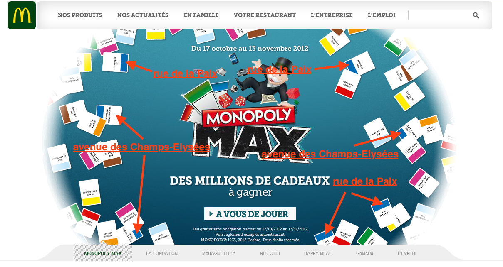

(430)&emsp;The visual representation is a circular arrangement of Monopoly game pieces dispersed around the promotional logo "MONOPOLY." Notably, the distribution and frequency of the game pieces, particularly the "RUE DE LA PAIX" and "AVENUE DES CHAMPS-ÉLYSÉES" stamps, give a distinct impression.

(431)&emsp;There are four "RUE DE LA PAIX" game stamps and three "AVENUE DES CHAMPS-ÉLYSÉES" game stamps, which are seemingly sprinkled amongst various other game pieces. Their almost equal number, coupled with their even distribution, strongly implies a parity in the likelihood of obtaining each stamp. This visual presentation obviously lead consumers to assume that all properties, including the aforementioned rare ones, have an equivalent distribution and are thus equally attainable.

(432)&emsp;In essence, the visual layout of the game pieces, with nearly equal counts and evenly spaced placements for properties, suggests an equal probability for each property, criminally and deliberately misleading consumers regarding the true odds of the game.

(433)&emsp;To ensure that American authorities fully grasp the gravity of the situation, it's pivotal to note that the "RUE DE LA PAIX" property in the French version is analogous to the "BOARDWALK" property in the U.S. game. And it bears repeating that there was no mechanism for French consumers to discern that certain properties were, in fact, scarce. Astoundingly, in the 2011 edition of this criminal campaign, McDonald's France overtly instructed that before laying claim to a prize, consumers were mandated to complete the entire board! Is there any record of such an accomplishment in any of the countries where these questionable practices were deployed? To my knowledge, there isn't.

(434)&emsp;Such misrepresentation is beyond mere oversight; it is willful, calculated deception. The very fact that a game named after the iconic Monopoly, a symbol of fair play in the world of board games, was used to perpetrate this fraud adds insult to injury.

(435)&emsp;In conclusion, if the regulatory authorities in the U.S. and Europe consider such behavior legal, the ramifications would be cataclysmic. Endorsing these fraudulent practices would equate to the outright legalization of fraud. The foundational pillars of our democratic systems—within Europe, the United States, and other affected countries—would shatter. If equality before the law holds any meaning, then McDonald's should be recognized as teetering on the brink of bankruptcy, as they must be held accountable for their egregious actions.

[Return to the Table of Contents ↩︎](#table-of-contents)

<h3 id="mcdonalds-france-2015-collect-to-win-fraud">(IV)(DD) 6th Example of Fraud: the 2015 "Collect-to-Win" Fraud by McDonald's France and Accomplices, Crimes Condoned by McDonald's Corporation</h3>
(436)&emsp;Understanding the full spectrum of McDonald's alleged malfeasance requires a deep dive into specific instances of criminal activity. A pivotal instance in this narrative pertains to the crimes committed by McDonald's France in 2015 and which were condoned by McDonald's Corporation. This year is not just another in a series of accusations; it bears undeniable evidence that directly implicates McDonald's Corporation in the crimes committed by its European subsidiary.

(437)&emsp;The premise of the 2015 fraud by McDonald's France mirrors those from 2010, 2011, and 2012. For the years 2013 and 2014, McDonald's France switched to a different sweepstakes, momentarily displacing the fraudulent Monopoly scheme. However, by 2015, the criminal practices through the fraudulent Monopoly scheme resurfaced.

(438)&emsp;To ensure clarity and underscore the gravity of this section, section which is of the utmost importance, a brief refresher is in order.

(439)&emsp;At the heart of these fraudulent activities is a core misconception: as journalist Walter Hickey aptly noted, "Many people assume that all the spaces are equally likely." But what Mr. Hickey dubs "the secret to McDonald's Monopoly," I interpret as a spectrum of deceit that extends from fraudulent misrepresentation, if not outright fraud, in cases like the 2016 U.S. edition, to outright fraud in the French editions of 2010, 2011, 2012, and 2015.

(440)&emsp;In France, McDonald's didn't just omit essential information, leading consumers to believe all properties held equal odds; they sometimes actively misled them. Take 2011, for instance: McDonald's France advised players to first complete their entire game board before submitting their pieces to claim prizes. In 2012, even after receiving formal notifications highlighting the fraudulent nature of their sweepstakes, they brazenly portrayed seemingly equal quantities of each property on their website's front page. Imagine the uproar if McDonald's U.S. depicted, say, four BOARDWALK stamps alongside three PARK PLACE stamps on their website, without clarifying the actual odds in their official rules. The gravity of such fraudulent misrepresentations cannot be overstated.

(441)&emsp;Before I became aware McDonald's started defrauding French consumers again in 2015, I decided to alert the headquarters of McDonald's Corporation, based in Illinois, directly. I drafted an email, detailing some of my concerns and demands, and sent it to the General Counsel of McDonald's Corporation, Ms Gloria Santona. The email was CCed to other executives including Steve Easterbrook and Kevin Ozan among other people.

(442)&emsp;Subsequently, I managed to reach Ms Santona by phone. If my memory serves me right, during our conversation, she appeared unaware or claimed ignorance of the previous warnings I had sent regarding the issue. This could possibly indicate a severe communication breakdown between the European and global branches of McDonald's. Either the French executives hadn't informed the global headquarters about their criminal marketing tactics, or there was an intentional omission.

(443)&emsp;Shortly after this call and based on my best recollection, I revisited the McDonald's France website. To my dismay, the fraudulent practices seemed to have resumed. In response, I sent a series of emails to McDonald's Corporation's top executives, ensuring they were formally notified.

(444)&emsp;In a correspondence timestamped 2015-10-21 23:47 (China Standard Time +0800) and addressed to me with CEO Steve Easterbrook CCed, Ms Santona responded, stating: "[…] Thanks for your follow-up note. Of course, we take such inquiries seriously. As this is a French matter, I have asked the French team to review the situation and respond to you once they have shared their findings with me. The details are being checked in an expeditious manner and no delay is anticipated. […]" (I emphasize)

(445)&emsp;This email sent by Gloria Santona can visualized at the following URL: https://www.ecthrwatch.org/timeline/mcdonalds-general-counsel-confirms-taking-inquiry-seriously-2015-10-21/MCD--2-2015-10-21-23h47CN_Redacted.pdf

(446)&emsp;This email holds paramount importance. It serves as undeniable evidence that McDonald's Corporation, at its highest echelons, was made aware of the then ongoing criminal activities of its subsidiary companies. The chain of communication had been established. Therefore, any subsequent actions or lack thereof from McDonald's Corporation become a conscious choice, with full knowledge of the criminal misconduct by McDonald's France and related entities. It illuminates the corporation's complicity in these actions, making them equally accountable.

(447)&emsp;Following this exchange, on October 23, 2015, at 05:34 +0800 (China Standard Time), I received another email, this time from Malcolm Hicks. He introduced himself as the "General Counsel for the McDonald's business segment that includes France among other countries." The email can be accessed here: https://www.ecthrwatch.org/timeline/2015-10-23_email_received_from_malcolm_hicks_mcdonalds_corporate_vice_president/MCD-2--2015-10-23-05h34CN_Redacted.pdf

(448)&emsp;Mr. Hicks mentioned his intent to employ an external French attorney to scrutinize this issue, likely in response to my prior communication suggesting that McDonald's Corporation appoint an independent attorney not previously entangled in the crimes committed by McDonald's France.

(449)&emsp;A few points of note:

(450)&emsp;Origins of Contact: The mechanism of how Mr. Hicks acquired my contact remains uncertain. Post-receiving his email, I attempted to connect with Ms Santona, but this time she did not answer. One of her presumed assistants intimated that Malcolm Hicks was now overseeing this matter. My strong presumption is that McDonald's Corporation in Illinois handed over this case to Mr. Hicks. Thus, when Mr. Hicks mentions that he "[has] chosen to intervene in this matter," it warrants the question: was it genuinely his unilateral decision?

(451)&emsp;The Connection with McDonald's France: A pivotal discovery was made in late 2022 or early 2023 when, through an official website, I stumbled upon the fact that Malcolm Hicks was intricately tied to McDonald's France. The official publication can be viewed here: https://www.bodacc.fr/pages/annonces-commerciales-detail/?q.id=id:B201301902227

(452)&emsp;As per the mentioned publication:

(453)&emsp;"Annonce n° 2227 du BODACC B n° 20130190 publié le 02/10/2013

(454)&emsp;[…]

(455)&emsp;N° RCS : 479 506 800 RCS Versailles

(456)&emsp;Dénomination : MCD FRANCE [note: "dénomination" = name]

(457)&emsp;Forme juridique : Société à responsabilité limitée [note: free translation: Legal Form: Limited liability company]

(458)&emsp;Administration : Gérant : PETIT Jean-Pierre Robert modification le 12 Septembre 2007 Gérant : BOURDON Alexis, Germain, Jean, Hugues en fonction le 03 Février 2011 Gérant : GOARE Douglas en fonction le 23 Février 2012 Gérant : HICKS Malcolm Wayne en fonction le 24 Septembre 2013" (I emphasize)

(459)&emsp;This unearths Mr. Hicks's undeniable affiliation with McDonald's France.

(460)&emsp;Given these circumstances, the overarching theme surfaces: the ties between McDonald's France and the McDonald's Corporation were intricate and tightly interwoven. Claims of ignorance or distance from the crimes committed become increasingly questionable in light of these revelations.

(461)&emsp;Even more strikingly, another revelation emerged when I scoured the same official website. Steve Easterbrook, who held the position of CEO at McDonald's Corporation in 2015 and was CCed in Gloria Santona's correspondence to me, was discovered to have been an executive at McDonald's France during the time of the 2011 frauds. The official publication, accessible here https://www.bodacc.fr/pages/annonces-commerciales-detail/?q.id=id:B201102121431 makes it evident:

(462)&emsp;It states:

(463)&emsp;"Annonce n° 1431 du BODACC B n° 20110212 publié le 31/10/2011

(464)&emsp;[…]

(465)&emsp;N° RCS : 479 506 800 RCS Versailles

(466)&emsp;Dénomination : MCD FRANCE [note: "dénomination" = name]

(467)&emsp;Forme juridique : Société à responsabilité limitée [note: free translation: Legal Form: Limited liability company]

(468)&emsp;Administration : Gérant : PETIT Jean-Pierre Robert modification le 12 Septembre 2007 Co-gérant : BOURDON Alexis, Germain, Jean, Hugues en fonction le 03 Février 2011 Co-gérant : EASTERBROOK Stephen James en fonction le 03 Février 2011" (I emphasize)

(469)&emsp;This newly-unearthed detail amplifies the connections and corroborates the fact that McDonald's Corporation, all the way to its highest ranks, was intimately aware of the operations and potential irregularities happening within its French subsidiary. Given Easterbrook's involvement with McDonald's France during the specific period when these frauds were happening, the plausible deniability of the parent corporation being uninformed or detached from its subsidiary's actions becomes totally untenable.

(470)&emsp;Such intertwining of roles and positions underscores that the activities of McDonald's France might not have been isolated incidents but potentially a reflection or consequence of a broader corporate ethos or lack of oversight. The onus and responsibility rest significantly, but not only, on McDonald's Corporation's leadership.

(471)&emsp;Furthermore, it is important to emphasize that Steve Easterbrook, as mentioned above, had firsthand knowledge and direct involvement with both entities. This dual association further implicates him and the broader corporate structure in any allegations related to these crimes.

(472)&emsp;Given the close association and overlaps in executive roles, questions arise about the integrity of the internal investigations promised by McDonald's Corporation. Malcolm Hicks, who was purportedly tasked with independently examining the allegations against McDonald's France, had a conspicuous history with the very entity he was supposedly investigating. One wonders how an investigation into criminal activities could be impartial when the investigator has had prior associations, and perhaps even allegiances, with the entity under scrutiny.

(473)&emsp;It is therefore crucial to scrutinize the depth and breadth of these internal probes. Were they merely perfunctory exercises aimed at giving an appearance of due diligence? Or were they genuine attempts to unearth the truth, hold individuals accountable, and rectify systemic issues? The lack of transparency and tangible outcomes from these investigations tilts the balance in favor of the former assumption.

(474)&emsp;Moreover, the narrative becomes even more compelling when we consider the swiftness with which McDonald's Corporation historically intervened in the operations of its subsidiary companies, even when legalities were not in question. Former McDonald's France CEO Jean-Pierre Petit's recount in his book, "I sold my soul to McDonald's", highlighted the parent company's capability to halt an advertising campaign with just one phone call. Given this precedent, it seems implausible that the corporation, when informed of ongoing criminal activities by one of its most prominent subsidiaries, would take a passive stance and allow such activities to continue unbridled.

(475)&emsp;Indeed, in the memoir "I sold my soul to McDonald's," (in reference to the expression selling one's soul to the devil) penned by Jean-Pierre Petit, the former CEO of McDonald's France, there's an anecdote that vividly highlights the ironclad control McDonald's Corporation wields over its subsidiaries. Mr. Petit recalls a time when McDonald's France had rolled out an advertising campaign that, while entirely within the bounds of the law, was met with disapproval by McDonald's U.S. headquarters. With just a single phone call from the corporate center, the campaign was immediately terminated. This incident poses a stark and unsettling question: If McDonald's Corporation can wield such power to swiftly halt a legitimate campaign purely based on their preferences, how can they possibly argue an inability to intervene and stop an unequivocally criminal operation, especially given the clear implications of money laundering? Mr. Petit's story is not just corporate lore; it's a glaring revelation of the centralized authority and inherent responsibility at the very top of McDonald's Corporation.

(476)&emsp;It is clear that McDonald's Corporation, with its intricate web of shared executives and cross-entity involvements, cannot simply distance itself from the actions of McDonald's France or feign ignorance. Instead, the corporation is deeply implicated in these alleged frauds, either through its direct knowledge, tacit approval, or lack of decisive intervention.

(477)&emsp;The implications of this are far-reaching. Not only does this reflect a glaring ethical lapse on the part of one of the world's most recognizable brands, but it also draws attention to the inherent flaws in multinational corporations' oversight mechanisms. How can these behemoths ensure accountability and ethical conduct when their top executives wear multiple hats and when lines of loyalty, duty, and responsibility are blurred?

(478)&emsp;The onus is on the legal and regulatory bodies to delve deeper into these concerns and hold entities and individuals accountable. Only then can consumers repose faith in global brands and their promises of integrity, transparency, and ethical conduct.

(479)&emsp;Another damning repercussion of McDonald's Corporation's complacency regarding the transgressions in France and in Europe is their direct involvement in money laundering. The depths of this grave criminal endeavor will be meticulously dissected in an upcoming section.

(480)&emsp;McDonald's Corp. v. Simon Marketing, Inc., Case No. 01 C 8121 (N.D. Ill. Sep. 16, 2002), provides a stark revelation about the vigilance McDonald's Corporation can exercise when there's suspicion or evidence of wrongdoing, especially if it concerns the potential of significant financial harm or reputational damage to the company. Given their previous litigation under the Racketeer Influenced and Corrupt Organizations Act (RICO) against individuals associated with Simon Marketing, McDonald's Corporation clearly demonstrated its awareness of the gravity of certain illicit activities and their potential consequences.

(481)&emsp;The 2002 case, as described, outlined charges against individuals for conducting a company's affairs through a pattern of racketeering activity and conspiracy. The fact that McDonald's sought relief under RICO proves, beyond a shadow of a doubt, their awareness of such regulations. Because Gloria Santona served as U.S. General Counsel from December 1999 to June 2001 and corporate General Counsel from June 2001 until March 2017, she could only have understood that McDonald's subsidiary companies in Europe were committing serious frauds and money laundering, and that McDonald's Corporation was engaging, with their accomplices (i.e. their subsidiary companies, among other persons) in a pattern of racketeering activity as defined under 18 U.S. Code § 1961.

(482)&emsp;Therefore, with this historical context in mind, it becomes impossible to believe that the executives of McDonald's Corporation could be oblivious to any criminal actions of their subsidiary companies, especially if they carried the same weight and significance as a RICO violation. The logical deduction here is clear: if the corporate leadership had the inclination and resources to pursue legal action in one instance, how could they, in 2015, turn a blind eye or plead ignorance to the criminal actions of their subsidiary in France? Such incongruence confirms that McDonald's Corporation's compliance policy is nothing more than a superficial paper program without any value and that it is NOT a genuine commitment to ethics, oversight, and corporate governance. McDonald's Corporation operates as nothing short of a criminal syndicate!

(483)&emsp;Why didn't McDonald's Corporation, in 2015, once fully aware that their subsidiary company in Europe was engaging in organized criminal activities targeting, among other people, children, order McDonald's France and its franchisees to immediately stop their then ongoing criminal activities? As unequivocally evidenced by the book written by former CEO of McDonald's France, Jean-Pierre Petit, a simple phone call would have sufficed!

(484)&emsp;McDonald's Corporation's history, including their proactive pursuit in the 2002 RICO lawsuit, makes their 2015 inaction all the more indefensible. How can Steve Easterbrook, Gloria Santona, and Malcolm Hicks justify their deafening silence in the face of such damning evidence? It's not just an oversight; it's criminal negligence and a blatant act of willful blindness.

(485)&emsp;The audacity of the frauds by the subsidiary isn't just alarming; it's an indictment of the corporation's entire operational ethos. This isn't a minor error that can be excused or overlooked. This is a deeply rooted, orchestrated scheme that severely undermines the integrity of McDonald's Corporation as a whole.

(486)&emsp;Given the evidence, McDonald's Corporation and McDonald's France are on the brink of financial collapse. Their evasion and avoidance of direct questions suggest a desperate scramble to cover their tracks and mitigate the fallout.

(487)&emsp;To state it unequivocally: McDonald's Corporation's behavior mirrors not that of a global, reputable brand but of a covert, criminal syndicate. The FBI's involvement isn't just advisable; it's imperative. The time for accountability is now.

(488)&emsp;On October 27, 2015, at 15:59 +0800 (China Standard Time), I received an unequivocal email from McDonald's France attorney Éric Andrieu, a partner at the Péchenard & Associés law firm. Mr. Andrieu curtly dismissed my accusations without offering any substantive explanations. He conveyed that his client — referred to in the French feminine form "ma cliente", possibly indicating the French General Counsel, Ms Françoise de Borda — had mandated him to state that no further discussions on this matter would be entertained, and that henceforth, I should expect no communication from either him or McDonald's.

(489)&emsp;My subsequent investigation revealed a startling connection. Mr. Andrieu, McDonald's France attorney, is the best friend, allegedly dating back to their childhood, of Frédéric Péchenard, the erstwhile General Director of the French National Police. For context, during the period I was myself a victim of these organized crimes orchestrated by McDonald's, Péchenard held the highest office in the French Police, making him the French counterpart to the FBI Director.

(490)&emsp;Further delving into the intricate web of associations, I discovered that the Péchenard & Associés law firm was established by none other than Frédéric Péchenard's parents. This assertion is reinforced by the fact that the letter I received from Éric Andrieu bears the unmistakable name of Chantal PÉCHENARD, Frédéric's mother.

(491)&emsp;Intriguingly, there was a juncture, in 2002, when McDonald's France attracted the scrutiny of the French Ministère de l'Intérieur, owing to suspicions of conducting unlawful lotteries within the country, leading to their indictment. Given this backdrop, it's staggering that McDonald's Corporation, with its stringent compliance policy that categorically prohibits even a hint of potential conflicts of interest, opted to retain a law firm so deeply intertwined with French law enforcement.

(492)&emsp;On August 1, 2016, at 03:12 +0800 (China Standard Time), an email was sent to Steve Easterbrook, Gloria Santona, and Malcolm Hicks highlighting a potentially compromising association. The correspondence indicated concerns about McDonald's choice of legal representation in Mr. Andrieu, especially given his known close relationship with Frédéric Péchenard, the former General Director of the French National Police.

(493)&emsp;Yet, even with this information, McDonald's persisted in retaining the services of this law firm, closely connected to the former director of the French National Police, seemingly overlooking their own compliance policy.

(494)&emsp;Compounding these concerns is the revelation that Frédéric Péchenard shared close ties with François Molins, who was then the preeminent public prosecutor in France. The plot thickens with accounts of various legal proceedings being compromised by forged, doctored, or falsified public/legal/court documents. These manipulations effectively shielded McDonald's France from being held accountable in a French courtroom. It's ambiguous whether these falsifications stemmed from an inherently flawed French judicial system or if external forces were at play to aid McDonald's evasion of justice. However, the body of evidence I've amassed indubitably establishes multiple instances of fraud, both in France and the U.S., but also in other third countries.

(495)&emsp;The relationship between McDonald's and the Péchenard & Associés law firm appears to be clouded with some uncertainty. While it's unclear whether Péchenard & Associés was specifically engaged by Malcolm Hicks for a second opinion regarding McDonald's alleged criminal activities, certain events provide a more defined picture.

(496)&emsp;Soon after detecting renewed fraudulent activities by McDonald's France, I created a website to warn consumers, leading to interactions with several victims. Subsequently, another website focused on white-collar criminal Steve Easterbrook was launched: https://www.Steve-Easterbrook.com. The domain name was registered on 2015-12-23 14:12:52 UTC.

(497)&emsp;Shortly after, on January 04, 2016, I noticed internet connections on some of my websites from the London network of a Big Law law firm: Allen & Overy.

(498)&emsp;Despite McDonald's previous engagement with Péchenard & Associés during that time, their association would shift during the fall of 2016 with Allen & Overy emerging as the new legal representative.

(499)&emsp;I accuse both Péchenard & Associés and Allen & Overy of being complicit with McDonald's Corporation and its associates in aiding and abetting in money laundering activities.

(500)&emsp;I will later delve deeper into the intricacies of asset forfeiture. The justification for pursuing indictments under RICO against both law firms will be discussed, alongside the rationale for pursuing asset forfeiture even when assets have been transferred to attorneys as compensation for legal representation in criminal matters.

(501)&emsp;Was Péchenard & Associés the original law firm representing McDonald's France before I receive the email from Malcolm Hicks who was then based in London? Or was it the law firm mandated by Malcolm Hicks to have a second opinion? Or was the first law firm mandated by Malcolm Hicks to have a second opinion Allen & Overy? Only a criminal investigation can determine the facts. Given the weight and scope of my accusations, it's imperative that every stone be turned, every connection investigated.

(502)&emsp;In a series of events that adds further depth to the ongoing investigation against McDonald's Corporation, a notable interaction transpired on Twitter with Gloria Santona, a significant executive figure within the organization.

(503)&emsp;On November 24, 2016, at 01:15 Beijing time, I was notified by Twitter that Gloria Santona chose to follow one of my accounts. Given the extensive and detailed nature of the accusations I've been directing at McDonald's, this action is far from a casual or incidental gesture. It demonstrates a clear indication that Santona, at the very least, was monitoring the situation.

(504)&emsp;Upon her follow, Twitter's system automatically enabled the Direct Message (DM) feature between us, a potential oversight she may not have anticipated. I promptly initiated a conversation, seeking explanations and highlighting the gravity of McDonald's alleged unlawful activities. Shortly after my series of messages, I found myself blocked, suggesting she might not have intended to open such a direct communication channel or was taken aback by the immediate contact.

(505)&emsp;This incident is not a minor footnote. Instead, it underscores a tacit acknowledgment from high-level executives at McDonald's. Their awareness of the allegations cannot be dismissed, and such digital interactions further solidify the case against the company's oversight, if not outright approval, of the purported frauds.

(506)&emsp;Furthermore, it's crucial to highlight Gloria Santona's subsequent career moves. Instead of retiring after a long tenure at McDonald's, she transitioned, a few months later, to another role leaving McDonald's Corporation. This shift, within the context of our exchanges and her seemingly inadvertent acknowledgment of the allegations, might signify internal company dynamics or her personal attempt to distance herself from the brewing storm at McDonald's.

(507)&emsp;Considering the gravity of these revelations, the DOJ may want to approach Ms Santona for potential cooperation. Her proximity to the crimes committed by McDonald's Corporation and her evident awareness might make her a valuable asset in unravelling the depth and breadth of these accusations.

(508)&emsp;It's of paramount importance that every strand of this narrative is meticulously verified, as the implications of these allegations are profound. The digital trail, combined with the substantive claims, paints a picture that demands rigorous examination by investigative authorities.

[Return to the Table of Contents ↩︎](#table-of-contents)

<h3 id="mcdonalds-france-2016-fraud">(IV)(EE) 7th Example of Fraud: the 2016 Fraud by McDonald's France and Accomplices, Crimes Condoned, Again, by McDonald's Corporation</h3>
(509)&emsp;In 2016, McDonald's France underwent a drastic change in its racketeering strategy. Even though its fraudulent sweepstakes retained the name "Monopoly", it unveiled a novel concept, entirely unrelated to the traditional Monopoly board game. Yet, the criminal activities persisted. Here's a breakdown of one of the frauds (as for the previous years, there were many frauds within a single criminal operation that year) from the 2016 criminal activities which took place from October 19, 2016, to November 13, 2016:

(510)&emsp;One of the frauds within this single illegal sweepstakes revolved around collecting virtual currency, termed as 'M'. The erstwhile property collection mechanism was supplanted by this virtual money accumulation. Participants had to amass a specific sum of 'M' to claim prizes.

(511)&emsp;With the purchase of a Maxi Best Of meal or a drink or a McFlurry (an ice cream), consumers would receive game stamps, one and only one of which would systematically indicate an amount ranging from 10 'M' to 500 'M'. McDonald's enticed people to accumulate these game stamps to claim gifts. For example, if a consumer managed to collect 4000 'M', he would win an XBOX. With 3500 'M', he would win a computer, etc.

(512)&emsp;As you'll discern from the table below, McDonald's planned to distribute a total of 35,149,999 'M' game stamps, cumulating to an overall amount of 3,491,499,999 'M'.

(513)&emsp;Based on my calculations, they circulated an equivalent of 3,491,499,990 'M' as evidenced by the table below (source: official rules of the 2016 edition "Monopoly" sweepstakes in France):

(514)&emsp;

<table>
<thead>
<tr style="background-color:#fd7e14;color:white;">
<th>Color of the 'M' game stamp</th>
<th>Quantity of 'M' game stamps per color</th>
<th>Value of each 'M' game stamp</th>
<th>Total 'M' value per color</th>
</tr>
</thead>
<tbody>
<tr><td>Blue</td><td style="text-align:right;">7,149,999</td><td style="text-align:right;">10</td><td style="text-align:right;">71,499,990</td></tr>
<tr><td>Green</td><td style="text-align:right;">6,000,000</td><td style="text-align:right;">20</td><td style="text-align:right;">120,000,000</td></tr>
<tr><td>Purple</td><td style="text-align:right;">10,000,000</td><td style="text-align:right;">50</td><td style="text-align:right;">500,000,000</td></tr>
<tr><td>Yellow</td><td style="text-align:right;">8,000,000</td><td style="text-align:right;">100</td><td style="text-align:right;">800,000,000</td></tr>
<tr><td>Orange</td><td style="text-align:right;">4,000,000</td><td style="text-align:right;">500</td><td style="text-align:right;">2,000,000,000</td></tr>
<tr style="font-weight:bold;"><td>Total number of 'M' game stamps:</td><td style="text-align:right;">35,149,999</td><td></td><td style="text-align:right;">Total value: 3,491,499,990</td></tr>
</tbody>
</table>

(515)&emsp;This translates to approximately 99 'M' for every purchase that would yield an 'M' game stamp. Indeed: 3,491,499,990 / 35,149,999 ≈ 99.33. To simplify the demonstration, let's round it down to 99.

(516)&emsp;However, upon calculating the total value in 'M' bills of the prizes on offer, one can startlingly ascertain that the total only amounts to 59,190,000 'M' (as seen in the table below).

(517)&emsp;

<table>
<thead>
<tr style="background-color:#fd7e14;color:white;">
<th>List of prizes</th>
<th>Quantity of prizes</th>
<th>Number of 'M' required per prize</th>
<th>Quantity × 'M' required</th>
</tr>
</thead>
<tbody>
<tr><td>An XBOX</td><td style="text-align:right;">200</td><td style="text-align:right;">4,000</td><td style="text-align:right;">800,000</td></tr>
<tr><td>A computer</td><td style="text-align:right;">300</td><td style="text-align:right;">3,500</td><td style="text-align:right;">1,050,000</td></tr>
<tr><td>A Bose headphone</td><td style="text-align:right;">500</td><td style="text-align:right;">3,000</td><td style="text-align:right;">1,500,000</td></tr>
<tr><td>A Bose speaker</td><td style="text-align:right;">700</td><td style="text-align:right;">2,000</td><td style="text-align:right;">1,400,000</td></tr>
<tr><td>A camera</td><td style="text-align:right;">1,000</td><td style="text-align:right;">1,000</td><td style="text-align:right;">1,000,000</td></tr>
<tr><td>A video game</td><td style="text-align:right;">4,300</td><td style="text-align:right;">800</td><td style="text-align:right;">3,440,000</td></tr>
<tr><td>1 movie to download</td><td style="text-align:right;">100,000</td><td style="text-align:right;">500</td><td style="text-align:right;">50,000,000</td></tr>
<tr style="font-weight:bold;"><td>Total 'M' value of all prizes:</td><td></td><td></td><td style="text-align:right;">59,190,000</td></tr>
</tbody>
</table>

(518)&emsp;Since the total value of all 'M' game stamps put on the market was 3,491,499,990 'M' but the total 'M' value of all prizes available was only 59,190,000, this means that there was approximately 59 times less prizes than what should have been up for grabs!

(519)&emsp;3,491,499,990 / 59,190,000 ≈ 59 (approximately)

(520)&emsp;There is a glaring discrepancy in this sweepstakes that warrants attention. The stark contrast between the total value of all 'M' game stamps in circulation, amounting to 3,491,499,990 'M', and the relatively paltry sum of prizes available, which is only 59,190,000 'M', raises serious concerns.

(521)&emsp;Further analysis reveals an even more alarming picture when we consider the actual value of prizes that were of interest to the consumers. Most participants were not primarily attracted to the promotional game for the 1 movie download, which accounted for a significant 50,000,000 'M' of the total prize value. If we exclude this amount from the total prize pool, the value drops dramatically to only 9,190,000 'M' for the more desirable prizes.

(522)&emsp;By subtracting 50,000,000 from 59,190,000, we arrive at a sum of 9,190,000. This means that the ratio is not just 59 times less than what should have been offered, but instead, it's a staggering 380 times less than what you should have had available for the game.

(523)&emsp;Such a considerable disparity not only misleads consumers, but it also undermines the integrity of this sweepstakes which by the way wasn't free contrarily to what McDonald's fraudulently claim and how I will demonstrate later.

(524)&emsp;Participants might have been led to believe that they had a genuine chance of accumulating enough 'M' game stamps to secure the more sought-after prizes, whereas in reality, the odds were heavily skewed against them.

(525)&emsp;Is it illegal? Indeed it is! It is even criminal! As highlighted in the previous section titled "Understanding Some Key Legal Concepts in France and Europe," the "While Supplies Last" notion doesn't hold water in either France or Europe. This concept not only lacks legitimacy, but it also potentially places businesses in direct contravention of the European directive 2005/29/EC, which pertains to unfair business-to-consumer commercial practices. It's crucial to understand that individual states within the European Union have the authority to fortify the transpositions of European directives. In France, the transposition of this particular directive has been executed stringently, to the extent of criminalizing such deceptive practices. Offenders found in violation face the possibility of incarceration. I will delve deeper into this shortly.

(526)&emsp;Now, let's revisit the events of 2016: Soon after the promotional event was initiated, a rather predictable occurrence unfolded - all the prizes disappeared from availability. Given the calculations and projections I've laid out earlier, this should have been an expected outcome for McDonald's France and their accomplices. Unless, as the evidence demonstrate beyond a reasonable doubt and sometimes even beyond a shadow of a doubt, their intent was to continue in their trajectory that is clearly characterized by criminal activities.

(527)&emsp;To elucidate further, the typical purchase would yield around 99 'M'. Hence, on average, a consumer who acquired 41 medium drinks priced at 2 euros each, resulting in an expenditure of 82 euros, would accumulate slightly over 4000 'M'. Such a cache of 'M's could be exchanged for an Xbox, which, I believe, was priced around 300 euros at that time. This disparity should have raised alarms for McDonald's France, signaling that the prize reservoir would deplete rapidly. And that is precisely what happened.

(528)&emsp;Evidence supporting this claim can be found in the two following screenshots. The visuals from October 23, 2016, confirm that every single prize, with the exception of the movie download that hardly piqued anyone's interest, had been claimed.

(529)&emsp;It's essential to note that, while the displayed figures pertain to October 23, 2016, I did not have the opportunity to observe the prize count on the preceding days. However, numerous online testimonials indicate that the majority of these prizes were depleted as early as the first or second day of the promotion, which commenced on October 19, 2016. A comprehensive criminal investigation should promptly establish the exact date of when the prizes ran out.

{/*  Original filename: Screenshot 2023-10-18 at 23.52.16-26.png  */}
(530)&emsp;

{/*  Original filename: Screenshot 2023-10-18 at 23.53.01-28.png  */}
(531)&emsp;

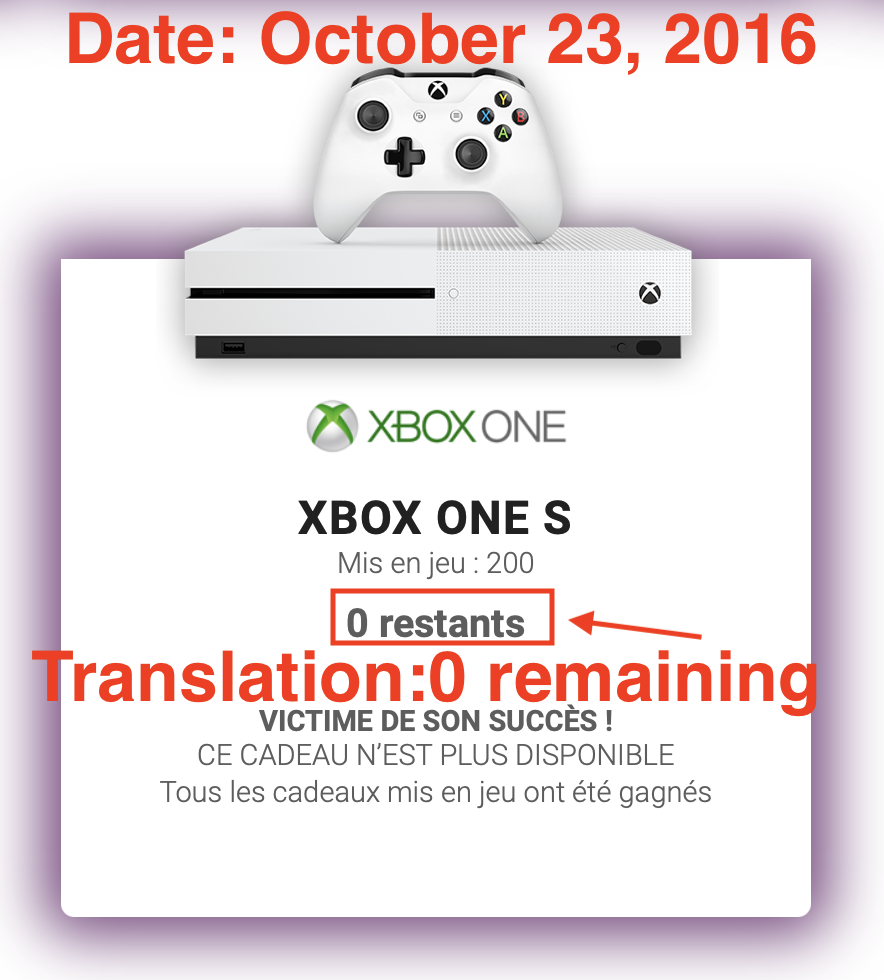

(532)&emsp;Not only did McDonald's France brazenly breach the European Directive 2005/29/EC, thereby committing a criminal act on French soil, but they and their associates went on to perpetrate an even more egregious crime. With full knowledge that all substantive prizes were depleted, save for the negligible movie download that drew scant attention, these entities maliciously continued to mislead the public. Via pervasive promotional displays, they audaciously and falsely asserted that consumers could still amass 'M' stamps to stand a chance to win coveted items such as the XBOX, computer, Bose headset, Bose speaker, or the video game. This was a blatant, unadulterated deception! Refer to the following screenshot for undeniable proof of their duplicitous activities.

{/*  Original filename: Screen Shot 2016-10-27 at 15.01.12 copy_IMPORTANT_USED IN CRIME REPORTED-30.png  */}
(533)&emsp;

(534)&emsp;While I won't provide the complete text of Article 313-1 of the French criminal code (formerly known as Article 405), which offers an in-depth definition of fraud that encompasses a wide range of deceptive tactics and ruses to clarify what constitutes fraud, it's beneficial to refer to several jurisprudences from French courts to further illustrate the scope of this law:

(535)&emsp;"Simple lies, even when documented in writing, are insufficient to constitute punishable maneuvers in matters of fraud; however, it is different when these lies are repeated and widely broadcasted via press advertisements." (District Court of Laval, November 22, 1940) (I emphasize)

(536)&emsp;"Intensively resorting to deceptive advertising to lend credibility and support to false allegations itself constitutes a set of fraudulent maneuvers within the meaning of Article 405 of the criminal code. [Note: Article 405 in the former criminal code is now Article 313-1 of the criminal code]" (District Court of Paris, November 17, 1983) (I emphasize)

(537)&emsp;"Advertising that can mislead the public in general, regardless of any harm, and fraud to the detriment of a specific person are two materially distinct offenses and can thus be prosecuted under two distinct counts." (Criminal Chamber of the French Court of Cassation, May 10, 1978) (I emphasize)

(538)&emsp;So, while it's evident that the promotional campaigns undertaken by McDonald's rank among the most intensive worldwide in terms of advertising scope, quantity, and intensity, the stark violation of both the European Directive 2005/29/EC and article 313-1 of the French criminal code cannot be overlooked.

(539)&emsp;The choice of purchasing the cheapest menu items to get the 'M' game stamps, which in theory could have been exchanged for prizes that were far more valuable, seemed smart and a rational thing to do.

(540)&emsp;Back then, I published on a Facebook which I had created for the purpose of trying to bring public attention of the crimes committed by McDonalds a post starting this way: "McDonald's Monopoly is a fraud. Our page was created with the aim of trying to warn and protect consumers. […]"

(541)&emsp;However, a damning revelation has come to light regarding the actual events of 2016 through an online testimony provided by an employee working at a McDonald's France restaurant during the time these crimes took place. Her name is Orane El'Khass. The testimony of this employee, unknowingly acting as a whistleblower, is especially pertinent as she shed light on the actual proceedings behind the scenes of the crimes which have been committed.

(542)&emsp;This employee's revelations further expose the depth of the frauds, providing additional evidence of the aggravating circumstances surrounding the crimes committed by McDonald's Corporation, McDonald's France, and countless accomplices as you will soon understand.

(543)&emsp;Orane El'Khass, who was a McDonald's employee at the time, publicly commented in reply to my post on Facebook: "All of the prizes were claimed in 2-3 days by McDonald's employees 😉." (Free translation) (I emphasize)

(544)&emsp;When I probed further, inquiring, "How did they manage that? Did they gather the game stamps discarded by customers in the trash?" she responded:

(545)&emsp;"Either on the stacks of beverage cups thrown away or consumed by my colleagues. Or just in the evening when we close, employees would collect multiple cups, even entire stacks, just to peel off the stickers and to accumulate, say, a maximum number of 500 points game stamps. Or they got them from the trash bins 😁." (Free translation)

(546)&emsp;Another user, Emilien Vares, pointed out that "McDonald's employees are not supposed to participate in the sweepstakes." I emphasized that while this is true in theory, McDonald's no matter what committed a serious fraud by continuing to falsely advertise the availability of these prizes.

(547)&emsp;Ms El'Khass further elaborated, "I work there, so I'm aware it's forbidden. But nearly 98% of the prizes were won by employees. They just had to register under a different name to claim the prize. And yes, I find this scandalous. I don't hide this from customers. They continue purchasing for the game stamps, so I openly tell them that it's useless and a fraud somehow." (Free translation) (I emphasize)

(548)&emsp;Though some of my comments on Facebook might have been illegally removed or deleted without my consent, I will get back to this topic later on in this crime report to explain how it's possible and the kind of censorship I faced from Big Tech companies in respect to my accusations targeting McDonald's and their accomplices, I still have the screenshots of Ms El'Khass' pivotal testimony. While it seems I might not have access to my own comments any longer, if my memory serves correctly, I might have insinuated, at some point, that her statement was speculative.

(549)&emsp;However, based on a screenshot and an email from Facebook, emails which were sent automatically for every reply I would receive and which contain the exact transcript of what she wrote, Ms El'Khass added:

(550)&emsp;"These aren't official numbers. Speculation, as you say. But excuse me. Unless one buys 20 drinks in a day and gets only 500-point stickers, how did more than half of the computers get claimed in just one day? It's simple logic. At the McDonald's where I work, that's what most of my colleagues did in the evening after closing... So the '98%' is an exaggeration for illustrative purposes." (Free translation)

(551)&emsp;As I elucidated while discussing the 2015 frauds in France, McDonald's Corporation, through its "previous litigation under the Racketeer Influenced and Corrupt Organizations Act (RICO) against individuals associated with Simon Marketing, McDonald's Corporation clearly demonstrated its awareness of the gravity of certain illicit activities and their potential consequences."

(552)&emsp;Furthermore, I delineated that "the fact that McDonald's sought relief under RICO proves, beyond a shadow of a doubt, their awareness of such regulations."

(553)&emsp;Given this precedent, one would logically expect McDonald's Corporation to have similarly sought relief under RICO against their subsidiary companies, franchisees, and respective employees. Unless, of course, they tacitly approved of these racketeering actions, which, I assert, is unequivocally evident.

(554)&emsp;Now, I'd like to present further evidence that sheds light on the aggravating circumstances of the committed crimes.

(555)&emsp;**Aggravating circumstance number 1 for the 2016 frauds in France:**

(556)&emsp;Before the blatant frauds of 2016 transpired, McDonald's Corporation was undeniably informed that their subsidiary, McDonald's France, alongside their collaborators, was deeply entrenched in persistent racketeering activities across Europe.

(557)&emsp;While I might not have previously employed the term "pattern of racketeering activity," it's inconceivable that McDonald's Corporation's General Counsel, Gloria Santona, would be oblivious to the RICO Act's stipulations.

(558)&emsp;Determining whether McDonald's France alerted Gloria Santona in 2012 requires a criminal investigation. Yet, it's an undeniable fact that in 2015, Santona, grasping the severity of the matter, acknowledged it in an email, with then-CEO Steve Easterbrook CCed.

(559)&emsp;Given these undeniable facts, any attempt by them to claim a defense of criminal negligence would be entirely baseless and disingenuous.

(560)&emsp;**Aggravating circumstance number 2 for the 2016 frauds in France:**

(561)&emsp;Upon recognizing the recurrence of McDonald's fraudulent activities in France, I took the initiative to comment on their Facebook page, aiming to alert consumers of the ongoing frauds.

(562)&emsp;Shockingly, McDonald's chose to silence me by blocking my account, thereby preventing me from raising awareness and warning potential victims of their maliciously criminal schemes.

(563)&emsp;Their attempt to muzzle a key witness, analyst, whistleblower, actively seeking to alert their victims is deeply unsettling. It's imperative to note that among these victims were innocent children.

(564)&emsp;**Aggravating circumstance number 3 for the 2016 frauds in France:**

(565)&emsp;Upon discovering that McDonald's was once again involved in fraud in France, I took to their Facebook page to inform consumers of the criminal nature of their Monopoly game. However, McDonald's swiftly silenced my attempts, leaving both victims and potential victims in the dark about the scam.

(566)&emsp;Subsequently, on October 24, 2016, at 17:03 (China Standard Time), I dispatched a detailed formal notice to the upper echelons of McDonald's Corporation, McDonald's Europe, and McDonald's France. This notice was also extended to the corrupted French Ministerial Officer, Henri-Antoine Le Honsec. Furthermore, this correspondence was CC'd to both McDonald's lawyer, Éric Andrieu—who, notably, shares an extremely close bond with the ex-General Director of the French National Police, Frédéric Péchenard—and my attorney, Ms Blumberg.

(567)&emsp;The initial section of my notice highlights an article authored by McDonald's attorney, showcasing his profound understanding of relevant consumer laws. Given this knowledge, it's unreasonable to assume he was unaware of McDonald's engagement in criminal activities. Subsequently, I referenced several pertinent legal cases related to McDonald's fraudulent actions.

(568)&emsp;The Marketing Store, one of McDonald's marketing agencies and a de facto partner in crime of McDonald's Corporation and its subsidiary companies in this criminal RICO case, candidly refers to consumers as "our targets" on its website. This audacity is underscored by the fact that their fraudulent sweepstakes was open to young adolescents, as tender as 13.

(569)&emsp;I presented detailed tables, previously shared in this crime report, to highlight the stark discrepancy between the touted 'M' game stamps and the actual prizes. I also underscored the censorship I faced on their Facebook platform despite my noble intent to caution the public about their fraudulent sweepstakes.

(570)&emsp;Detailing the timeline, I emphasized that by October 23, 2016—a day prior to dispatching my formal notice—all prized items that truly piqued consumer interest had vanished. Despite this, McDonald's persisted in fraudulently proclaiming the availability of these prizes on their website and on social media. I would later learn that a massive advertising campaign had also taken place not only on the internet but also using billboards.

(571)&emsp;In no uncertain terms, I urged them to shut down all French outlets until all misleading billboards and advertisements were eradicated. I starkly highlighted that with every passing day, countless consumers—adults and children alike—fell victim to their frauds.

(572)&emsp;In concluding, I pinpointed the absurdity that, even if a consumer were fortunate enough to secure two 'M' game stamps valued at 500 'M' each, they'd merely amass 1000 'M'. Thus, four out of the six most sought-after prizes were fundamentally unattainable. Consequently, besides the blatant frauds, McDonald's was also perpetrating what can only be described as a deliberate deception on a massive scale.

(573)&emsp;To drive my point home, I culminated my notice by referencing two jurisprudences that I believe were relevant to the frauds being committed.

(574)&emsp;Clarification not mentioned in my initial report back then: further aggravating the situation, McDonald's France and their accomplices had priced the movie download at 500 'M', making it the only attainable prize with a single game stamp, while every other prize required multiple stamps. This deliberate design choice further entrenched the deceptive nature of their scheme.

(575)&emsp;**Aggravating circumstance number 4 for the 2016 frauds in France:**

(576)&emsp;In 2015, I was unexpectedly confronted with McDonald's continuation of their fraudulent Monopoly campaign in France. Responding swiftly, I engaged directly with the highest echelons of the corporation via email. Remarkably, during this period, I even had a telephonic exchange with the then General Counsel, Gloria Santona.

(577)&emsp;In 2016, having received legal confirmation of McDonald's criminal actions, I felt a heightened responsibility to intervene. After being unjustly blocked from their Facebook platform, I established an informational website to enlighten consumers and ran a Google AdWords campaign to maximize reach.

(578)&emsp;Initially, the Google AdWords campaign yielded promising results. [DRAFT NOTE: insert the screenshot showing the growth of the traffic]

{/*  Original filename: Screen Shot 2016-10-25 at 20.14.21_IMPORTANT_GOOGLE_ANALYSTICS_EXPONENTIAL_GROWTH_TRAFFIC_COPY_REDACTED-32.png  */}
(579)&emsp;

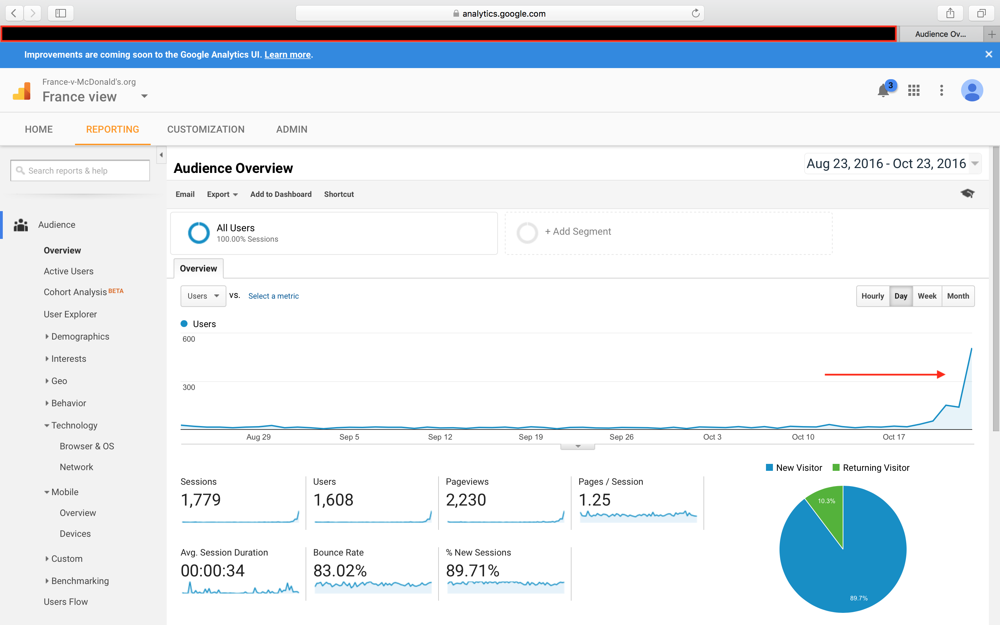

(580)&emsp;The screenshot from back then indicates that the campaign was showing promising exponential growth.

(581)&emsp;However, a turn of events occurred a few days into the campaign. I received an unexpected notification from Google, stating that despite its initial approval, my advertisements were now disapproved, bringing the campaign to an abrupt halt.

{/*  Original filename: Screen Shot 2016-10-28 at 16.52.17_IMPORTANT_GOOGLE_CENSORSHIP_6_ADS_DISAPPROVED_copy_REDACTED-36.png  */}
(582)&emsp;

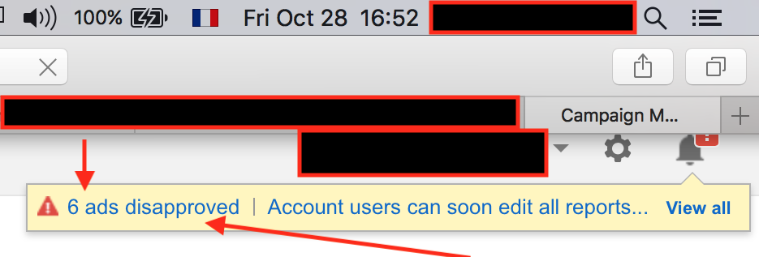

(583)&emsp;After reaching out to Google for clarification, I learned from a representative that McDonald's had lodged a complaint against my advertising campaign, leading to its suspension.

(584)&emsp;The implications of McDonald's actions are profound and deeply concerning. By not only perpetrating the fraud but also actively working to silence those who sought to expose it, McDonald's violated the rights of victims—rights to freedom of assembly and association as outlined in Article 11 of the European Convention on Human Rights.

{/*  Original filename: Screenshot 2023-10-24 at 13.42.00_google_analytics_2016_traffic_collapse_REFRAMED-66.png  */}
(585)&emsp;You can see in the following screenshot how the traffic to my website dramatically dropped following this censorship:

(586)&emsp;

(587)&emsp;On October 26, the website had 1,311 users. However, following collaboration between Google and the criminal entity McDonald's Corporation and/or their accomplices, traffic plummeted dramatically.

(588)&emsp;Google was not the sole Big Tech platform where I experienced censorship and harassment. I also faced similar treatment on Twitter and Facebook. Such collaborative efforts between major corporations to silence whistleblowers and protect criminal enterprises warrant serious investigation.

(589)&emsp;The European Court of Human Rights has emphasized the obligation of States to protect the rights enshrined in the Convention, including the right to freedom of expression and the right to receive information. McDonald's actions, in concert with Big Tech companies, appear to have violated these fundamental rights.

(590)&emsp;Furthermore, I suspect this could be an infringement of specific French criminal laws regarding obstruction of justice and witness tampering.

(591)&emsp;**Aggravating circumstance number 5 for the 2016 frauds in France:**

(592)&emsp;On October 28, 2016, I sent another formal notice, this time focusing on the censorship I had experienced and the ongoing criminal activities.

(593)&emsp;In my notice, I expressed the following (translated for clarity): I detailed the censorship tactics employed against me and reiterated the gravity of McDonald's ongoing fraudulent activities.

(594)&emsp;What was McDonald's response? An ominous silence. Not only did they remain mute, but they also persisted in their fraudulent activities, continuing to mislead consumers.

(595)&emsp;It's pertinent at this juncture to debunk a pervasive falsehood that McDonald's and their legal representatives might propagate: the claim that the sweepstakes was "free." This is categorically untrue, as I will demonstrate.

(596)&emsp;**Aggravating circumstance number 6 for the 2016 frauds in France:** Jean-Noël Penichon

(597)&emsp;

{/*  Original filename: Screen Shot 2016-10-29 at 17.26.16_IMPORTANT_recommendation_penichon_josset_linkedin copy_REFRAMED-48.png  */}
(598)&emsp;Let's begin by examining aggravating circumstance number 6 for the 2016 frauds in France. This pertains to Jean-Noël Penichon, a high-ranking executive at McDonald's France. To substantiate the connection between Mr. Penichon, Mélodie Josset, and Arnaud Le Faucheur, refer to the accompanying screenshot capturing a public online exchange on LinkedIn profile. It is noteworthy that Mr. Penichon had maintained longstanding acquaintanceships with Mélodie Josset and Arnaud Le Faucheur.

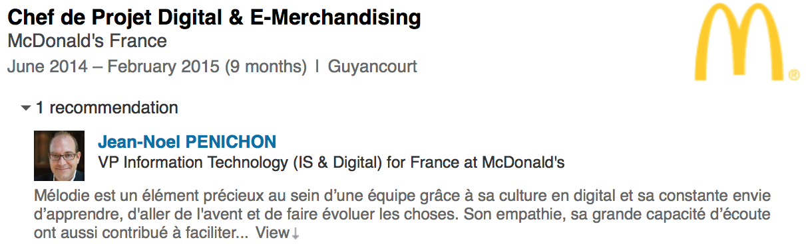

{/*  Original filename: Screen Shot 2016-10-31 at 14.24.49_IMPORTANT_PENICHON_LINKEDIN_IN_2016 copy_REDACTED-40.png  */}
(599)&emsp;Presented here is a screenshot from Mr. Penichon's LinkedIn profile, captured on October 31, 2016, at 14:24:49 (China Standard Time):

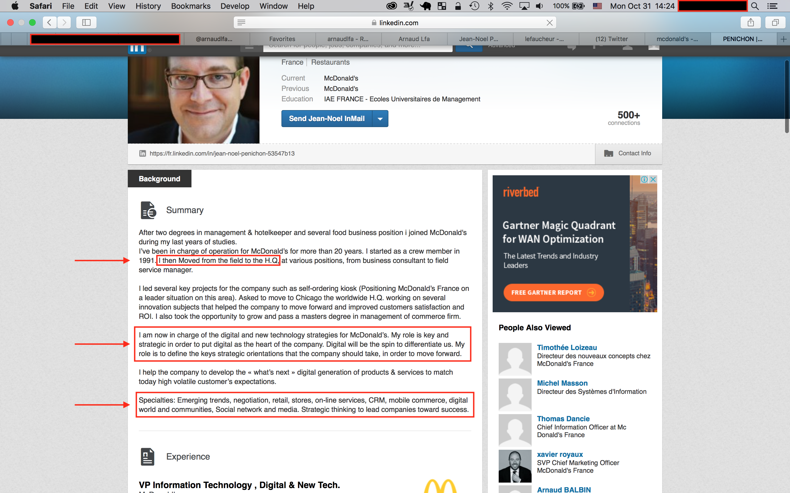

(600)&emsp;

(601)&emsp;In his self-description, Jean-Noël Penichon mentions a few notable points. He describes his role as "key and strategic" and highlights his expertise in the "digital world and communities, Social network and media."

(602)&emsp;Owing to significant censorship efforts against me, multiple social media accounts of mine were suspended or deleted. As a result, I've lost access to some crucial data, which are paramount for detailing the infractions committed against me and countless other consumers. Still, I'll endeavor to present as comprehensive a case as possible, based on available screenshots and retained data from that period.

(603)&emsp;To the best of my recollection, Jean-Noël Penichon, Mélodie Josset, and Arnaud Le Faucheur targeted me with verbal abuses and online defamation. On one occasion, Mr. Penichon questioned the veracity of my claims, rhetorically asking, "Because it's not true?". When I countered, asserting the falsehood of his statement, he responded dismissively, indicating he didn't wish to waste his time ("je n'ai pas de temps à perdre […]") (Tweet UID 793095857910538241). A screenshot of this interaction is provided below:

{/*  Original filename: Screenshot 2023-10-21 at 22.11.44-38.png  */}
(604)&emsp;

(605)&emsp;From the screenshot provided, my prior tweets are no longer visible due to the unjust suspension of my Twitter account (@McDoEscroc, account UID 766464750020653056). This suspension, a direct result of my efforts to spotlight what I've since identified as violations under 18 U.S. Code § 1961, among other statutes, underscores the lengths to which these entities will go to suppress the truth.

(606)&emsp;In an attempt to engage more directly, I reached out to Mr. Penichon via Twitter Direct Message, offering to clarify certain legal nuances. His response was a curt disinterest ("[…] je ne suis pas intéressé. […]"). Refer to the attached screenshot for evidence:

{/*  Original filename: Screen Shot 2016-11-02 at 15.49.39_IMPORTANT_PENICHON_NOT_INTERESTING_IN_KNOWING_MORE_REFRAMED-44.png  */}
(607)&emsp;

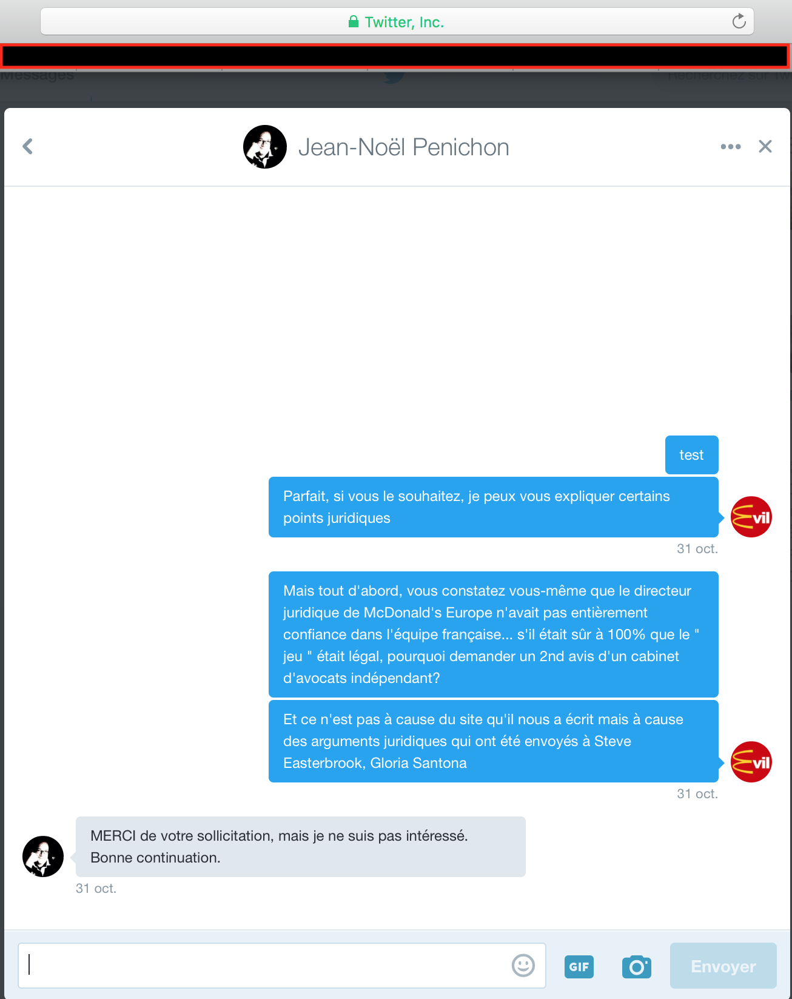

(608)&emsp;How is it conceivable that McDonald's executive Jean-Noël Penichon, who touts his "role [as] key and strategic" with expertise in "digital world and communities, Social network and media," could be indifferent to the alleged ongoing misconduct by the corporation he serves? This willful ignorance or deliberate avoidance is damning and should be of significant interest to the U.S. Attorney overseeing this criminal RICO case to persuade a jury of Mr. Penichon's involvement in the racketeering scheme.

{/*  Original filename: penichon_prefer_apologize_than_ask_permission-46.jpg AND Screenshot 2023-10-22 at 15.08.47-42.png  */}
(609)&emsp;From the montage below, assembled from two distinct screenshots of Mr. Penichon's Twitter biography—one captured on 2016-10-31 at 14:27:14 and the other on 2023-10-22 at 15:55:55—it's evident that Mr. Penichon candidly professes: "I prefer to apologize than ask permission." Refer to the attached screenshot for evidence:

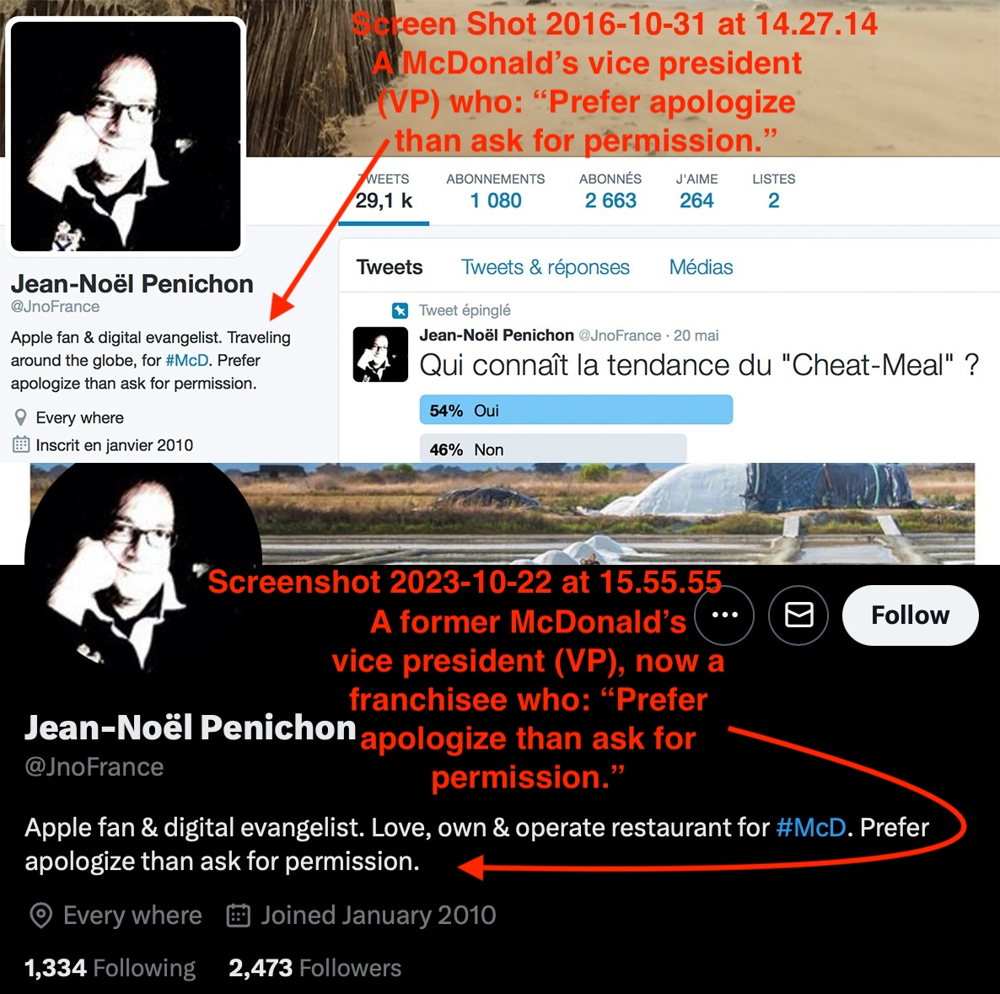

(610)&emsp;

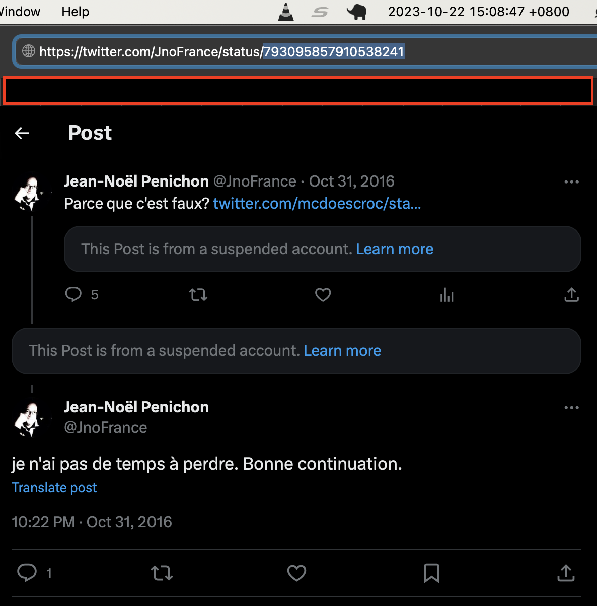

(611)&emsp;Given Mr. Penichon's proclaimed philosophy of "[preferring] to apologize than ask permission," one must question whether this cavalier attitude extends to his professional conduct at McDonald's, particularly concerning the fraudulent activities under discussion.

(612)&emsp;**Aggravating circumstance number 7 for the 2016 frauds in France:**

(613)&emsp;Consistently, I alerted key figures within the McDonald's Corporation about the ongoing criminal activities. My communications were detailed, providing ample evidence and legal references.

(614)&emsp;In an email dated November 9, 2016, at 11:28 (China Standard Time), I outlined the extensive evidence of fraud and demanded immediate action. The email was addressed to multiple executives and legal representatives.

(615)&emsp;How did they respond to my pressing concerns? Silence. Absolute silence, as if the matter were inconsequential. This deliberate non-responsiveness further implicates them in the ongoing criminal enterprise.

(616)&emsp;**Aggravating circumstance number 8 for the 2016 frauds in France:**

(617)&emsp;I've touched upon the censorship, harassment, and cyberbullying I faced at the hands of individuals connected to McDonald's. Now, let's delve deeper into the roles of Mélodie Josset and Arnaud Le Faucheur.

{/*  Original filename: Screenshot 2023-10-22 at 21.10.16_IMPORTANT_JOSSET_CONFIRMS_SHE_IS_UNQUALIFIED_TO_JUDGE-50.png  */}
(618)&emsp;

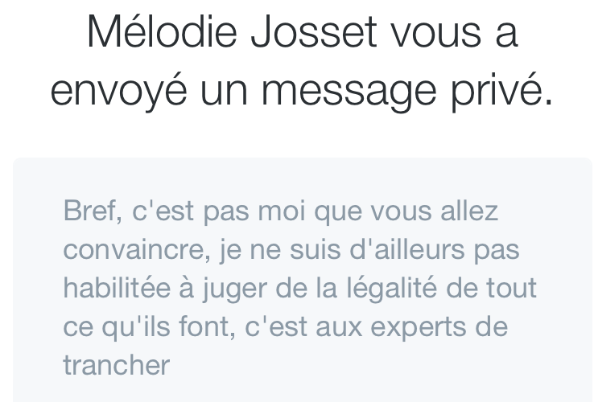

(619)&emsp;Mélodie Josset, through direct messages, also acknowledged her lack of qualification to assess the legal merits of my claims. Yet, despite this admission, she continued to engage in defamatory conduct against me.

(620)&emsp;

(621)&emsp;While encountering a derogatory and defamatory post from Arnaud Le Faucheur, I noticed that Mélodie Josset had "liked" his comment, thereby endorsing his defamatory statements.

(622)&emsp;However, what truly astonished me was a subsequent comment by Mélodie Josset. She publicly stated that she had reported my account to the relevant authorities or platform administrators.

(623)&emsp;

(624)&emsp;It's perplexing to me. Having openly confessed her inability to render a judgment on the matter, why would Ms. Josset take it upon herself to report my account? This action appears to be a coordinated effort to silence me.

{/*  Original filename: Screen Shot 2016-10-31 at 14.15.54_IMPORTANT_JOSSET_JAI_SIGNALE_SON_COMPTE copy_REFRAMED_REDACTED-52.png  */}
(625)&emsp;Upon discovering her public declaration about reporting my account, I approached Ms Josset via direct message, presenting a screenshot of her Facebook comment, and inquired about whom she had reported me to.

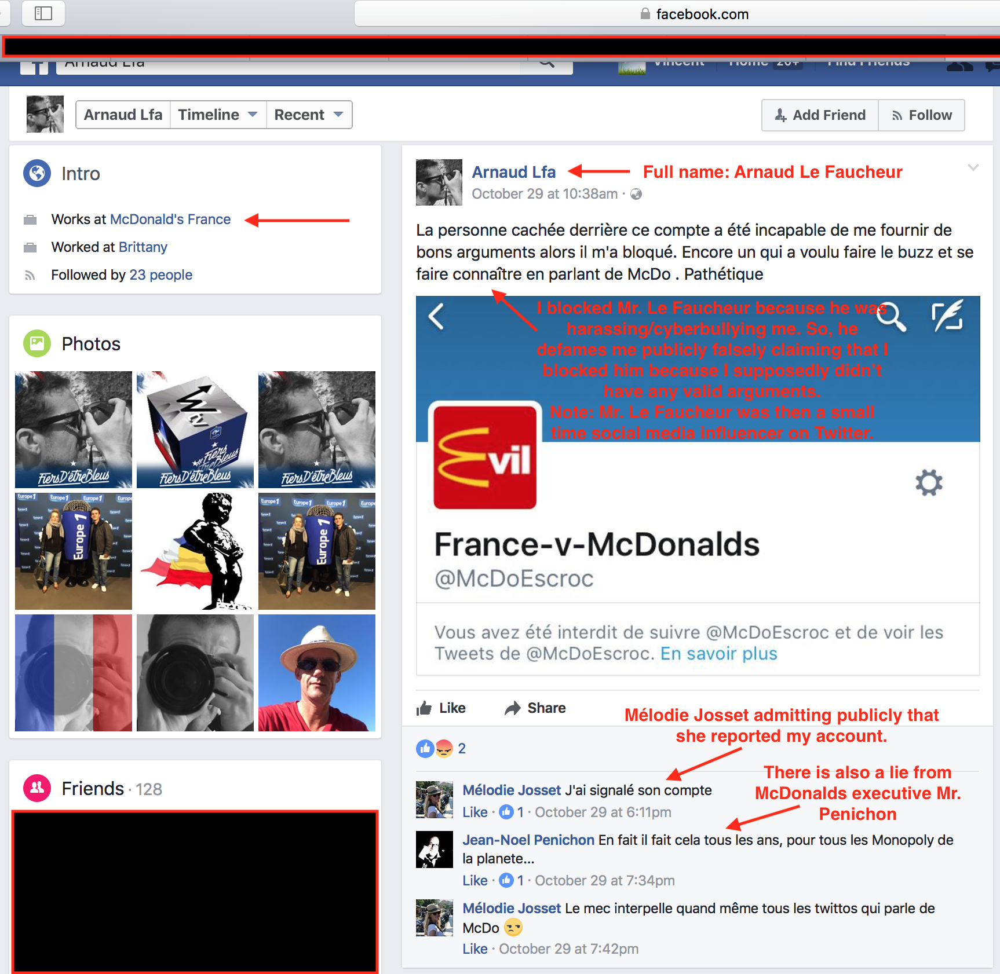

{/*  Original filename: Screen Shot 2016-11-02 at 00.10.14_IMPORTANT_I_ASK_MELODIE_JOSSET_WHO_SHE_REPORTED_ME_TO_REFRAMED_REDACTED-56.png  */}
(626)&emsp;

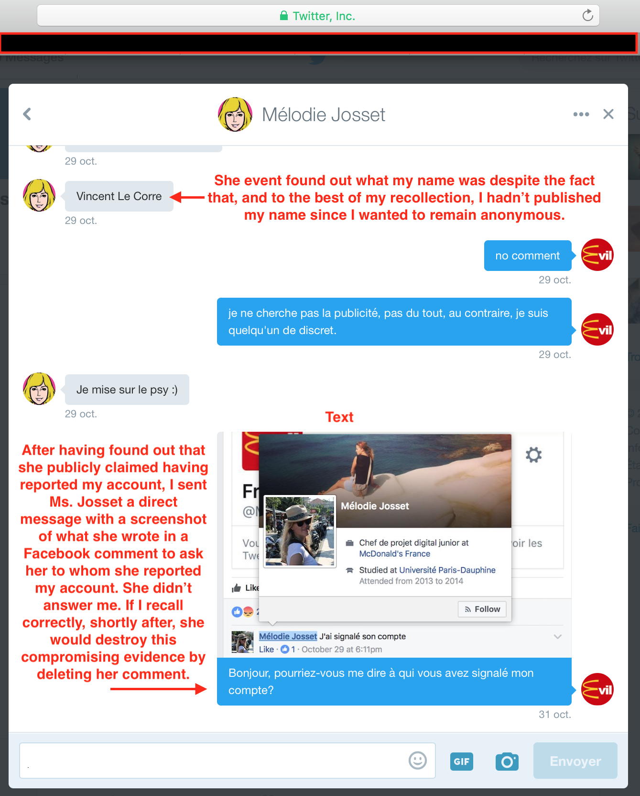

(627)&emsp;She remained silent in response. If my memory serves me right, in what appears to be a deliberate act of evidence destruction, she subsequently deleted her Facebook account.

(628)&emsp;Destroying evidence, especially when one is aware or suspects their involvement in criminal activities, is a serious offense. This act further implicates Ms. Josset in the broader conspiracy to obstruct justice.

(629)&emsp;**Aggravating circumstance number 9 for the 2016 frauds in France:**

(630)&emsp;Arnaud Le Faucheur was relentless in his antagonism. In spite of my cordial attempts to engage and clarify matters, he responded with hostility and defamation. At one point, he falsely accused me of hacking, a serious allegation without any basis in fact.

{/*  Original filename: Screenshot 2023-10-22 at 21.54.45_IMPORTANT_ARNAUD_LE_FAUCHEUR_LINKED_PROFILE_WORKS_MCD_REFRAMED_REDACTED-54.png  */}
(631)&emsp;However, the screenshot captured on 2023-10-22 at 21.54.45 appears to directly contradict his earlier denials of any connection to McDonald's.

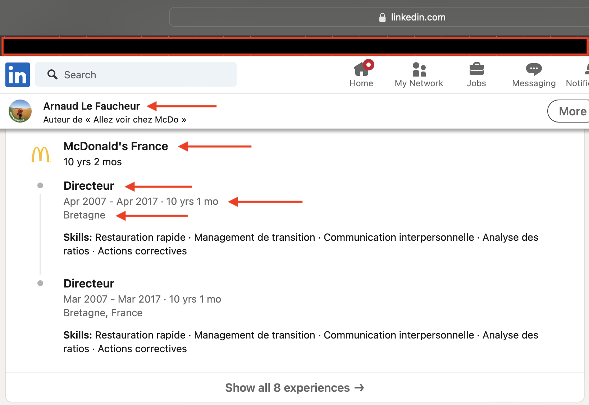

(632)&emsp;

(633)&emsp;Arnaud Le Faucheur's LinkedIn profile reveals his employment in Brittany, France, with apparent connections to McDonald's operations.

(634)&emsp;If these details are accurate, then as a director, Mr. Le Faucheur was clearly in a position to understand the gravity of the accusations and the potential legal ramifications.

(635)&emsp;So why single me out? Was it because I presented the most cogent arguments underscoring McDonald's criminal activities? A possible hint lies in a screenshot wherein Mr. Le Faucheur falsely accuses me of hacking. His accusation triggered an investigation into me. Refer to the screenshot taken on 2016-10-31 at 21.05.04 for evidence:

{/*  Original filename: Screen Shot 2016-10-31 at 21.05.04_IMPORTANT_LE_FAUCHEUR_FALSELY_ACCUSE_ME_OF_HACKING_REFRAMED-58.png  */}
(636)&emsp;

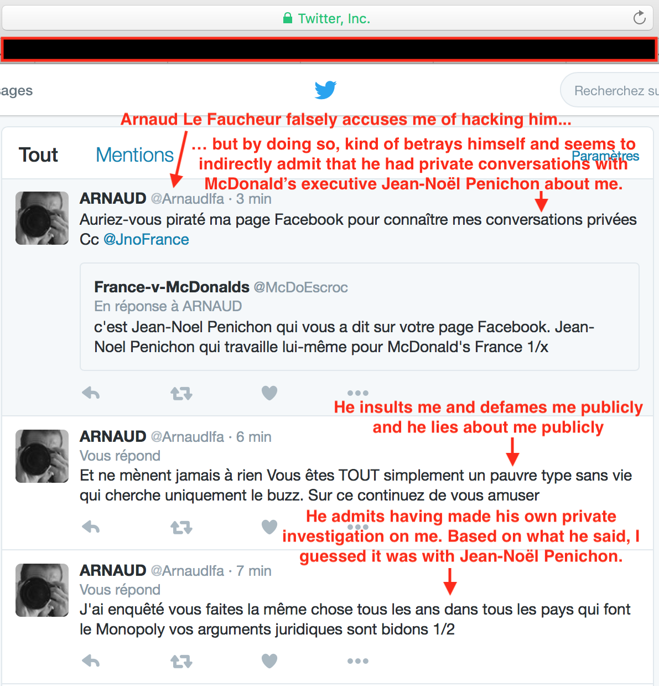

{/*  Original filename: Screen Shot 2017-01-28 at 20.55.06_IMPORTANT_JOSSET_LEFAUCHER_PENICHON_KNEW_EACH_OTHER_PERSONALLY_REFRAMED-60.png  */}
(637)&emsp;Keep in mind that there's a connection among McDonald's executive (vice-president) Jean-Noël Penichon, Arnaud Le Faucheur, and Mélodie Josset. The screenshot from 2017-01-28 at 20.55.06 offers further proof of their acquaintance:

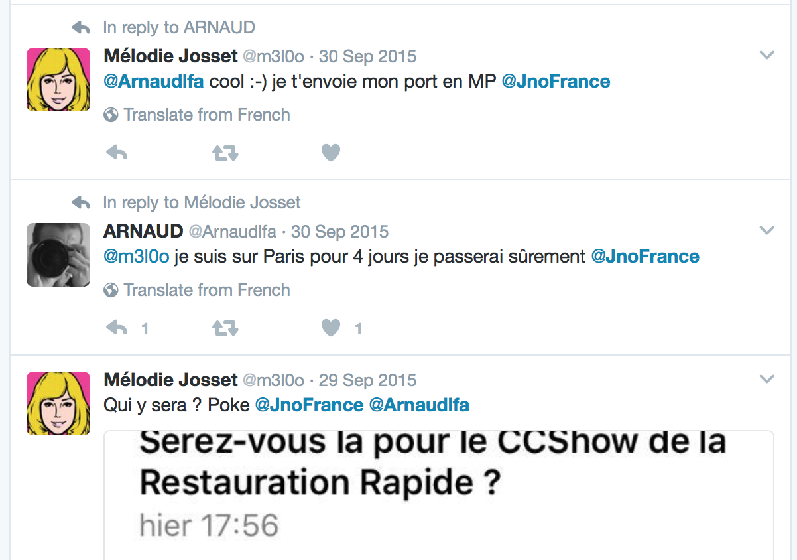

(638)&emsp;

(639)&emsp;Let's assume for a moment that Mr. Le Faucheur did indeed discuss me privately with McDonald's executives, including perhaps Mr. Penichon. What would that conversation look like given the incriminating evidence I had presented?

(640)&emsp;Given the magnitude of this case — as it pertains to the economic security of the United States, France, and other nations — a thorough investigation is warranted.

(641)&emsp;In the wake of these events, I eventually lodged a criminal complaint in France, believing that the French judicial system would uphold justice.

(642)&emsp;The ensuing manipulation and alteration of public and legal documents in this case is a topic I will address in subsequent sections. Refer to the screenshot provided below for verification.

(643)&emsp;**Aggravating circumstance number 10 for the 2016 frauds in France:**

(644)&emsp;On January 27, 2017, at 20:39 (China Standard Time), I submitted a criminal complaint for defamation to the Paris Public Prosecutor's Office.

(645)&emsp;Paris Public Prosecutor François Molins responded directly to me, noting: "Well received on 30/01/2017."

(646)&emsp;[DRAFT NOTE: Continue with the rest of the narrative regarding the complaint and subsequent events]

(647)&emsp;Given that my submission was a criminal complaint for defamation — which is a private prosecution matter in France — the direct involvement of the Paris Public Prosecutor was unexpected.

(648)&emsp;Yet, an astonishing development occurred: I received an email from the Paris Public Prosecutor's Office dated February 2, 2017, stating that my complaint had been registered on January 30, 2017.

(649)&emsp;This revelation left me bewildered. After all, François Molins, the Paris Public Prosecutor, had personally acknowledged receipt on January 30, 2017.

(650)&emsp;The glaring discrepancy in these dates leads to one unsettling conclusion: a potential manipulation of official records.

(651)&emsp;[DRAFT NOTE: Continue elaborating on document manipulation]

(652)&emsp;I had previously lodged a criminal complaint with the Paris Public Prosecutor's Office concerning the broader frauds perpetrated by McDonald's.

(653)&emsp;In my initial complaint, I cautioned the Paris Public Prosecutor, stating: "Beware, the case involves multinational corporations with extensive resources and influence."

(654)&emsp;Based on the definition provided by French law professor Yves Strickler, the term "faux" (forgery) in French law encompasses any fraudulent alteration of the truth in written documents that could result in prejudice.

(655)&emsp;Personally, I've encountered between 20 to 50 instances, if not more, of such document alterations in various legal proceedings. While this figure may seem staggering, it underscores the systemic nature of this issue.

(656)&emsp;These incidents were not solely related to the McDonald's case. From my observations, they appear to be symptomatic of a broader dysfunction within the French judicial system.

(657)&emsp;While it's concerning to witness such shortcuts and manipulations, which fundamentally undermine the rule of law, one must question whether this is an isolated phenomenon or indicative of systemic corruption.

(658)&emsp;The criminal activities orchestrated by McDonald's Corporation have inflicted immeasurable harm on countless individuals across multiple jurisdictions.

(659)&emsp;In hindsight, during 2015 and 2017, I was unaware of the special relationship between McDonald's legal representatives and high-ranking French officials.

(660)&emsp;The law firm Péchenard & Associés, hired by McDonald's France, was established by the parents of Frédéric Péchenard, the former General Director of the French National Police.

(661)&emsp;Furthermore, communication sent to me by Éric Andrieu also bears the name of Chantal PÉCHENARD, Frédéric's mother, on the letterhead.

(662)&emsp;Adding to the complexity, McDonald's Corporation's global compliance rules explicitly prohibit conflicts of interest. Yet, their choice of legal representation in France appears to flagrantly violate these very rules.

(663)&emsp;Decades ago, McDonald's France faced scrutiny from the French authorities for conducting unlawful lotteries.

(664)&emsp;Yet, in recent times, despite ample evidence proving that McDonald's France has engaged in similar if not more egregious conduct, no meaningful action has been taken.

(665)&emsp;This led me to write an open letter to François Molins, which was later published on my website.

(666)&emsp;Below, I provide a succinct summary translated into English: [DRAFT NOTE: Insert translation of open letter summary]

(667)&emsp;I explicitly told French top Public Prosecutor Mr. Molins that "Having said this, I firmly believe that you and your colleagues are honest public servants doing their best under difficult circumstances."

(668)&emsp;Now more than ever, I stand by this statement. Additionally, it's worth noting that in subsequent communications, I extended the benefit of the doubt to Mr. Molins.

(669)&emsp;However, I am extending the benefit of the doubt to Mr. Molins and choosing to believe that any irregularities were not of his doing but rather the result of subordinates acting without his knowledge or approval.

(670)&emsp;**Aggravating circumstance number 11 for the 2016 frauds in France:**

(671)&emsp;Andrieu knew that what McDonald's did was illegal since he wrote articles about consumer protection law and sweepstakes regulations.

(672)&emsp;Note: I also wrote an email to the head of the Paris bar association if I recall correctly, highlighting the ethical concerns regarding McDonald's legal representation.

(673)&emsp;Note: McDonald's Corporation knew the ties between their lawyer and the police. This raises serious questions about their compliance policies.

(674)&emsp;Note: Remind the article published in the Parisien in which they mention the legal proceedings against McDonald's France.

(675)&emsp;**Aggravating circumstance number 12 for the 2016 frauds in France:**

(676)&emsp;In case he had forgotten, my lawyer, then Ms. Myriam Blumberg, reminded Eric Andrieu of the ongoing legal issues and McDonald's obligations.

(677)&emsp;But something else surprised me in the logs of my website: Allen & Overy kept visiting my websites, monitoring my activities.

(678)&emsp;**Aggravating circumstance number 13 for the 2016 frauds in France:**

(679)&emsp;[DRAFT NOTE: Continue with additional aggravating circumstances]

(680)&emsp;Both the Péchenard & Associés law firm and the Allen & Overy law firm should be investigated for their roles in this matter.

(681)&emsp;The FBI and DOJ should move swiftly to seize/freeze/forfeit not only McDonald's assets but also those of their legal representatives who may have facilitated money laundering.

(682)&emsp;**Aggravating circumstance number 14 for the 2016 frauds in France:**

(683)&emsp;Note: McDonald's kept using the same corrupted French Ministerial Officer to serve legal documents, despite clear conflicts of interest.

(684)&emsp;Without the approval of French Ministerial Officer Le Honsec, it would have been impossible for McDonald's to perpetuate certain aspects of their fraud.

(685)&emsp;Note: which leads us to the fact Le Honsec firm admitted that if there were more prizes than winners, the remaining prizes should have been distributed—a clear acknowledgment of the fraud.

(686)&emsp;**Aggravating circumstance number 15 for the 2016 frauds in France:**

(687)&emsp;Google analytics data might help the American authorities to enlighten the investigation regarding the scope of the fraud and the number of affected consumers.

(688)&emsp;[DRAFT NOTE: Include additional analysis]

(689)&emsp;**Aggravating circumstance number 16 for the 2016 frauds in France:** NOTE: talk about Yahoo Finance connection

(690)&emsp;However, Yahoo Finance… continue with MCD knew back in 2016 already for certain that they were defrauding investors.

(691)&emsp;**Aggravating circumstance number 17 for the 2016 frauds in France:**

(692)&emsp;McDonald's was defrauding investors and their executives knew. I even started documenting this aspect of their criminal enterprise.

(693)&emsp;**Aggravating circumstance number 18 for the 2016 frauds in France:** Gloria Santona's involvement

(694)&emsp;=> very important. How could she possibly claim plausible deniability? Impossible.

(695)&emsp;=> Attach the screenshot(s) of what I told her via Twitter Direct Message function

(696)&emsp;**Aggravating circumstance number 19 for the 2016 frauds in France:** in 2016, McDonald's was fully aware of their criminal exposure.

(697)&emsp;**Aggravating circumstance number 20 for the 2016 frauds in France:**

(698)&emsp;Note: talk about Minister Martine Pinville who was notified of the frauds.

(699)&emsp;Note: talk about corrupted French official Gilles Ruaud. => don't forget to mention his role in obstructing justice.

(700)&emsp;Note: talk about McDonald's provided false evidence. Once I told Ruaud, he turned hostile.

(701)&emsp;Note: it's passive corruption. As you can see, he was well rewarded with a promotion.

(702)&emsp;**Aggravating circumstance number 21 for the 2016 frauds in France:**

(703)&emsp;Such a case involves such phenomenal amounts of money, we are talking here about billions of euros in potential liabilities.

(704)&emsp;Note: talk about Macron's party ties to McKinsey and McKinsey ties to McDonald's.

(705)&emsp;Note: talk about TMS (The Marketing Store) possible ties with Macron's party. I need to investigate this further.

(706)&emsp;**Aggravating circumstance number 22 for the 2016 frauds in France:**

(707)&emsp;[DRAFT NOTE: Continue with additional details]

(708)&emsp;=> mention the facts that many French high level magistrates like Chantal Arens may have been compromised.

(709)&emsp;**Aggravating circumstance number 23 for the 2016 frauds in France:**

(710)&emsp;DRAFT Note: => include some of the testimonies I received from the victims who contacted me.

(711)&emsp;**Aggravating circumstance number 24 for the 2016 frauds in France:**

(712)&emsp;DRAFT Note: => McDonald's was encouraging consumers to steal the game stamps from each other, creating a hostile environment.

(713)&emsp;DRAFT Note OTHER POINTS TO MENTION: [Additional items to be added]

(714)&emsp;[DRAFT NOTE: Continue with remaining points]

(715)&emsp;DRAFT Note: Don't forget to say that this explanation has already been sent to the FBI and other authorities.

(716)&emsp;DRAFT Note: talk about TMS, targets are children and young people, ties with HAVI logistics.

(717)&emsp;DRAFT Note: Christophe Chapuis was one of the top McDonald's executives who should be investigated.

(718)&emsp;DRAFT Note: I would be interrogated by the Chinese Police regarding my activities. This shows the international reach of McDonald's influence.

(719)&emsp;[DRAFT NOTE: Additional information to be added]

(720)&emsp;DRAFT Note: The FBI/DOJ should immediately issue an arrest warrant for the French Ministerial Officer involved in facilitating McDonald's fraud.

(721)&emsp;**Conclusion for the 7th example of fraud: the 2016 fraud by McDonald's France and their accomplices:**

(722)&emsp;While I have highlighted numerous aggravating circumstances surrounding the 2016 frauds perpetrated by McDonald's France and condoned by McDonald's Corporation, the evidence speaks for itself.

(723)&emsp;The narrative takes a deeper, more ominous turn as we delve into the testimony of former McDonald's France employee Ms Orane El'Khass.

(724)&emsp;The allegations brought forth by Ms El'Khass are intrinsically tied to the RICO case against McDonald's Corporation.

(725)&emsp;The actions, or rather the lack thereof, by McDonald's France and its executives—including their failure to prevent employees from stealing prizes—constitute clear violations of both French and American law.

(726)&emsp;With this backdrop, the explosive revelations by Ms Orane El'Khass extend the scope of the criminal enterprise far beyond what was initially apparent.

(727)&emsp;[DRAFT NOTE: Continue with legal analysis]

(728)&emsp;[DRAFT NOTE: Additional paragraphs to be added]

(729)&emsp;DRAFT (MESSAGE FOR EDWARD LEHMAN: I NEED TO TRIPLE CHECK THIS, either I made an error or there's a discrepancy in the records)

(730)&emsp;[DRAFT NOTE: Continue with verification]

(731)&emsp;--

(732)&emsp;The testimony of former McDonald's France employee Ms Orane El'Khass is damning evidence of systemic fraud within the organization.

(733)&emsp;These aren't just claims against some unknown corporate entity. These are allegations against prominent figures in the McDonald's hierarchy.

(734)&emsp;But what's even more damning is the suggestion that this wasn't limited to the 2016 campaign but was part of a broader pattern of racketeering activity.

(735)&emsp;[DRAFT NOTE: Continue with pattern analysis]

(736)&emsp;This isn't just a stain on a corporate logo; it's an affront to the values that form the bedrock of fair commerce and consumer protection.

(737)&emsp;DRAFT: Now, segueing into the legal realm, the actions described bear significant implications under both French and U.S. law.

(738)&emsp;DRAFT: This complex legal conundrum beckons a higher authority – the U.S. Justice Department and the FBI – to intervene and ensure justice is served.

(739)&emsp;[DRAFT NOTE: Final legal arguments to be added]

(740)&emsp;DRAFT: Given the magnitude of the allegations and the number of implicated parties, a comprehensive criminal investigation is not just warranted but imperative.

[Return to the Table of Contents ↩︎](#table-of-contents)

<h3 id="8th-example-fraud-2017-mcdonalds-france">(IV)(FF) 8th Example of Fraud: the 2017 Fraud by McDonald's France and their Accomplices, and Condoned, Again, by McDonald's Corporation</h3>
(741)&emsp;NOTE FOR EDWARD LEHMAN: I haven't finished yet to list all aggravating circumstances for the year 2016 but I am going to explain very quickly what happened in 2017:

(742)&emsp;Note for Mr. Lehman: so, for 2017, they kept a similar concept as in 2016 but instead of setting a fixed amount of 'M' for prizes, they would let people do an online bidding.

(743)&emsp;Note for Mr. Lehman: However, to prevent what happened the year before, they would only allow people to input a maximum amount of 5 game stamps into their system every day.

(744)&emsp;Note for Mr. Lehman: For example, one of the prize was a television. The highest game stamp value was 500 'M'. The first day, someone bid 2500 'M' which means that person was exceptionally lucky enough to get 5 game stamps of 500 'M' each. The second day, the bid reached 5000 'M', the third day 7500 'M', the fourth day 10,000 'M', the fifth day 12,500 'M'.

(745)&emsp;Note for Mr. Lehman: It means one or more people were lucky enough to get 25 game stamps of 500 'M' within 5 days. It also means they ate 5 Best Of meals per day 5 days in a row.

(746)&emsp;If I am not mistaken, I will triple check before I write my report but the probability of getting a 500 'M' game stamp was about 0.02563 (or in percentage, 2.563% of chance per attempt to get a 500 'M'). Therefore, the probability to get 25 x 500 'M' game stamps in a row is 0.02563 x 0.02563 x 0.02563 x … and you multiply 25 times totally. Or written another way 0.02563^25 = 1.6546843318724983 10^-40 or in decimal form:

(747)&emsp;0.00000000000000000000000000000000000000016546843318724983

(748)&emsp;Or put another way: 1 chance out of 6043448775926736700000000000000000000000 (calculation: 1/0.00000000000000000000000000000000000000016546843318724983)

(749)&emsp;The odds of winning the Powerball jackpot is

(750)&emsp;1 in 292.2 million (source: https://apnews.com/article/powerball-mega-millions-winning-odds-numbers-a3e5a8e8e7ed15d7500c1d6acdab6785#)

(751)&emsp;Or

(752)&emsp;1 in 292200000

(753)&emsp;1 in 6043448775926736700000000000000000000000 are the odds of getting 25 x 500 'M' game stamps in a row. You see the difference? 🤔 ^∞

(754)&emsp;Now, McDonald's stated that consumers could input their top 5 game stamps. So let's redo the calculation taking this into account. Let's assume a consumer would eat 10 Best Of menus per day: 5 for lunch and 5 for dinner every day 5 days in a row!

(755)&emsp;I use a special software for mathematics to get the right number, it's called Wolfram Alpha. I use this input:

(756)&emsp;Probability[x>=25, x\[Distributed]BinomialDistribution[50,0.02563]]

(757)&emsp;It's related to Binomial Distribution (https://en.wikipedia.org/wiki/Binomial_distribution)

(758)&emsp;The output is then 1.12124*10^-26

(759)&emsp;Or in decimal form a probability of 0.000000000000000000000000011212436112931688

(760)&emsp;Or put in another way, 1 chance out of 89186684314452024000000000

(761)&emsp;Now, McDonald's could argue that there were more than 1 participant. Okay, let's calculate what the outcome would be if in 2017, all of the people on planet Earth had traveled to France AND ate 10 meals per day, including babies!

(762)&emsp;The population in 2017 was about 7.55 billion people.

(763)&emsp;I use this formula in the software:

(764)&emsp;Expectation[x, x\[Distributed]BinomialDistribution[7550000000,1.12124*10^-26]]

(765)&emsp;I put a screenshot to show you how it looks like:

{/*  Original filename: Screenshot 2023-10-24 at 18.17.24.png  */}
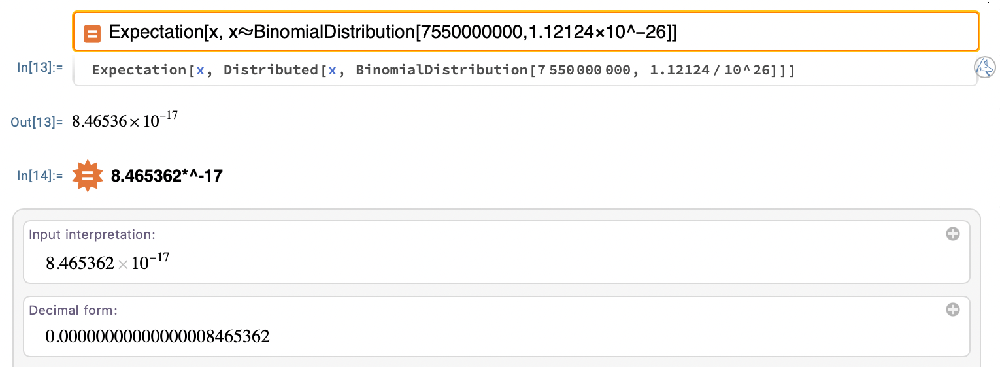

(766)&emsp;[Image above]

(767)&emsp;So a probability of 8.465362 10^-17

(768)&emsp;Or in decimal form: 0.00000000000000008465362

(769)&emsp;Or put in another way: 1 chance out of 11812844000000000 (This is the probability that if 7.55 billion people participated in the 2017 edition in France ate every day 10 meals per day for 5 days in a row, the probability that only 1 human being out of 7.55 billion would get 25 x 500 'M' game stamps out of the 50 games stamps he would have collected within a 5 days period. I-M-P-O-S-S-I-B-L-E ! ! !)

(770)&emsp;CONCLUSION: IT WAS IMPOSSIBLE. Ms Orane El'Khass was right. McDonald's France own employees were stealing the game stamps as she explained.

(771)&emsp;Note: email sent October 31, 2017 at 18:12

[Return to the Table of Contents ↩︎](#table-of-contents)

<h3 id="9th-example-fraud-china-2019">(IV)(GG) 9th Example of Fraud: China 2019</h3>
(772)&emsp;Text

(773)&emsp;Text

[Return to the Table of Contents ↩︎](#table-of-contents)

<h3 id="11th-example-fraud-ireland">(IV)(HH) 11th Example of Fraud: Ireland XXXX</h3>
(774)&emsp;Text

[Return to the Table of Contents ↩︎](#table-of-contents)

<h3 id="12th-example-illegal-lottery-usa-2016">(IV)(II) 12th Example: Illegal Lottery in the United States in 2016</h3>
(775)&emsp;18 U.S. Code § 1955 - Prohibition of illegal gambling businesses

(776)&emsp;Text

[Return to the Table of Contents ↩︎](#table-of-contents)

<h3 id="misprision-of-felony">(IV)(JJ) Misprision of Felony: 18 U.S. Code Section 4</h3>
(777)&emsp;Text

(778)&emsp;Text

[Return to the Table of Contents ↩︎](#table-of-contents)

<h2 id="urgent-recommendations-addressing-crimes-committed-by-mcdonalds-and-accomplices">(V) Urgent Recommendations for Addressing the Crimes Committed by McDonald's Corporation and its Accomplices</h2>
<h3 id="wake-up-look-at-the-facts">(V)(A) With the Utmost Respect: Wake Up! Look at the Facts! You Must Analyze the Facts!</h3>
[Return to the Table of Contents ↩︎](#table-of-contents)

<h3 id="long-term-consequences-organized-crime-money-laundering">(V)(B) Understand the Long-Term Consequences of Organized Crime and Money Laundering</h3>
(779)&emsp;Money is the motive behind most crime.

[Return to the Table of Contents ↩︎](#table-of-contents)

<h3 id="be-ready-biggest-frauds-in-history">(V)(C) Be Ready! It's One of the Biggest Frauds in History: You Must Have a Plan</h3>
[Return to the Table of Contents ↩︎](#table-of-contents)

<h3 id="hold-press-conferences">(V)(D) Hold Press Conferences or Journalists Might be Afraid to Publish</h3>
(780)&emsp;And it can help other whistleblowers to come out.

(781)&emsp;It can initiate a public debate which will be healthy. Hunt down influencers who might be working for McDonald's to provide a false narrative as if the frauds was obvious or whatever, the frauds weren't obvious and almost impossible to find out.

[Return to the Table of Contents ↩︎](#table-of-contents)

<h3 id="victim-information-website">(V)(E) Victim Information Website for Consumers and Small Business Owners</h3>
(782)&emsp;Given the large-scale nature of the crimes by McDonald's Corporation and its subsidiary companies, it is imperative that the FBI immediately establish a dedicated portal for potential victims. Such a platform would streamline the process of victims coming forth with their claims and grievances. An exemplar for this approach can be found in the FBI's endeavors in seeking victims related to magazine subscription scams. An example of such an initiative is accessible at https://www.fbi.gov/how-we-can-help-you/victim-services/seeking-victim-information/seeking-victims-in-magazine-subscription-scams-investigation.

[Return to the Table of Contents ↩︎](#table-of-contents)

<h3 id="investigators-no-financial-stake">(V)(F) Make Sure Investigators Investigating This Case Don't Have a Financial Stake in This Criminal Enterprise</h3>
[Return to the Table of Contents ↩︎](#table-of-contents)

<h3 id="determine-corrupted-officials">(V)(G) Try to Determine Which Officials Might be Corrupted</h3>
[Return to the Table of Contents ↩︎](#table-of-contents)

<h3 id="estimate-loss-for-victims">(V)(H) Estimate the Loss for the Victims</h3>
[Return to the Table of Contents ↩︎](#table-of-contents)

<h3 id="estimate-book-value-mcdonalds">(V)(I) Estimate the Book Value of McDonald's Corporation</h3>
[Return to the Table of Contents ↩︎](#table-of-contents)

<h3 id="initiate-asset-forfeiture-measures-against-the-attorneys-of-this-criminal-rico-enterprise">(V)(J) Immediately Initiate Asset Forfeiture Measures Against the Attorneys of this Criminal RICO Enterprise (SECTION FORMERLY CALLED (V)(Uncategorized-2))</h3>
(783)&emsp;Before delving into the asset forfeiture measures against McDonald's Corporation, it is essential to address the forfeiture of attorneys' fees. Considering the gravity of the allegations, agencies such as the FBI, DOJ, SEC, IRS, and Homeland Security must scrutinize whether attorneys' fees paid by McDonald's Corporation stem from the proceeds of their alleged criminal activities.

(784)&emsp;According to legal precedents and discussions within the legal community, particularly those highlighted in the American Bar Association's publications, the forfeiture of attorneys' fees should be pursued only if it is clear that the attorneys knew the fees were the proceeds of criminal activities. Excluding attorneys' fees from forfeiture aligns with preserving defendants' constitutional rights, thus maintaining the statutory goal of combating organized crime without undermining the right to a fair trial.

(785)&emsp;However, it is also argued that allowing defendants to use illicitly obtained funds to pay for defense contradicts the intent of the RICO statutes and potentially violates victims' rights. As noted in legal analyses, using stolen funds for defense is akin to a bank robbery suspect using stolen money to hire legal representation, which courts have ruled as impermissible:

(786)&emsp;"[…] The Supreme Court then provided a concrete example of this concept: '[a] robbery suspect . . . has no Sixth Amendment right to use funds he has stolen from a bank to retain an attorney to defend him if he is apprehended,' and no lawyer has the right to accept stolen property or ransom money in payment of a fee—'the privilege to practice law is not a license to steal.' Id. […]"

(787)&emsp;This situation is analogous to the principle upheld by the Supreme Court: no individual has the right to use stolen funds for defense purposes, as this would contravene the fundamental legal principles of justice and equity. The same should apply to McDonald's Corporation; if it is established that their legal fees were financed through criminal activities, these fees should be subject to forfeiture.

(788)&emsp;Ensuring fair legal representation for McDonald's, if their assets are frozen or forfeited, means they might have to rely on public defenders or court-appointed attorneys. This transition is crucial to maintaining the integrity of the legal process while ensuring that illegally obtained funds are not used to influence the outcome of judicial proceedings.

(789)&emsp;By addressing the potential forfeiture of attorneys' fees early in the proceedings, the involved legal and government agencies can safeguard the legal process and ensure that all parties retain their constitutional rights without enabling further misuse of stolen assets.

(790)&emsp;================

(791)&emsp;Draft: before I mention asset forfeiture of McDonald's Corporation, I believe it's important to first discuss the asset forfeiture of attorney's fees. The FBI/DOJ/SEC/IRS/Homeland Security will make their life infinitely easier once McDonald's Corporation gets a public defender.

(792)&emsp;"This morning, I was thinking about the FBI crime report I want to submit to tips.fbi.gov to make sure they fully understand the scope of the criminal RICO case targeting McDonald's Corporation and I often wondered about lawyers fees, what if the fees comes from a RICO enterprise. I had read this before:

(793)&emsp;https://www.ojp.gov/ncjrs/virtual-library/abstracts/against-forfeiture-attorneys-fees-under-rico-racketeer-influenced

(794)&emsp;"The conflict among various courts' interpretations of the provisions are examined, and it is argued that attorney's fees should not be forfeitable unless the attorney knew them to be the fruit of crime."

(795)&emsp;"Exclusion of attorney's fees from forfeiture would achieve the statutory purpose of combating organized crime while preserving defendants' constitutional rights."

(796)&emsp;=> non-exclusion would also violate article 6 of the ECHR equality of arms. The rights of the victims should also be preserved. For the sake of clarity, imagine plaintiff A got defrauded by defendant B. Defendant B stole 100% of plaintiff A assets through a RICO enterprise. Should defendant B allowed to use the money he stole to defend himself against its victim who can't afford legal representation any longer because he was the victim of a RICO enterprise?

(797)&emsp;"It is argued that forfeiture of attorney's fees interferes with the right to fair trial by stripping defendants of the competent counsel they could otherwise afford." => they (McDonald's) couldn't have afforded Big Law law firms like Allen & Overy hadn't they kept engaging in a criminal enterprise. Furthermore, they can get a free lawyer designated by the state/court lawyer like other criminals who can't afford a lawyer.

(798)&emsp;Then, I found this document which I haven't finished reading:

(799)&emsp;https://www.americanbar.org/groups/criminal_justice/publications/criminal-justice-magazine/2023/spring/potential-forfeiture-attorneys-fees-minefield-defense-attorneys/

(800)&emsp;"[…] The [Supreme?] Court then provided a concrete example of this concept: "[a] robbery suspect . . . has no Sixth Amendment right to use funds he has stolen from a bank to retain an attorney to defend him if he is apprehended," and no lawyer has the right to accept stolen property or ransom money in payment of a fee—"the privilege to practice law is not a license to steal." Id. […]"

(801)&emsp;Perfect, it's exactly the point I wanted to make! 😳" // end of messages sent to Dr. Lehman.

[Return to the Table of Contents ↩︎](#table-of-contents)

<h3 id="initiate-asset-forfeiture-measures-against-mcdonalds-corporation-and-complicit-parties">(V)(K) Immediately Initiate Asset Forfeiture Measures Against McDonald's Corporation and Any Complicit Parties (SECTION FORMERLY CALLED (V)(Uncategorized-1))</h3>
(802)&emsp;Given the magnitude of the purported fraud, the Department of Justice should invoke its authority, as per Title 18 U.S.C. § 981 and § 982, to immediately initiate asset forfeiture measures against McDonald’s Corporation and any complicit parties. Such actions are especially warranted if it becomes evident that the sums due to victims eclipse McDonald’s current market capitalization, not to mention the intrinsic value or book value of the company.

(803)&emsp;The book value, sometimes referred to as shareholders’ equity, provides a more genuine representation of a company’s net value. For McDonald’s Corporation, the book value is currently negative, a situation largely attributed to the extensive share buybacks the corporation has undertaken. While I’ll expound on this in detail later, there’s an underlying impression that the structure of these buybacks bears similarities to certain aspects of a Ponzi scheme. For the record, I am not categorically stating that McDonald’s Corporation is operating a Ponzi scheme; this is simply a preliminary concern that will be discussed further later in this crime report.

(804)&emsp;Please allow me to emphasize that civil forfeiture doesn’t require a criminal conviction or even criminal charges against the owner of the asset. Instead, the asset itself is named as the defendant (a process known as “in rem”, or “against the property”). The government only needs to show that the property was connected to certain illegal activities, usually by a “preponderance of the evidence” which is a lower standard than the “beyond a reasonable doubt” standard in criminal cases.

(805)&emsp;The Department of Justice, through its various divisions (like the Asset Forfeiture Program), can and does initiate civil and criminal forfeitures based on a broad range of offenses, including fraud.

(806)&emsp;The government can initiate forfeiture procedures before a final judgment has been reached in the case, especially in situations where they believe the assets might be hidden, spent, or moved outside the jurisdiction of the court before the case is concluded. This is called “preliminary” or “prejudgment” forfeiture. The goal is to preserve the assets so they can be available for forfeiture if the government is ultimately successful in its case.

(807)&emsp;Civil forfeiture in the U.S. federal system is primarily governed by Title 18, U.S.C., Section 981 and Title 21, U.S.C., Section 881. These statutes provide the framework and authority for the government to seize and forfeit property involved in certain offenses.

(808)&emsp;For the specific details about the standard of proof and the “in rem” nature:

(809)&emsp;Civil Forfeiture Standard of Proof: The standard of proof was raised by the Civil Asset Forfeiture Reform Act (CAFRA) of 2000. Under CAFRA, the government’s standard of proof in federal civil forfeiture proceedings is “preponderance of the evidence.” This is laid out in 18 U.S.C. § 983(c).

(810)&emsp;“In Rem” Proceedings: The concept of “in rem” forfeiture (i.e., against the property itself) is embedded in the language of many forfeiture statutes. For example, for assets related to money laundering, 18 U.S.C. § 981 provides the authority for the government to seize and forfeit property involved in or traceable to certain offenses, including money laundering offenses. Section 981(a)(1)(A) specifically states that any property involved in a transaction or attempted transaction in violation of sections 1956, 1957, or 1960 of title 18 (which cover money laundering and illegal money transmitting) is subject to forfeiture.

(811)&emsp;Moreover, many forms of fraud can lead to money laundering charges when the illicitly gained funds are moved, used, or disguised. Therefore, the assets connected to such fraudulent schemes can be subject to forfeiture under money laundering statutes as well.

(812)&emsp;Again, civil forfeiture actions are "in rem" (against the property itself). This means the government alleges that the property itself was involved in or is traceable to the commission of the relevant offense, rather than pursuing action against the owner of the property. The goal is to remove the assets from the illicit enterprise and deprive wrongdoers of the proceeds of their activities.

[Return to the Table of Contents ↩︎](#table-of-contents)

<h3 id="asset-forfeiture-mcdonalds-subsidiary-companies">(V)(L) Asset Forfeiture of McDonald's Corporation and their Subsidiary Companies</h3>
(813)&emsp;Write a section before to discuss book value and the estimate scope of their frauds how many billions if not trillions

(814)&emsp;Text

[Return to the Table of Contents ↩︎](#table-of-contents)

<h3 id="arrest-warrants-restaurants-franchisees">(V)(M) Then Start Issuing Arrest Warrants for All Individual Restaurants Including All the Franchisees</h3>
(815)&emsp;Text text text

[Return to the Table of Contents ↩︎](#table-of-contents)

<h3 id="interrogate-restaurant-managers-owner-operators">(V)(N) Interrogate Restaurant Managers and Owner-Operators to Determine the Extent of Their Participation in This Criminal RICO Enterprise</h3>
[Return to the Table of Contents ↩︎](#table-of-contents)

<h3 id="asset-forfeiture-suppliers-marketing-store">(V)(O) Asset Forfeiture of McDonald's Suppliers and Accomplices like The Marketing Store</h3>
(816)&emsp;Note: Pay attention to my notes (check email sent to Dr. Lehman October 30, 2023 at 18:13) in red color fonts about the HAVI group and The Marketing Store and their executives and the ties with McDonald's, even that Simon Marketing company for one of the executive, quite stunning! Completely stunning. I knew Mr. Perlman was on the board of McDonald's "charity" but I didn't know Russ Smyth served as President of McDonald's Europe or that Mark Landolt was working for HAVI/TMS and that he "worked at Simon Marketing" (remember MCDC launched a civil RICO lawsuit against employees of Simon Marketing) and that "Over the course of his career at Simon Marketing, Mark was an essential part of the company's explosive growth and development, building revenues from $100 million to $750 million." Very good, excellent, I hope the FBI/DOJ will like it.

[Return to the Table of Contents ↩︎](#table-of-contents)

<h3 id="monitor-top-100-institutional-investors">(V)(P) Monitor the Top 100 Institutional Investors in McDonald's Corporation</h3>
[Return to the Table of Contents ↩︎](#table-of-contents)

<h3 id="asset-forfeiture-investment-companies">(V)(Q) Asset Forfeiture of Investment Companies Financing this Criminal Enterprise</h3>
(817)&emsp;Note: Explain why the corporate veil could be pierced. Based on my understanding, all I have to do is to demonstrate to investors beyond a shadow of a doubt, and not only beyond a reasonable doubt, that McDonald's Corporation keeps engaging in a pattern of racketeering activity and that they haven't paid their debts yet and if they did, they would be bankrupt. See the formal notice I sent to Neuberger Berman and send it again with this crime report when it is finished => https://www.mcdstockinvestors.com/open-letters/ceo-george-walker-neuberger-berman-notified-mcdonalds-corporation-money-laundering-2023-03-16/2023-03-16_0042_0800_formal_notice_to_george_walker_neuberger_berman_with_email_Redacted.pdf

(818)&emsp;Text

(819)&emsp;Text

[Return to the Table of Contents ↩︎](#table-of-contents)

<h3 id="return-donations-mcdonalds">(V)(R) Urgent Call to American Politicians and Parties: Return Donations from McDonald's Corporation and Its Accomplices</h3>
(820)&emsp;With irrefutable evidence proving beyond a shadow of a doubt that McDonald's Corporation and its accomplices have engaged in extensive fraudulent transactions, including within the United States, the necessity for American politicians and political parties to critically evaluate their financial ties with this criminal entity becomes paramount. The evidence, revealing billions of transactions in illicit activities, directly challenges the legality and ethics of retaining contributions from sources, directly or indirectly, related to this criminal enterprise.

(821)&emsp;This situation not only demands a rigorous review of these contributions to ensure compliance with the highest standards of ethical fundraising but also underscores a profound moral imperative. In light of these proven crimes—echoing the Divine teachings in Proverbs 17:23, "The wicked accept bribes in secret to pervert the course of justice"—it is essential for all recipients of funding from McDonald's Corporation to immediately halt any further acceptance of donations and to return funds previously received. This decisive step, far beyond a mere legal formality, is a testament to a commitment to integrity, ethical governance, and the foundational principles of justice and equity.

(822)&emsp;By taking such actions, political figures and institutions have the opportunity to begin restoring public trust and demonstrating an unwavering commitment to the principles that should underpin our democratic processes. It's a crucial moment for demonstrating moral leadership and severing ties with entities proven to engage in criminal conduct, thereby reinforcing the sanctity of justice and the importance of ethical stewardship in public life.

[Return to the Table of Contents ↩︎](#table-of-contents)

<h3 id="safeguard-preserve-evidence">(V)(S) Safeguard/Preserve the Evidence Given the History of McDonald's Corporation of Destroying Evidence</h3>
(823)&emsp;=> Google Analytics logs => Allen & Overy => give DOJ FBI, INTERPOL, SFO authorization

(824)&emsp;=> All companies have back ups of database, issue warrants to seize these databases to find the victims, especially the child-victims

[Return to the Table of Contents ↩︎](#table-of-contents)

<h3 id="international-coordination-interpol-eurojust">(V)(T) International Coordination with INTERPOL and Eurojust</h3>
(825)&emsp;Given the undeniable transnational scope of the evidence presented, robust international cooperation is imperative. The FBI, SFO (the Serious Fraud Office, based in the U.K.), law enforcement authorities in every single country where McDonald's is present, should coordinate their efforts with INTERPOL and Eurojust, as various McDonald's Monopoly promotions were hosted globally, with a possibility that most likely most of them were fraught with legal inconsistencies. Furthermore, it's not only the McDonald's Monopoly which is suspect, but there are also other illegal practices which have been committed by McDonald's Corporation and its accomplices. I've personally witnessed mass-marketing frauds in China for example, frauds which were totally unrelated to the McDonald's Monopoly mass-marketing fraud. Yet, these frauds had the same modus operandi.

(826)&emsp;Furthermore, even if there countries in which no mass-marketing frauds ever took place, because this criminal RICO enterprise is orchestrated at its core by McDonald's Corporation, restaurants in such countries would be competing unfairly against honest businesses.

(827)&emsp;A document, "MONEY LAUNDERING: A PRACTICE MANUAL FOR STATE PROSECUTORS", which I found on the website of the Office of Justice Programs of the U.S. Department of Justice at https://www.ojp.gov/pdffiles1/Digitization/155129NCJRS.pdf explains it well:

(828)&emsp;"Money laundering also distorts the economy. Honest businesses lose out to those bankrolled by organized crime. As a member of the Italian parliament and former prosecutor observed, 'How would you like to be a company competing against [businesses taking dirty money] when you have to carry a debt load of 25 percent and your competition has zero?' With such a competitive advantage, it is no wonder that dirty money quickly penetrates and dominates entire industries." (PART I INTRODUCTION TO MONEY LAUNDERING, CHAPTER ONE -- MONEY LAUNDERING: OVERVIEW OF THE PROBLEM, SECTION B. MONEY LAUNDERING DISTORTS THE ECONOMY AND CORRUPTS SOCIETY).

(829)&emsp;That's exactly what McDonald's Corporation is: a criminal entity orchestrating a criminal enterprise which has dominated the fast-food industry because they've engaged in a pattern of racketeering activities for decades.

[Return to the Table of Contents ↩︎](#table-of-contents)

<h3 id="coordinate-european-court-human-rights">(V)(U) Coordinate With the European Court of Human Rights</h3>
(830)&emsp;Text

[Return to the Table of Contents ↩︎](#table-of-contents)

<h3 id="us-senate-senatorial-inquiry">(V)(V) For U.S. Senate: Start Senatorial Inquiry</h3>
(831)&emsp;Text text text

[Return to the Table of Contents ↩︎](#table-of-contents)

<h3 id="investigate-who-alerted-mcdonalds-2019">(V)(W) Investigate and Try to Find Out Who Alerted Someone Within McDonald's Corporation, Maybe the Chairman of the Board, in 2019</h3>
(832)&emsp;Text text text

[Return to the Table of Contents ↩︎](#table-of-contents)

<h3 id="consider-deal-gloria-santona-steve-easterbrook">(V)(X) A Chain is Only as Strong as Its Weakest Link: Consider Cutting a Deal With Gloria Santona and/or Steve Easterbrook</h3>
(833)&emsp;Text text text

[Return to the Table of Contents ↩︎](#table-of-contents)

<h3 id="criminal-investigation-ufc-que-choisir">(V)(Y) Launch a Criminal Investigation Against the French Consumer Association UFC-Que Choisir</h3>
[Return to the Table of Contents ↩︎](#table-of-contents)

<h3 id="investigate-french-president-marketing-store-mckinsey">(V)(Z) Investigate the French President and Its Political Party's Connection With The Marketing Store and Even McKinsey</h3>
(834)&emsp;Text text text

(835)&emsp;Text

[Return to the Table of Contents ↩︎](#table-of-contents)

<h3 id="monitor-institutional-investors-financing-criminal-enterprise">(V)(AA) Start Monitoring Institutional Investors Who Would Knowingly Keep Financing this Criminal Enterprise and Benefiting from it</h3>
(836)&emsp;Text text text

[Return to the Table of Contents ↩︎](#table-of-contents)

<h3 id="extradition-requests-mouricou-villani-belloubet">(V)(BB) Start Issuing Extradition Requests for Philippe Mouricou and Cédric Villani and Nicole Belloubet and Jean-Pierre Petit and Nawfal Trabelsi and Françoise de Borda and Pénichon and Malcolm Hicks and Anyone Who Partook in this Criminal RICO Enterprise</h3>
(837)&emsp;Text text text

[Return to the Table of Contents ↩︎](#table-of-contents)

<h3 id="withhold-passports-flight-risks">(V)(CC) Withhold Passports of Steve Easterbrook, Consider Carine Smith Ihenacho, Guillaume Huin and Any Potential Flight Risks</h3>
(838)&emsp;Text text text

[Return to the Table of Contents ↩︎](#table-of-contents)

---

<h2 id="truth-is-power-mathematics-is-power">(VI) Truth is Power: Mathematics is Power</h2>
(839)&emsp;[TO IMPROVE] First, remember that some of the franchisees seem to feel very proud that they are "killing" competition. Never forget that. Never forget that you are dealing with one of the most powerful white-collar crime syndicate.

(840)&emsp;[TO IMPROVE] before I start listing some of the crimes committed by McDonald's Corporation and its accomplices, it's important for you to arm yourself with knowledge and how to tackle this case, the best angle to create a breach. Some law enforcement agencies like the FBI will handle McDonald's Corporation. But I feel concerned to help out the local law enforcement community which might not have the same resources. And I want to help you building the strongest possible case.

(841)&emsp;[TO IMPROVE] Truth is Power and Mathematics is Power. God gave you a brain, use it!

(842)&emsp;[TO IMPROVE] If your have proceeded to freeze the assets of a franchisee, if you face their attorneys or legal counsel, they might attempt to mislead you, even lie to you. It's what the Big Law law firm Allen & Overy, which is now accused of aiding and abetting McDonald's Corporation and its accomplices to commit the crime of money laundering, did.

(843)&emsp;[TO IMPROVE] Start by focusing your efforts on the "1 in 4" mass-marketing fraud. You must have a perfect understanding of something: always remember that the sweepstakes was the equivalent of a draw without replacement. So, you must first make it clear that it is the equivalent in probability theory of a draw without replacement. And any time a lawyer for McDonald's accomplice gives you a counter example with a flipping a coin or rolling a die, cite him for obstruction and lying to a police officer. Same in a court of law, when they will face a jury: disbar the rotten lawyer. The Bible says that [quote]

[Return to the Table of Contents ↩︎](#table-of-contents)

---

<h2 id="relevant-laws-and-regulations">(VII) Relevant Laws and Regulations</h2>
<h3 id="understanding-key-legal-concepts-france-europe">(VII)(A) Understanding Some Key Legal Concepts in France and Europe</h3>
(844)&emsp;In order to fully comprehend the allegations previously detailed, as well as the subsequent points that will be made, it's essential to grasp certain distinct legal concepts applicable in France and Europe. These concepts set the backdrop against which certain commercial actions, like those of McDonald's, must be viewed and evaluated.

(845)&emsp;1. "While Supplies Last" is Not Valid in France

(846)&emsp;In the United States and several other countries, promotions often come with the caveat "while supplies last." However, in France, this principle holds no water. Retailers, especially those launching commercial campaigns offering products at discounted rates, are legally mandated to ensure sufficient stock to meet expected demand.

(847)&emsp;Illustrative Example: Suppose a supermarket advertises a week-long 50% discount on Champagne brand A, reducing its price from $50 to $25 per bottle. They are obligated to ensure stock availability for the entire duration of the sale. If they exhaust their stock before the sale ends, they must provide an equivalent quality product at the discounted price—even if the replacement is of a higher original value. Thus, a Champagne brand B, normally priced at $60, may have to be offered for $25. However, a cheaper alternative, originally priced at $40, cannot be provided at the $25 sale price. This principle stems from a commitment to fair trade practices and ensures that consumers always get what they're promised.

(848)&emsp;2. Fine Print Cannot Counteract the Main Message

(849)&emsp;France takes a firm stance against deceptive marketing. If a brand, for example, advertises "1 in 4 chances to win instantly" but later in the fine print states, "Just kidding! It's actually 1 in 8", such contradictory messages are not just viewed with skepticism—they're considered fraudulent.

(850)&emsp;The EU's COUNCIL DIRECTIVE 93/13/EEC of 5 April 1993 reinforces this sentiment, clearly stating that any contractual terms must be in plain, intelligible language. Any ambiguity or contradiction is always resolved in favor of the consumer. The directive states: "Where there is doubt about the meaning of a term, the interpretation most favorable to the consumer shall prevail." (I emphasize)

(851)&emsp;This concept isn't exclusive to Europe. Countries such as Canada, Australia, and New Zealand also uphold the principle that fine print cannot negate or contradict the main promotional message. It's a global recognition that consumers deserve clarity, and hidden terms or conditions that surprise and disadvantage them are unacceptable.

(852)&emsp;3. The EU Directive 2005/29/CE

(853)&emsp;The European Union's Directive 2005/29/CE of the European Parliament and of the Council, concerning unfair business-to-consumer commercial practices, is clear on one thing: misleading consumers is prohibited. The Directive makes it unlawful to give consumers a false impression about any primary product characteristics, the nature of the sales process, or the price. Clearly, the intent is to foster trust and transparency in commercial interactions.

(854)&emsp;However, McDonald's seems to have taken their actions a step further. Instead of merely creating a false impression, they've actively and knowingly deceived consumers. This isn't just a violation of the Directive—It's outright fraud. It's also worth noting that this isn't an isolated incident affecting one European country; multiple nations across the continent have fallen prey to these tactics.

(855)&emsp;I felt compelled to mention this Directive to McDonald's Corporation executives in 2015, warning them of the questionable practices of their European subsidiaries. At the time, my focus was primarily on Europe, and it wasn't until later that I came to understand that similar tactics were also in play in the United States.

(856)&emsp;Conclusion: it's evident that European consumer protection laws, especially those in France, are robust and were crafted with the genuine interest of the consumer in mind. They prioritize transparency, fairness, and uphold the rights of consumers, ensuring that businesses cannot exploit or mislead them. Recall my earlier discussion referencing the works of Daniel Kahneman and the study by Furth-Matzkin and Sommers. Both these references underscore the global concern for protecting consumers from deceitful business practices, no matter how cleverly disguised. Whether in Europe, the US, or other parts of the world, such tactics merit serious scrutiny and accountability.

[Return to the Table of Contents ↩︎](#table-of-contents)

<h3 id="justice-manual">(VII)(B) Justice Manual</h3>
(857)&emsp;PRINCIPLES OF FEDERAL PROSECUTION OF BUSINESS ORGANIZATIONS: Source: https://www.justice.gov/jm/jm-9-28000-principles-federal-prosecution-business-organizations "The prosecution of corporate crime is a high priority for the Department of Justice."

"At times, Department criminal investigations take place in parallel to criminal investigations in foreign jurisdictions into the same or related conduct. In such situations, the Department may learn that a foreign government intends to bring criminal charges against an individual whom the Department is also investigating. Before declining to commence a prosecution in the United States on that basis, prosecutors must make a case-specific determination as to whether there is a significant likelihood that the individual will be subject to effective prosecution in the other jurisdiction. In making that determination, prosecutors should consider, inter alia: (1) the strength of the other jurisdiction's interest in the prosecution; (2) the other jurisdiction's ability and willingness to prosecute effectively; and (3) the probable sentence and other consequences if the individual is convicted in the other jurisdiction. When appropriate, Department prosecutors may wait to initiate a federal prosecution in order to better understand the scope and effectiveness of a prosecution in another jurisdiction. However, prosecutors should not delay commencing federal prosecution to the extent that delay could prevent the government from pursuing certain charges (e.g., on statute of limitations grounds), reduce the chance of arresting the individual, or otherwise undermine the strength of the federal case. Similarly, prosecutors should not be deterred from pursuing appropriate charges just because an individual liable for corporate crime is located outside the United States."

[Return to the Table of Contents ↩︎](#table-of-contents)

---

<h2 id="key-considerations">(VIII) Key Considerations: Helpful Pointers to Keep in Mind</h2>
<h3 id="strategy-force-franchisees-to-choose-a-side">(VIII)(A) Strategy: Force the Franchisees to Choose a Side</h3>
[Return to the Table of Contents ↩︎](#table-of-contents)

<h3 id="kahneman-behavioral-economics-exploitation">(VIII)(B) How the Con Artists McDonald's Corporation and Their Accomplices Exploited Kahneman's Behavioral Economics Theories for Mass-Marketing Frauds</h3>
(858)&emsp;Given the extensive documentation provided so far in this report, outlining the fraudulent practices of McDonald's Corporation and their accomplices, it is essential to scrutinize the psychological tools they used to deceive and manipulate the masses.

(859)&emsp;In 2011, Nobel laureate Daniel Kahneman, a psychologist, not an economist, published the seminal book "Thinking, Fast and Slow," which became an international bestseller.

(860)&emsp;Kahneman's insights have been so impactful that, according to an article in The Economist dated December 7, 2013, admen have turned him into a marketing guru. Though the original intent of Kahneman's research was to enlighten, there is a dark side: his findings have been exploited by unscrupulous entities, McDonald's Corporation included.

(861)&emsp;Exploiting Cognitive Biases: Kahneman's research, often cited in his book "Thinking, Fast and Slow," identified cognitive biases like "cognitive ease" and the "gorilla study," which demonstrated how people can be blind to the obvious and also blind to their blindness. This essentially means that if something is repeated often enough or presented with enough confidence, the public will often believe it, despite its inaccuracy or downright falsehood.

(862)&emsp;In McDonald's promotional campaigns, particularly the Monopoly games, the corporation took advantage of these biases. By constantly hammering terms like "Monopoly," "collect-to-win," "1 in 4 [chances of winning instantly]," and the word "win," they induced a state of cognitive ease in consumers. This misleadingly reaffirmed the incorrect beliefs that by merely collecting 4 games stamps in the instant-win aspect of the game, or collecting game stamps in the "collect-to-win" aspect of the game, one could secure a win—despite the near impossibility of doing so due to intentionally rare game pieces. Further details on this will be discussed in the next section.

(863)&emsp;The Monopoly Deception: McDonald's usage of the term "Monopoly" is another manipulation tactic. The original Monopoly board game is indeed a game of collection and acquisition, so when McDonald's presented its sweepstakes as a "Monopoly game," it planted the deceptive idea that winning could be achieved through collection. The reality is far different; their game resembled more of a lottery than a game of Monopoly.

(864)&emsp;Unethical Application of Behavioral Economics: It is evident that McDonald's Corporation and its accomplices have tapped into advanced cognitive science techniques to deliberately distort and manipulate consumer perceptions. While this may not have been the intention of Kahneman and other researchers, corporations have leveraged these insights for nefarious purposes, often abetted by advertising agencies keen to exploit these psychological loopholes.

(865)&emsp;Legal Implications: McDonald's behavior raises serious ethical and legal questions. Misleading a consumer, intentionally or not, is illegal. By obscuring the actual odds and manipulating consumer psychology, they didn't merely mislead; they lied. This is not just a violation of advertising norms; it is fraudulent activity, reinforced and amplified through the exploitation of behavioral economic theories.

(866)&emsp;Conclusion: Given these manipulations, which extend beyond mere fraudulent misrepresentation into the realm of psychological deception, the Federal Bureau of Investigation and State Attorneys General need to consider these factors in their comprehensive probe into McDonald's Corporation. It is crucial to understand that these deceptions are multi-layered, incorporating not just simple lies but also sophisticated psychological tactics to intensify their fraudulent schemes.

(867)&emsp;Given the irrefutable evidence provided, some of which substantiates claims beyond a shadow of a doubt, the call for a thorough, immediate investigation is not just warranted—it's imperative.

[Return to the Table of Contents ↩︎](#table-of-contents)

<h3 id="consumer-psychology-fine-print-fraud">(VIII)(C) "Consumer Psychology and the Problem of Fine Print Fraud"</h3>
(868)&emsp;Modern consumer contracts are pervasive, often characterized by intricate fine print that is overlooked or misunderstood by the average consumer. The problem escalates when such contracts arise out of deceitful actions by businesses. This section is based on an enlightening study by Furth-Matzkin and Sommers that delves into how laypeople respond to contracts stemming from fraudulent actions.

(869)&emsp;Source: Furth-Matzkin, Meirav and Sommers, Roseanna, Consumer Psychology and the Problem of Fine Print Fraud (April 25, 2019). 72 STANFORD LAW REVIEW___ (Forthcoming), U of Michigan Law & Econ Research Paper No. 19-018, Available at SSRN: https://ssrn.com/abstract=3378353

(870)&emsp;Consumer contracts in the context of fraud have been a long-standing topic of discussion. Recent findings, however, shed light on the profound impact of fine print on consumer psychology, debunking the common myth that such details are merely inconsequential.

(871)&emsp;The Influence of Fine Print on Consumers: Conventionally, fine print in contracts is often dismissed as being trivial or treated as "white noise." However, studies indicate a much more profound effect. Fine print, even when unread or unnoticed at the point of signing a contract, can significantly affect a consumer's behavior and decisions after discovering they were misled.

(872)&emsp;False Representations & Consumer Behavior: The study presented scenarios where sellers misled consumers with false promises, which were directly contradicted in the contract's fine print. What's startling is that, upon discovering the fraud, laypeople felt demoralized rather than wronged. Contrary to what legal professionals might believe, these laypeople often assumed that they had consented to these terms and that the contract, even if induced by deception, was valid and binding.

(873)&emsp;The Impact of Deception on Contract Legitimacy: One might expect that discovering a seller's deception would undermine the perceived legitimacy of the contract. Surprisingly, the study found that the realization of being deceived did little to alter consumers' beliefs about the enforceability of the agreement. They still believed that the written contract was the ultimate authority, even if it contradicted verbal promises.

(874)&emsp;Effect of Anti-Deception Consumer Protection Laws: Informing consumers about laws designed to protect against deception changed their perspectives slightly. While awareness of these laws did make consumers more skeptical of fraudulent contracts, it did not entirely erase their deep-seated belief in the sanctity of the written word in contracts.

(875)&emsp;Implications for Business and Law: The study's findings have profound implications for both business practices and legal remedies. Relying solely on legal provisions to counteract deceptive practices seems inadequate. The very psychology of consumers, shaped by their trust in the finality of written contracts, poses a significant challenge. The need of the hour is to design interventions that both educate consumers and challenge these ingrained beliefs.

(876)&emsp;In conclusion, while fine print might seem an insignificant aspect of consumer contracts, its psychological effects can't be ignored. The prevailing mechanisms to combat deceptive business tactics might need reevaluation, ensuring they align better with consumer perceptions and behaviors.

(877)&emsp;It's important to note that the term "fine print" refers to any additional, often detailed information provided in a smaller font size at the bottom or on the back of an advertisement or other promotional material. It's typically used to include disclaimers, additional terms, or clarifications that might not be highlighted in the main body of the advertisement. But as it was demonstrated, the criminal entity McDonald's Corporation and their accomplices never disclosed to their victims that the fraudulent "1 in 4" claim was not a probability but the result of the sum of what we call in probability theory the probability mass function (PMF) of the hypergeometric distribution for obtaining at least k successes, summing from i = k to the minimum of n and K, each term calculating the probability of exactly i successes in a sample of size n from a population of N with K successes.

(878)&emsp;Let's indulge in a bit of speculation for a moment. Imagine if McDonald's had decided to include in the fine print a mocking disclaimer along the lines of, "Haha! Got you! Actually, the odds are 1 in 8, not 1 in 4, because this figure is the result of the sum of the probability mass function (PMF) of the hypergeometric distribution yada yada yada..." Even if they had attempted to cloak their deceptive claim with this form of 'transparency,' would it truly absolve them of their mass-marketing fraud? The answer, grounded in the findings of this study, is a resounding no. Even a candid admission of the real odds in the fine print—which, let's be clear, McDonald's did not provide—would not legalize such deceptive practices. In numerous jurisdictions worldwide, including the United States, laws strictly prohibit misleading consumers in this manner. But let's not forget, McDonald's didn't even offer this hypothetical disclaimer. The absence of any clarification about the actual probability of winning leaves us with a straightforward case of fraud.

[Return to the Table of Contents ↩︎](#table-of-contents)

<h3 id="mcdonalds-executives-knew-about-frauds">(VIII)(D) McDonald's Corporation, Their Subsidiary Companies, Their Respective Executives, Their Lawyers, All Knew They Were Committing Massive Mass-Marketing Frauds and Money Laundering. Even Some Employees Knew!</h3>
(879)&emsp;A critical facet of this multifaceted case hinges on the incontrovertible evidence pointing to the acute awareness of numerous executives across McDonald's Corporation, McDonald's Europe, and McDonald's France concerning the crimes the company had been embroiled in.

(880)&emsp;Notably, many of these infractions can be substantiated with unwavering certitude. However, what sets this situation apart is the transparent nature of these malfeasances. Once highlighted, their egregiousness became palpable even to those without a legal background.

(881)&emsp;An instance that stands out is that of an employee who, despite their lack of formal legal training, readily grasped the gravity of the malpractices. Similarly, certain fraudulent activities were so overt that the very notion of claiming criminal negligence or feigned ignorance becomes untenable. In this context, plausible deniability is rendered non-existent.

(882)&emsp;Executives, including Gloria Santona and Malcolm Hicks, while initially attempting to deflect blame onto McDonald's France, could not remain oblivious once the full scope of the violations was unveiled. It became their moral and legal duty to intervene and cease any ongoing deceptive practices immediately—a step that was, as attested by former CEO Jean-Pierre Petit in his writings, entirely feasible.

(883)&emsp;Their prolonged inaction, coupled with their eventual involvement, implies a deeper comprehension of the ramifications, including the inevitable descent into money laundering. This perception is further underscored by instances where Ms. Santona seemingly chose to distance herself from the ongoing schemes, even if it meant contravening U.S. regulations in 2016. Her possible involvement in insider trading, which I believe was reported in my 2015 submission to the Office of the Whistleblower of the U.S. Securities and Exchange Commission (if my memory serves me correctly), further complicates the picture.

(884)&emsp;

(885)&emsp;It's also concerning that several of the executives, once privy to these illicit activities and in positions of influence to effect change, remain entwined with McDonald's to this day. Figures like Malcolm Hicks, Jean-Noël Penichon (who may have faced a defamation lawsuit), and Christophe Chaps—who recently sought to influence my LinkedIn testimony—cast shadows over the integrity of the corporation's leadership.

(886)&emsp;

(887)&emsp;The epicenter of this vast web of white-collar malfeasance is unmistakably McDonald's Corporation. They are the architects behind this sprawling criminal enterprise, leading what could be one of the most potent white-collar crime syndicates in history. Yet, the repercussions of their actions, if the rule of law is duly honored, could lead to their financial ruin.

(888)&emsp;

(889)&emsp;In the ensuing section, we shall delve into a comprehensive evaluation of the potential financial liabilities McDonald's Corporation might be encumbered with—debts owed to national treasuries where their deceptions occurred, reparations to defrauded victims, and compensations to rival businesses that bore the brunt of their unscrupulous practices.

[Return to the Table of Contents ↩︎](#table-of-contents)

<h3 id="mcdonalds-virtually-bankrupt">(VIII)(E) McDonald's Corporation Is Currently Virtually Bankrupt: A Rough Estimation of Their Current Liabilities</h3>
(890)&emsp;Éric Andrieu, an attorney from the Péchenard & Associés law firm representing McDonald's, authored a law review article published on May 1, 2014. This article is now an evidence in the criminal RICO case targeting McDonald's Corporation and their accomplices and I keep a copy of it which I share under the fair use doctrine for evidentiary and public interests purposes:

(891)&emsp;https://www.ecthrwatch.org/evidence/mcdonalds-attorney-law-review-article-2014-05-01/evidence-law-review-article-from-mcdonalds-attorney-may-2014-european-parliament.pdf

(892)&emsp;In this article, he cites the European Parliament resolution of February 4, 2014, on the implementation of the Unfair Commercial Practices Directive 2005/29/EC (2013/2116(INI)). Specifically, he references the statement "that the penalties imposed for failure to comply with the Directive ought never to be lower in value than the profit made through a practice deemed to be unfair or misleading."

Refer to paragraph 19 of the European Parliament resolution, which is available for review at the following link:

(893)&emsp;https://www.europarl.europa.eu/doceo/document/TA-7-2014-0063_EN.pdf

(894)&emsp;This citation in Andrieu's article is unequivocal evidence of both his and McDonald's understanding of the potential severe financial implications if they continued their alleged racketeering activities. Given the applicability of this European Directive across all EU nations, McDonald's could face monumental financial consequences, possibly leading them to bankruptcy.

(895)&emsp;In a LinkedIn post, Jana Cappello, spokesperson for the European Anti-Fraud Office (OLAF), referenced two poignant remarks from a conference: "EU funds belong to Europeans, not to fraudsters!" and "If you don't look for fraud, there is no fraud…"

(896)&emsp;

(897)&emsp;Drawing from this sentiment, it's conceivable that if rigorous criminal investigations were conducted across the European Union, scrutinizing every detail, the discovery of around 100 instances of mass-marketing frauds, if not more, could emerge throughout the region.

(898)&emsp;

(899)&emsp;Should the European resolution be upheld, dictating that penalties for failing to adhere to the Directive should at least equal the profit garnered from any misleading or unfair practice, and assuming an average clawback of 100 million euros for each identified mass-marketing fraud, the total could potentially reach a staggering 10 billion euros.

(900)&emsp;

(901)&emsp;And this figure pertains only to Europe. It doesn't factor in the compensations owed to deceived consumers or the competitors who grappled with the criminal strategies deployed by McDonald's.

(902)&emsp;

(903)&emsp;Considering only the infractions from the years 2010, 2011, 2012, 2015, 2016, and 2017, the reparations due to French consumers alone could run into the hundreds of billions of euros, underscored by the principle that contracts must be honored.

(904)&emsp;

(905)&emsp;Given the apparent lapses or potential complicity within the French administration, it might be argued that the statute of limitations may not present a hurdle. This opens the door for French consumers to potentially initiate a class-action lawsuit against McDonald's Corporation, citing sustained engagement in racketeering, money laundering, and the corruption of foreign officials. I'll delve into the corruption angle later, but a foundation for this claim is laid out in Jean-Pierre Petit's book, which illuminates how McDonald's effectively muted the French parliament and funneled ill-gotten funds to municipalities.

(906)&emsp;Regarding the crimes committed in the United States, it's similar. Millions of young participants in the 2016 McDonald's Monopoly game may still regard themselves as victims of a federal offense. Setting aside state laws, many of which often have no expiration for fraud-related offenses, McDonald's Corporation's alleged continuous involvement in racketeering could imply that the statute of limitations might not begin until they completely cease these activities.

(907)&emsp;

(908)&emsp;In 2016, when McDonald's asserted in the U.S. that making a purchase doesn't amplify the odds of securing a win, the mathematical implication is that every purchase should, in essence, guarantee a win. This is a straightforward mathematical conclusion. Consequently, any interpretation of this claim should lean in favor of the consumers rather than the corporation in question. If not, it sets a precedent where corporations could potentially circumvent the law to their advantage, which is contrary to public interest. While I need to validate the math, I suspect that the compensatory sum owed to the 2016 game participants in the U.S. alone might exceed 1 trillion dollars.

(909)&emsp;

(910)&emsp;Moreover, if these allegations hold water, McDonald's Corporation and its associated franchisees might find themselves besieged by a plethora of class-action lawsuits at municipal, state, and federal levels, echoing the recent financial woes of Rite Aid.

(911)&emsp;This naturally raises the question: What would it take to financially topple McDonald's Corporation? \$10 billion? \$20 billion? \$50 billion? Some might point to McDonald's current market capitalization, hovering around \$186 billion, to argue that even a \$100 billion hit wouldn't destabilize them. However, this perspective might be misguided. It's crucial to distinguish between the market capitalization, which is based on stock price multiplication by the number of shares, and the intrinsic value of the company, often referred to as the book value or shareholder's equity.

[Return to the Table of Contents ↩︎](#table-of-contents)

<h3 id="market-capitalization-vs-book-value">(VIII)(F) Understanding the Financial Core: Market Capitalization vs. Book Value (a.k.a. Shareholder's Equity), and McDonald's Massive Shares Buybacks</h3>
(912)&emsp;In financial parlance, the distinction between market capitalization and book value is fundamental, yet often overlooked in popular discourse. Let's delve deeper into what sets these two metrics apart and why this distinction could be the linchpin when evaluating the real vulnerability of a corporate giant like McDonald's Corporation.

(913)&emsp;Market Capitalization: This is a snapshot of what the market believes a company is worth at any given moment. It's calculated by multiplying the current stock price by the total number of outstanding shares. However, this figure is notoriously volatile, swayed by market sentiments, rumors, news, and even geopolitical events.

(914)&emsp;Book Value (Shareholder's Equity): On the other hand, the book value represents the net value of a company's total assets minus its total liabilities. Think of it as the residual value to shareholders if the company were to be liquidated. Unlike market capitalization, book value is based on a company's balance sheet, a more concrete and less speculative representation of its worth.

(915)&emsp;When gauging the financial stability or vulnerability of a company, relying solely on market capitalization can be misleading. While a high market cap might suggest robustness, it's the book value that gives a clearer picture of the company's "safety net" in times of crisis.

(916)&emsp;In the case of McDonald's Corporation, if legal actions, penalties, and reparations were to chip away at its finances, it would be the book value that would serve as its actual buffer, not its inflated market capitalization. Knowing this distinction can make all the difference in understanding the true scale of impact potential lawsuits and penalties could have on the company's solvency.

(917)&emsp;The latest annual report of McDonald's Corporation reveals a striking detail: the company's total shareholders' equity stands at a deficit of approximately $6 billion. This raises a pertinent question: How can a corporation, with an impressive market capitalization of $186 billion, display a negative book value?

(918)&emsp;Let's delve into the apparent discrepancy between a company's large market capitalization and a negative book value, particularly through the lens of share repurchases.

(919)&emsp;1. Negative Shareholder's Equity (Book Value): When a company reports a negative shareholder's equity, it means that its liabilities exceed its assets. This situation doesn't necessarily indicate financial distress. Sometimes, it's the result of accounting practices or financial strategies, such as share repurchases.

(920)&emsp;2. Share Repurchases and Negative Equity:

(921)&emsp;Share repurchases, also known as stock buybacks, involve a company buying back its own shares from the open market. The primary reasons for this are:

(922)&emsp;- To return value to shareholders directly.

(923)&emsp;- To reduce the number of outstanding shares, which can increase earnings per share and potentially boost stock price.

(924)&emsp;- To utilize excess cash in a way that might be seen as beneficial for shareholders.

(925)&emsp;From an accounting standpoint, when a company repurchases its shares, those shares become 'treasury stock'. The cost of these repurchased shares is then subtracted from shareholder's equity on the balance sheet, which reduces the total shareholder's equity. If a company repurchases a large number of shares, it can significantly decrease shareholder's equity and, in some cases, make it negative.

(926)&emsp;3. Relevance of Accounting Rules:

(927)&emsp;Under most accounting standards, including the Generally Accepted Accounting Principles (GAAP), treasury stock is recorded at cost (the price the company paid to repurchase the shares) and shown as a contra-equity account on the balance sheet. This means it's subtracted from shareholder's equity. The accounting treatment is not influenced by the market value of these shares. If the company repurchases the shares at a price higher than its book value, it can further dilute the shareholder's equity.

(928)&emsp;4. Discrepancy in Shares:

(929)&emsp;The "number of shares outstanding of the registrant's common stock as of January 31, 2023: 731,496,951" signifies the total shares that are currently held by all shareholders, including institutional investors, insiders, etc. The difference between this number and the larger "929.3 million shares" that McDonald's Corporation owned as of December 31, 2022, indicates the amount of treasury stock the company holds.

(930)&emsp;In essence, even though treasury stocks reduce shareholder's equity, they don't diminish the intrinsic value or operational capacity of a company. However, a negative book value can be a concern for some investors, as it shows that the company has more liabilities than assets when excluding market value considerations. Still, it's essential to evaluate the entire financial picture, including cash flow, revenue, and other metrics, before drawing conclusions about a company's financial health.

(931)&emsp;Isn't it alarming to consider a scenario where a corporation, fully aware of its illicit activities that could essentially render it bankrupt, remains silent? Where executives, rather than coming clean, opt to buy back the company's shares to artificially elevate the stock price, all while keeping their trusting shareholders in the dark? And where those very executives benefit personally, capitalizing on stock options, all based on this deception? What could one possibly call such actions, and under what legal framework might they fall?

(932)&emsp;The situation I describe involves multiple potential legal and ethical breaches. Here's a breakdown:

(933)&emsp;1. Misrepresentation and Omission: If executives are aware of ongoing criminal activities within their corporation and intentionally do not disclose this to shareholders and potential investors, they might be guilty of securities fraud. Specifically, companies are obligated to disclose material information — that is, any information a reasonable investor would consider important when deciding whether to buy or sell a stock.

(934)&emsp;2. Manipulation: Intentionally buying back shares to artificially inflate the stock price is a form of market manipulation. This is prohibited under securities law in many jurisdictions, as it distorts the true market value of a security.

(935)&emsp;3. Insider Trading: If corporate executives, having non-public knowledge about the criminal activities and potential adverse impacts on the stock price, trade the company's stock (such as exercising stock options), they might be engaged in insider trading, which is illegal in many countries.

(936)&emsp;4. Breach of Fiduciary Duty: Corporate officers and directors owe fiduciary duties to their shareholders. This includes the duty of care (making decisions in the best interest of the corporation) and the duty of loyalty (putting the corporation's interests above their own). Engaging in or concealing illegal activities and manipulating stock prices for personal gain could be seen as a breach of these duties.

(937)&emsp;5. Enrichment at the Expense of Shareholders: Receiving stock options and then artificially boosting the stock price to exercise these options at a profit, all while being aware of detrimental information not known to the public, can be considered unjust enrichment.

(938)&emsp;Given the situation described, it's evident that such actions by McDonald's are not just unethical, but criminal. In the United States, the Securities and Exchange Commission (SEC) oversees federal securities laws, and such manipulative practices undoubtedly breach these regulations.

(939)&emsp;Considering I first brought this to the SEC's attention via the whistleblower office program in 2015 and again in 2022, it's high time for the SEC to acknowledge the gravity of these actions. McDonald's should face criminal indictment for such blatant disregard of the law.

(940)&emsp;Key applicable laws include:

(941)&emsp;- The Securities Act of 1933 and the Securities Exchange Act of 1934, which, among other things, prohibit fraudulent acts, misrepresentations, and omissions in the offer and sale of securities and in connection with the purchase or sale of securities.

[Return to the Table of Contents ↩︎](#table-of-contents)

<h3 id="mcdonalds-ponzi-scheme-traits">(VIII)(G) Does McDonald's Corporation Have the Traits of a Ponzi Scheme? I Believe Yes, Something Along These Lines.</h3>
(942)&emsp;I talked about Market….

(943)&emsp;Text

[Return to the Table of Contents ↩︎](#table-of-contents)

<h3 id="money-laundering-mcdonalds">(VIII)(H) Money Laundering by McDonald's Corporation and Their Subsidiary Companies</h3>
(944)&emsp;Note: explain why they are theoretically bankrupt if the rule of law is respected, and quote relevant laws about asset forfeiture. => don't forget to mention that shareholder's equity is negative and that it's therefore a fragile company if law enforcement in various countries finally decide to act.

(945)&emsp;Text

[Return to the Table of Contents ↩︎](#table-of-contents)

<h3 id="foreign-corrupt-practices-act">(VIII)(I) The Foreign Corrupt Practices Act (FCPA)</h3>
(946)&emsp;Text

(947)&emsp;NOTE: remember to mention everything former McDonald's France CEO Jean-Pierre Petit brags about in his book "I sold my soul to McDonald's" => he brags about having reduced to silence the French parliament, how he started getting close to people of power and influence

(948)&emsp;Note: Remember to talk again, about how McDonald's Corporation condoned McDonald's France violating their own compliance policy about suppliers => they hire the law firm Péchenard & Associés with strong ties to the French Police => And Frédéric Péchenard had also strong ties with François Molins => and legal/court/official documents ("écritures publiques" would be falsified/altered/forged etc => as a result McDonald's always got away)

(949)&emsp;NOTE: VERY IMPORTANT => former McDonald's France CEO Jean-Pierre Petit might actually have admitted in his book one form of corruption: he mentions small towns/villages in France which are desperate for money/tax income, and opening a McDonald's suddenly brings income to the municipality. Except that McDonald's engages in criminal activities, giving them an edge and accessorily killing competitors who compete fairly but can't compete with a criminal enterprise resorting to frauds and money laundering. => mayors in France have the legal status of "officier de police judiciaire" => how many of them reported the crimes McDonald's committed?

(950)&emsp;Text

[Return to the Table of Contents ↩︎](#table-of-contents)

<h3 id="rico-act-mcdonalds-pattern">(VIII)(J) The Racketeer Influenced and Corrupt Organizations (RICO) Act and McDonald's Corporation Pattern of Racketeering Activity (18 U.S. Code §1961)</h3>
(951)&emsp;Text

(952)&emsp;Text

[Return to the Table of Contents ↩︎](#table-of-contents)

<h3 id="fbi-federal-crime-victims-rights">(VIII)(K) The FBI and Federal Crime Victims' Rights</h3>
(953)&emsp;The FBI is legally mandated to identify victims of federal crimes that it investigates and provide these victims with information, assistance services, and resources.

(954)&emsp;This obligation is primarily grounded in the "Justice for All Act" of 2004, which brought forth pivotal amendments to the rights of federal crime victims, central to which is the Crime Victims' Rights Act (CVRA). The CVRA, enshrined within Title 18, United States Code, Section 3771, stipulates several rights for victims, such as:

(955)&emsp;- The right to be reasonably protected from the accused.

(956)&emsp;- The right to receive timely and accurate notifications of public court proceedings.

(957)&emsp;- The right against exclusion from public court proceedings.

(958)&emsp;- The right to be reasonably heard during certain district court proceedings, notably those concerning release, plea, sentencing, or parole.

(959)&emsp;Furthermore, the "Justice for All Act" bolstered victims' rights by introducing the Federal Crime Victim Assistance Fund and amplifying provisions related to victim restitution.

[Return to the Table of Contents ↩︎](#table-of-contents)

<h3 id="concerns-for-sec">(VIII)(L) Concerns for the U.S. Securities and Exchange Commission</h3>
(960)&emsp;The U.S. Securities and Exchange Commission (SEC) has regulations that require public companies to disclose legal proceedings or other contingencies that might have a material impact on their financial position. This requirement is found in the Regulation S-K, specifically under Item 103 titled "Legal Proceedings."

(961)&emsp;According to Item 103 of Regulation S-K:

(962)&emsp;"The registrant shall describe briefly any material pending legal proceedings, other than ordinary routine litigation incidental to the business, to which the registrant or any of its subsidiaries is a party or of which any of their property is the subject."

(963)&emsp;While the rule doesn't state a specific percentage threshold like 10%, the SEC provides some guidance. For instance, an instruction to Item 103 states:

(964)&emsp;"No information need be given with respect to any proceeding that involves primarily a claim for damages if the amount involved, exclusive of interest and costs, does not exceed 10 percent of the current assets of the registrant and its subsidiaries on a consolidated basis."

(965)&emsp;This suggests that legal actions involving amounts that exceed 10% of a company's current assets are deemed significant enough to require disclosure.

(966)&emsp;However, it's essential to note that even if a legal action doesn't meet this specific threshold, companies still need to evaluate whether the lawsuit is "material" and therefore needs to be disclosed. The concept of materiality is broader than just this 10% threshold and involves a judgment about what a reasonable investor would consider important when making investment decisions.

(967)&emsp;The specific disclosure requirements regarding legal proceedings for companies under the SEC's Regulation S-K, Item 103 ("Legal Proceedings") are described below:

(968)&emsp;Description of the Proceedings: Companies must briefly describe any material pending legal proceedings to which they or their subsidiaries are a party, or of which any of their properties is the subject.

(969)&emsp;Name of the Court or Agency: The disclosure must include the name of the court or agency in which the proceedings are pending.

(970)&emsp;Date Instituted: The date on which the litigation was initiated should be mentioned.

(971)&emsp;Principal Parties: The identities of the principal parties to the proceedings should be included.

(972)&emsp;Factual Basis Alleged to Underlie the Litigation: A brief description of the factual basis alleged to underlie the litigation and the relief sought should be provided. This would include, for instance, any claims for damages or injunctive relief.

(973)&emsp;Potential Impact: If it is possible to do so, the registrant should provide any material financial impact or potential exposure from the proceedings, though this can sometimes be challenging given the uncertainties of litigation.

(974)&emsp;Management's Evaluation: If appropriate, the company can include management's evaluation of the likely outcome and potential impact, including any potential financial exposure or range of exposure.

(975)&emsp;Environmental Proceedings: Special mention is made of certain types of legal proceedings arising under any federal, state, or local laws and regulations that regulate the discharge of materials into the environment or protect the environment. For these proceedings, if a governmental authority is a party and the potential monetary sanctions could exceed $100,000, specific disclosure might be required.

(976)&emsp;Ordinary Routine Litigation: it's important to note that no disclosure is needed for "ordinary routine litigation incidental to the business."

(977)&emsp;Proceedings Related to Matters of Financial Importance: As I mentioned earlier, no information might be needed for a proceeding that primarily involves a claim for damages if the amount, exclusive of interest and costs, doesn't exceed 10 percent of the current assets of the company and its subsidiaries on a consolidated basis. However, the concept of materiality can override this threshold.

(978)&emsp;The above are general guidelines, and the specifics of disclosure can vary depending on the nature and complexity of the legal proceedings and the company's judgment about the materiality of the proceedings to investors.

[Return to the Table of Contents ↩︎](#table-of-contents)

<h3 id="concerns-for-irs">(VIII)(M) Concerns for the Internal Revenue Service (IRS)</h3>
(979)&emsp;The primary focus of this report is to shed light on and substantiate the allegations of mass-marketing frauds and the subsequent money laundering operations by McDonald's Corporation. These operations have been identified in both domestic and international markets. Notably, the funds from these activities have found their way into the financial system, and by extension, to shareholders, given that McDonald's Corporation is publicly traded on the New York Stock Exchange.

(980)&emsp;1. Provenance of Funds:

(981)&emsp;The legitimacy of the proceeds from McDonald's Corporation's activities has been called into question. Although the principle of "innocent until proven guilty" stands in the U.S., the proofs presented in this report are so compelling that they go beyond the traditional "beyond a reasonable doubt" standard to "beyond a shadow of a doubt." This casts serious suspicions over the origin, movement, and utilization of these funds.

(982)&emsp;2. Repatriation and Deferral of Foreign Income:

(983)&emsp;a. Pre-TCJA Regulations:

(984)&emsp;Prior to the enactment of the Tax Cuts and Jobs Act (TCJA) of 2017, corporations had the leeway to defer foreign income, presumably earned through legal means. However, the underlying question here is: Were the deferrals made by McDonald's Corporation a bona fide business decision or a strategy to avoid U.S. scrutiny, especially considering the possibly illicit nature of these funds?

(985)&emsp;b. Post-TCJA Regulations:

(986)&emsp;With the TCJA of 2017, there were significant changes in how U.S. corporations are taxed on their foreign income. The IRS should assess McDonald's Corporation's actions in light of these changes and whether any maneuvers post-TCJA could be seen as tactics to further obscure the movement of potentially illicit funds.

(987)&emsp;3. U.S. Anti-Money Laundering Laws and Regulations:

(988)&emsp;While it remains uncertain whether McDonald's Corporation chose to repatriate these questionable funds, it's undeniable that a significant portion of their income has been tainted due to the fungibility of money. Once illicit income, derived from criminal activities, merges into the corporation's financial pool, it contaminates the entire pool, making it virtually impossible to distinguish between legitimate and illegitimate sources. This fungibility might have facilitated the corporation's attempts to bypass anti-money laundering regulations.

(989)&emsp;4. Implications for Tax Evasion:

(990)&emsp;If funds obtained through dubious means were concealed or misrepresented, this could signify tax evasion. By deferring illicit income, there is a looming question of whether McDonald's Corporation may have underreported or misrepresented their taxable income to the IRS or to tax authorities of other countries.

(991)&emsp;5. Conclusion for the IRS:

(992)&emsp;Legal tax planning is one thing; however, the evasion of tax and legal responsibilities, especially when intertwined with criminal undertakings, is entirely different. Given the overwhelming evidence of fraudulent activities and the subsequent implications of money laundering, the IRS is strongly encouraged to deeply probe the financial movements, deferrals, and reporting practices of McDonald's Corporation. Their potential infractions are not just limited to tax evasion but extend to larger issues of financial fraud and corporate malfeasance.

(993)&emsp;Given the severe nature of the allegations and the strength of evidence provided, a coordinated, rigorous investigation by the IRS, in tandem with other regulatory bodies, is both imperative and urgent.

(994)&emsp;=> DRAFT NOTE IRS FORM 8300 https://www.irs.gov/pub/irs-pdf/f8300.pdf

[Return to the Table of Contents ↩︎](#table-of-contents)

<h3 id="concerns-for-state-revenue-authorities">(VIII)(N) Concerns for State Revenue Authorities</h3>
(995)&emsp;It's crucial to recognize that if McDonald's Corporation engaged in mass-marketing fraud and subsequent money laundering—as demonstrated beyond a shadow of a doubt in certain aspects—this does not merely represent a federal issue but also poses serious concerns for state revenue authorities.

(996)&emsp;When a large corporation like McDonald's Corporation engages in nationwide criminal practices, the economic repercussions are felt across the board, impacting state-level economies as well. These illicit activities can divert funds from legitimate businesses, causing a reduction in state tax revenue derived from those businesses. Additionally, the illegal gains accrued through such criminal enterprises may not be reported correctly, leading to further loss of state-level tax revenue.

(997)&emsp;Given the fungibility of money, illicit income that enters the corporation's revenue stream contaminates the entire pool, making it complex to differentiate between 'clean' and 'dirty' money. Thus, McDonald's Corporation could potentially be dodging state taxes on income that is illicitly obtained, affecting state budget allocations for essential public services like education, health, and infrastructure.

(998)&emsp;Therefore, this case should not just be of interest to federal agencies but also to individual state revenue and taxation departments. Their cooperation and vigilance are vital in fully untangling the economic impacts and ensuring compliance with both state and federal laws.

[Return to the Table of Contents ↩︎](#table-of-contents)

<h3 id="conspiracy-to-defraud-united-states">(VIII)(O) 18 U.S.C. § 371—CONSPIRACY TO DEFRAUD THE UNITED STATES</h3>
(999)&emsp;Source: https://www.justice.gov/archives/jm/criminal-resource-manual-923-18-usc-371-conspiracy-defraud-us

(1000) Although this language is very broad, cases rely heavily on the definition of "defraud" provided by the Supreme Court in two early cases, Hass v. Henkel, 216 U.S. 462 (1910), and Hammerschmidt v. United States, 265 U.S. 182 (1924).

(1001) In Hass the Court stated:

(1002) The statute is broad enough in its terms to include any conspiracy for the purpose of impairing, obstructing or defeating the lawful function of any department of government . . . (A)ny conspiracy which is calculated to obstruct or impair its efficiency and destroy the value of its operation and reports as fair, impartial and reasonably accurate, would be to defraud the United States by depriving it of its lawful right and duty of promulgating or diffusing the information so officially acquired in the way and at the time required by law or departmental regulation. (Hass, 216 U.S. at 479-480.)

(1003) In Hammerschmidt, Chief Justice Taft, defined "defraud" as follows:

(1004) To conspire to defraud the United States means primarily to cheat the Government out of property or money, but it also means to interfere with or obstruct one of its lawful governmental functions by deceit, craft or trickery, or at least by means that are dishonest. It is not necessary that the Government shall be subjected to property or pecuniary loss by the fraud, but only that its legitimate official action and purpose shall be defeated by misrepresentation, chicane or the overreaching of those charged with carrying out the governmental intention. (Hammerschmidt, 265 U.S. at 188.) (I emphasize)

[Return to the Table of Contents ↩︎](#table-of-contents)

<h3 id="concerns-for-european-revenue-authorities">(VIII)(P) Concerns for European Countries Revenue Authorities</h3>
(1005)&emsp;Text

(1006)&emsp;Text

[Return to the Table of Contents ↩︎](#table-of-contents)

<h3 id="conspiracy-to-defraud-european-union">(VIII)(Q) CONSPIRACY TO DEFRAUD THE EUROPEAN UNION AND COUNTRIES WITHIN THE EUROPEAN UNION</h3>
(1007)&emsp;Text

(1008)&emsp;Text

[Return to the Table of Contents ↩︎](#table-of-contents)

<h3 id="concerns-for-third-countries-revenue-authorities">(VIII)(R) Concerns for Third Countries Revenue Authorities</h3>
(1009)&emsp;Text

(1010)&emsp;Text

[Return to the Table of Contents ↩︎](#table-of-contents)

<h3 id="conspiracy-to-defraud-third-countries">(VIII)(S) CONSPIRACY TO DEFRAUD THIRD COUNTRIES (e.g. Australia, Brazil, China, Singapore etc)</h3>
(1011)&emsp;Text

(1012)&emsp;Text

[Return to the Table of Contents ↩︎](#table-of-contents)

<h3 id="headline-table-of-contents">(VIII)(T) Headline Table of Contents</h3>
(1013)&emsp;Text

(1014)&emsp;Text

[Return to the Table of Contents ↩︎](#table-of-contents)

<h3 id="about-this-crime-report">(VIII)(U) About This Crime Report</h3>
(1015)&emsp;My primary objective with this report, and the subsequent ones that will follow, is to urge the FBI to initiate a Criminal RICO investigation into McDonald's Corporation and their accomplices.

(1016)&emsp;I have already provided a significant amount of evidence and detailed explanations to the FBI Field Office located within the U.S. Embassy in China. Initially, when I sought to communicate with the FBI Field Office, I was approached by Assistant Legal Attaché Adam Rogalski.

(1017)&emsp;Some of the communications were initially also forwarded to the FBI Field Office within the U.S. Embassy in France, specifically to FBI language specialist Mahonri Manjarrez. An inconsistency in their email domains caught my attention: Mr. Manjarrez uses an @fbi.gov domain, while Mr. Rogalski's is associated with @state.gov.

(1018)&emsp;This divergence raised concerns. While Mr. Rogalski may be affiliated with the State Department rather than the Department of Justice (DOJ), I was initially under the assumption that my findings would be relayed directly to the DOJ. Although I want to believe in the diligence and competence of the officials I communicated with, the potential for misunderstandings remains.

(1019)&emsp;International protocols further complicate the situation. If the FBI intended to engage with me directly for further questioning, they'd typically be required to navigate through official Chinese channels, given existing international treaties and agreements. Such bureaucratic intricacies could lead to delays or miscommunications.

(1020)&emsp;I also want to acknowledge that the evidence and explanations I provided were spread out over numerous emails, making the narrative harder to follow. As such, I wasn't able to consistently update my communications with Mr. Rogalski on https://Adam-Rogalski.Federal-Bureau-of-Investigation.com, a NON-OFFICIAL website on Mr. Rogalski that I created for the sake of transparency. I genuinely want to believe Mr. Rogalski is astute and likely grasped much of the information I conveyed. However, given the intricacy and sophistication of the schemes devised by McDonald's, it took me considerable time and effort to unravel the full extent of their fraudulent activities, sometimes resorting to mathematical proofs to demonstrate the fraud conclusively.

(1021)&emsp;In light of these complexities and my previous submissions to the U.S. Securities and Exchange Commission via the Office of the Whistleblower, I'm taking a two-step approach. I will first submit this report to the SEC and then promptly submit it to the FBI through https://tips.fbi.gov to ensure my crime reports are unequivocally documented in the system.

(1022)&emsp;Moreover, considering the multifaceted nature of the infractions and their potential ramifications, I'm also contemplating submitting this crime report to other pertinent agencies: The Financial Crimes Enforcement Network within the U.S. Treasury, the Internal Revenue Service (IRS), and Homeland Security Investigations.

(1023)&emsp;Furthermore, for the sake of transparency in this unprecedented Criminal RICO case, I have decided to publish the crime reports I submit to the FBI online. They will be available, among other websites, on Federal-Bureau-of-Investigation.com, another NON-OFFICIAL website I created to promote transparency in this exceptional case.

(1024)&emsp;~~In conclusion, it is posited that McDonald's Corporation, alongside its associates, has been involved in a minimum of 50 to 100 instances of mass-marketing fraud on an international scale. The actual count could potentially be higher, warranting thorough investigation and redressal.~~

(1025)&emsp;DON'T FORGET TO MENTION TO FREEZE MCDC's ATTORNEYS FEES

(1026)&emsp;DON'T FORGET TO MENTION new_ag_guidelines_for_vwa_effective_2023.pdf

(1027)&emsp;I sold my soul to McDonald's book as evidence.

(1028)&emsp;Explain I was made understood that the French government supposedly would ask me to sign a non-disclosure agreement and wanted to settled the case out of court. I can't possibly accept the French President to betray its own country. Yes, It's borderline treason if not treason, if what I've been told is true.

(1029)&emsp;DON'T FORGET TO CHECK MY NOTES

(1030)&emsp;Mention Gloria Santona could be the weak link and a chain is only as strong as the weakest link. Considering she made contact with me, considering she left McDonald's to go work somewhere else, considering her current, I doubt she wants to spend the rest of her life behind bars. Whether or not she notified back them these concerns to the Chairman of the Board Mr. Hernandez could be crucial. Even though she is, in my eyes, clearly guilty of nothing having put an end two at least two major ongoing frauds which were taking place, she might willing to talk and tell the truth if she gets some form of plea bargain in exchange for her cooperation. My impression, but I could be wrong, is that she might have remorses.

(1031)&emsp;Draft/Note to expand => I believe it's called "withdrawal from conspiracy" see => https://www.ce9.uscourts.gov/jury-instructions/node/955

(1032)&emsp;"Once a person becomes a member of a conspiracy, that person remains a member until that person withdraws from it. One may withdraw by doing acts which are inconsistent with the purpose of the conspiracy and by making reasonable efforts to tell the co-conspirators about those acts. You may consider any definite, positive step that shows that the conspirator is no longer a member of the conspiracy to be evidence of withdrawal."

(1033)&emsp;Forfeiture of attorney fees

(1034)&emsp;McDonald's kills. Premature deaths, and cost on the state for increase Medicare cost on the long run. => Volkswagen, it was determined the number of premature deaths they had caused. What will Germany think if the DOJ discriminate based on the country of origin?

(1035)&emsp;=> https://www.bbc.com/news/uk-47601307 (UK: Lord Watson urges chain to drop Monopoly campaign)

(1036)&emsp;=> Premature deaths => https://news.mit.edu/2015/volkswagen-emissions-cheat-cause-60-premature-deaths-1029

(1037)&emsp;DON'T FORGET TO EXPLAIN EU DIRECTIVE 2005/29/CE what the European Parliament clarified.

(1038)&emsp;Explain the while supply last doesn't exist in France, nor in Europe.

(1039)&emsp;elucidate the corruption aspect of this case later in this report.

(1040)&emsp;Although the transnational money laundering component will be detailed subsequently

(1041)&emsp;State McDonald's is like a con artist. They keep fraudulently claiming that they respect law, regulations, human rights but it's not true. McDonald's Corporation is mean machine.

(1042)&emsp;SEND A COPY TO DON ALWAY AND RESPECTFULLY ASK HIM TO FORWARD IT ASAP TO FBI DIRECTOR CHRISTOPHER-ASHER-WRAY, tell him it will be published on at least 3 non-official website and 1 official one (ECtHRwatch). Ask him what he thinks about McDonald's Corporation condoning the fact McDonald's France was paying the best friend of the French Director of the National Police. Very respectfully remind Mr. Alway about 18 USC Section 4 in case he criticizes me again for not submitting through the FBI tips platform. Tell him I tried to notify the FBI for the first time in 2015 already.

(1043)&emsp;IMPROVE: DON'T BE FOOLED BY McDonald's FALSE CLAIMS THEY ARE AN ETHICAL COMPANY. THEY ARE NOT. THEY LOST CONTROL. McDonald's WILL GASLIGHT YOU. IF NOT McDonald's MOST LIKELY MANY OF THEIR ACCOMPLICES, AMONG OTHER PERSONS, THEIR FRANCHISEES. McDonald's OPERATES LIKE THE MAFIA. THEY LIKE TO SAY MCFAMILY. MCMAFIA IS MORE ACCURATE. IT'S A TRUE CRIMINAL ENTERPRISE.

(1044)&emsp;Their franchisees can't possibly claim on one side that they are entrepreneurs operating individually and on the other side refuse unions. There is a total contradiction here. It's time for the authorities around the world to take down this evil criminal enterprise.

(1045)&emsp;MINI CULTURAL GENOCIDE; maybe on a small scale but there is somehow a mini cultural genocide.

(1046)&emsp;Mention the 15 million dollars distributed randomly. https://www.businessinsider.com/mcdonalds-gave-away-15-million-after-rigged-monopoly-game-2018-7

(1047)&emsp;IF MCDC and their accomplices are authorized to commit fraud on such a wide scale, so shall everyone else and it will be the fall of our democratic, rule of law systems.

(1048)&emsp;McDonald's will collapse because even if they succeed, due to their popularity (=> justice manual about popular and loved defendant) not to be guilty because of a jury nullification, once consumers and/or competitors start suing McDonald's in various States, it will be impossible not to convict McDonald's based on the preponderance of evidence.

(1049)&emsp;Daniel Kahneman, The Economist, Guru of admen. Then, should admen use their knowledge to trick consumers or to make sure they are well informed? Because if they wanted to make sure consumers were well informed, McDonald's should have stated 1 chance out 8, and distribute the stickers sequentially.

(1050)&emsp;AFTER EXPLAINING THE TRAITS OF A PONZI SCHEME

(1051)&emsp;PONZI-KIND AFTER CONTINUE by explaining that it is why the company structure is very fragile. Because it's kind of like an empty shell company, what would have happen if back in 2012, or 2013, or 2015, McDonald's had acknowledged the frauds? Well, as I explained to McDonald's France, they should have issued a profit warning and the company was already theoretically bankrupt. Instead, they just kept running their fraud. The motive is the most common one in white-collar crimes: greed, money. Imagine only a few months after Mr. Easterbrook land the job of his life, CEO of McDonald's Corporation. Imagine if he had to acknowledge the fraud? Imagine if they had stopped the marketing operation of the year only a few days after it had been launched? Do you think the news worldwide wouldn't have talked about it? It would have been in every newspapers.

(1052)&emsp;Fraud against the United States and conspiracy to defraud the United States. VERY GOOD DOCUMENT: https://www.justice.gov/archives/jm/criminal-resource-manual-923-18-usc-371-conspiracy-defraud-us#:~:text=To conspire to defraud the,by means that are dishonest.

(1053)&emsp;"or that the defendant performed acts or made statements that he/she knew to be false, fraudulent or deceitful to a government agency, which disrupted the functions of the agency or of the government. It is sufficient for the government to prove that the defendant knew the statements were false or fraudulent when made. The government is not required to prove the statements ultimately resulted in any actual loss to the government of any property or funds, only that the defendant's activities impeded or interfered with legitimate governmental functions."

(1054)&emsp;"To conspire to defraud the United States means primarily to cheat the Government out of property or money, but it also means to interfere with or obstruct one of its lawful governmental functions by deceit, craft or trickery, or at least by means that are dishonest. It is not necessary that the Government shall be subjected to property or pecuniary loss by the fraud, but only that its legitimate official action and purpose shall be defeated by misrepresentation, chicane or the overreaching of those charged with carrying out the governmental intention.

(1055)&emsp;Hammerschmidt, 265 U.S. at 188."

(1056)&emsp;I.R.S. tax frauds: money is fungible. Did McDonald's keep money/profits made abroad at bay? If the source of the money is crime, then, I don't believe they can keep it at bay simply to avoid having to declare to the I.R.S. that parts of the money comes from organized crime.

(1057)&emsp;Why when they realized the frauds, in 2011/12/13/15 didn't they simply sue The Marketing Store, and/or the HAVI Group? Interestingly, the founder of the HAVI is on the board of MCDC's charities. The tie seems to be profound and that's also why I don't hesitate anymore to talk about a white-collar crime syndicate. => VERY IMPORTANT: AT LEAST ONE EXECUTIVE WITHIN HAVI Group/The Marketing Store used to work for Simon Marketing when MCDC sued under RICO!

(1058)&emsp;https://www.irs.gov/pub/irs-pdf/f1040s1.pdf report Kempczinski and Hernandez and Santona and Easterbrook under Illegal activities. Income from illegal activities, such as money from dealing illegal drugs, must be included in your income on Schedule 1 (Form 1040), line 8z, or on Schedule C (Form 1040) if from your self-employment activity. See https://www.irs.gov/publications/p17 CHECK if there is the same for corporations.

(1059)&emsp;While talking with Henry, I mentioned the idea of being more competitive because of fraud. Give example of jewelry store which would cheat their customers of even only 5-10%. They would be extra competitive compared to their competitors => VERY IMPORTANT I FOUND AN EXCELLENT DOCUMENT: https://www.ojp.gov/pdffiles1/Digitization/155129NCJRS.pdf ("Money laundering also distorts the economy. Honest businesses lose out to those bankrolled by organized crime. As a member of the Italian parliament and former prosecutor observed, "How would you like to be a company competing against [businesses taking dirty money] when you have to carry a debt load of 25 percent and your competition has zero?" [Note: exactly! It's how McDonald's has become so competitive!] With such a competitive advantage, it is no wonder that dirty money quickly penetrates and dominates entire industries.")

(1060)&emsp;Media companies, and all suppliers of McDonald's Corporation and their accomplices should also be put on the radar. If a companies like TF1 or M6 advertises to the public a claim which is fraudulent, like 1 chance out of 4 to win instantly, shouldn't they be held accountable in a court of law also? You might argue they weren't aware back then, they blindly trust McDonald's because McDonald's fraudulently claim they are respecting laws. But what about now? If McDonald's goes bankrupt, considering McDonald's in France spend, or at least spent at some point in time and if I recall correctly about 300 million euros a year in advertisements, many media companies might be indirectly affected. Yet, these 300 million euros are the result of a criminal enterprise. So, the flow of dirty money also infiltrate suppliers. Just like the concept of forfeiture of attorney's fees. Why should it apply only to attorney's fees?

(1061)&emsp;"Thus, for example, if a defendant's legal fees are paid by another in an effort to protect that other person's identity or legal interests or any other interests of the overall criminal venture, **such payments may not be bona fide**. However, fee payments by third parties, standing alone, do not create any presumption of lack of bona fides, so long as the attorney's loyalty and obligation remains to the client and the third-party payment does not create any conflicting obligation to the payor." (I emphasize) => https://www.justice.gov/jm/jm-9-105000-money-laundering

(1062)&emsp;IRS: "According to the legislative history of the amendment (134 Cong. Rec. S17367 (daily ed. November 10, 1988)):

(1063)&emsp;[The provision] is vital to the effective use of the money laundering statute and would allow the Internal Revenue Service with its expertise in investigating financial transactions to participate in developing cases under § 1956. Under this provision any person who conducts a financial transaction that in whole or in part involves property derived from unlawful activity, intending to engage in conduct that constitutes a violation of the tax laws, would be guilty of a money laundering offense."

"Section 1956 also directs that the authority to investigate money laundering violations is controlled by a Memorandum of Understanding which has been entered into by the Departments of Justice, Treasury, Homeland Security, and the Postal Service. *See* § 1956(e). Prosecutors should be aware of the provisions of this memorandum and do nothing to cause its abrogation."

SOURCE: https://www.justice.gov/jm/jm-9-105000-money-laundering#9-105.750

(1064)&emsp;=> Burns video with Ms Rice, a more perfect union. Things need to change in the advertising field. => BK getting sued in the U.S. is right and so should they be in France, where according to a LinkedIn Post, they now have 500 restaurants. It's misleading advertising, so much that it becomes fraudulent misrepresentation.

(1065)&emsp;Decades ago, when a thief tried to steal another thief, McDonald's ended up supposedly distributing 15 times $1 million to random customers. What if they are now not legally covered. They should have fully understood that they owe customers/victims huge amount of money. Why do they make share buybacks while they should be saving the money to return to their victims.

(1066)&emsp;McDonald's Corporation shares repurchase

(1067)&emsp;[mention that it's part of laundering money, and increasing the value not for the shareholder, which they are currently kind of taking hostage, but it mostly benefits the executives with stock options. How much did Gloria Santona made by selling shares of MCDC? Is that why she left the company? The guilt was overwhelming?]

(1068)&emsp;McDonald's Corporation commits money laundering in plain sight! I should say that the FBI, DOJ, SEC, etc need to enlighten yourself but I prefer the term de-brainwash or brain-un-wash yourself.

(1069)&emsp;The Economist article is golden because yes, admen have made of Daniel Kahneman their guru. But God gave you a brain, didn't He? So, use it! Analyze the facts! Try as hard as you can to make abstraction that you are dealing with McDonald's because subconsciously, the sentence ". McDonald's Corporation is the biggest con artist on Wall Street. They lie, they cheat, they steal. You've been hypnotized for too long and I hope this crime report will bring you to a state of consciousness and that you will finally be able to see the facts, to see undeniable truth, that it's one of the biggest frauds in history if not the biggest one. How many millions of premature deaths have they caused so far? McDonald's is a killer! I fully understand that lots of corporations behave unethically but I am not aware, in recent times, of a corporation who has known for so long that they were engaging in serious crimes yet keep engaging in it.

(1070)&emsp;9-131.000- THE HOBBS ACT- 18 U.S.C. § 1951 "This chapter focuses on the Hobbs Act (18 U.S.C. § 1951) which prohibits actual or attempted robbery or extortion affecting interstate or foreign commerce. Section 1951 also proscribes conspiracy to commit robbery or extortion without reference to the conspiracy statute at 18 U.S.C. § 371. Although the Hobbs Act was enacted as a statute to combat racketeering in labor-management disputes, the statute is frequently used in connection with cases involving public corruption, commercial disputes, violent criminals and street gangs, and corruption directed at members of labor unions." Source: https://www.justice.gov/jm/jm-9-131000-hobbs-act-18-usc-1951

(1071)&emsp;https://www.benzinga.com/news/16/11/8749239/whistleblower-site-calls-mcdonalds-the-fraud-of-the-century and explain what happened in France. Source also available at https://www.yahoo.com/news/whistleblower-calls-mcdonalds-fraud-century-190303086.html

(1072)&emsp;In the Daniel Kahneman section, give in an Annex some examples taken from his book like the Gorilla study which is good. Then, in the section, ask the authorities to ponder: since admen have made Kahneman their guru, since as Kahneman states it in his book, "[admen or advertisers] have always known it", can it be used for fraudulent misrepresentation?

(1073)&emsp;"Rule of law is a principle under which all persons, institutions, and entities are accountable to laws that are:

(1074)&emsp;Publicly promulgated

(1075)&emsp;Equally enforced

(1076)&emsp;Independently adjudicated

(1077)&emsp;And consistent with international human rights principles.

(1078)&emsp;The courts play an integral role in maintaining the rule of law, particularly when they hear the grievances voiced by minority groups or by those who may hold minority opinions. Equality before the law is such an essential part of the American system of government that, when a majority, whether acting intentionally or unintentionally, infringes upon the rights of a minority, the Court may see fit to hear both sides of the controversy in court." Source: https://www.uscourts.gov/educational-resources/educational-activities/overview-rule-law

(1079)&emsp;I may hold a minority opinion that McDonald's Corporation is a criminal enterprise, but once I demonstrate beyond a shadow of a doubt the crimes they've committed, like fraud for example, it becomes essential for the American authorities to handle this case impartially, without any biases which many people working for American institutions/agencies will necessarily simply because we are human and we can be blind to the obvious and be blind to our own blindness, as Daniel Kahneman perfectly described it.

(1080)&emsp;It's imperative to freeze their assets because with the financial resources this criminal syndicate has, they could easily and swiftly shift public opinions through seemingly benign PR relations activities. Take this article published in the Daily Beast which wasn't news at all, published years after it was a partially known fact. Nowadays, try to search for "Monopoly fraud" on search engines and instead of finding information that I published online, my voice has been indirectly silenced simply by an overwhelming quantity of articles mentioning only a tiny fraction of a case in which American authorities, surprisingly, or not, never wondered if McDonald's Corporation hadn't also committed fraud. There will necessarily be a time of reckoning in which the DOJ and the FBI should ponder as to why McDonald's wasn't also indicted back 20 years ago.

(1081)&emsp;BIG TECH companies censorship. Don't forget to mention it. They should be indicted as well.

(1082)&emsp;IMPORTANT: FREEZE the money of any advertisers who advertise for McDonald's: they are maybe not as guilty as McDonald's but they are partially guilty. It's too easy to hide behind assumptions, criminally negligent assumptions in that case, that McDonald's verified the legality of its campaign. Many of the frauds were so obvious.

(1083)&emsp;McDonald's, A HOUSE OF CARDS READY TO COLLAPSE

[Return to the Table of Contents ↩︎](#table-of-contents)

---

<h2 id="brief-timeline">(IX) Brief Timeline</h2>
[Return to the Table of Contents ↩︎](#table-of-contents)

---

<h2 id="uncategorized-yet">(X) Uncategorized Yet</h2>
<h3 id="uncategorized-criminal">(X)(A) Criminal</h3>
[Return to the Table of Contents ↩︎](#table-of-contents)

---

<h2 id="other">(XI) Other</h2>
<h3 id="criminal-activity-continuous">(XI)(A) Criminal Activity Is Continuous and Has Not Concluded</h3>
(1084)&emsp;When a crime is ongoing, meaning that the criminal activity is continuous and/or has not concluded, it can affect the statute of limitations in several significant ways:

(1085)&emsp;1. Tolling of the Statute of Limitations: In legal terms, "tolling" refers to delaying or pausing the clock on the statute of limitations. For ongoing crimes, the statute of limitations may not begin until the criminal activity has ceased. This means that if the crime continues over a period of time, the statute of limitations might only start running from the last act of the criminal conduct.

(1086)&emsp;2. Last Act Doctrine: Many jurisdictions apply what's known as the "last act doctrine" to ongoing crimes. This doctrine states that the statute of limitations begins to run from the date of the last act of the ongoing criminal activity. For instance, in a case of continuous theft or fraud, the limitations period would start from the date of the final theft or fraudulent transaction.

(1087)&emsp;3. Series of Related Actions: In cases where the ongoing crime involves a series of related actions or a conspiracy, courts may consider the series of actions as part of a single, continuing conspiracy or criminal enterprise. In such scenarios, the statute of limitations might not begin until the final act in furtherance of the conspiracy or crime has been committed.

(1088)&emsp;4. Impact on Prosecution and Defense: Ongoing crimes can complicate both the prosecution and defense of criminal charges. For the prosecution, establishing a clear timeline of continuous criminal activity is crucial to argue that the statute of limitations has not expired.

(1089)&emsp;5. Policy Considerations: The rationale behind different treatment for ongoing crimes is rooted in public policy considerations. It recognizes that certain types of criminal behavior, particularly those that involve complex schemes or abuse of trust over time, may not be immediately detectable. Allowing the statute of limitations to begin only after the crime has concluded helps ensure that perpetrators of ongoing crimes are held accountable.

(1090)&emsp;It's important to note that laws and interpretations can vary significantly by jurisdiction. Therefore, specific legal advice from a qualified professional is essential for understanding how the statute of limitations applies to an ongoing crime in a particular case or jurisdiction.

[Return to the Table of Contents ↩︎](#table-of-contents)

<h3 id="witness-tampering">(XI)(B) Witness Tampering</h3>
(1091)&emsp;Witness tampering is a criminal offense that involves attempting to alter, influence, intimidate, or otherwise obstruct the testimony of a witness in a criminal or civil proceeding. The legal definition and the specifics of the offense, including the article or section number, can vary by jurisdiction, including differences between countries and, within the United States, between federal and state law.

(1092)&emsp;Under U.S. Federal Law:

(1093)&emsp;Under federal law, witness tampering is addressed in 18 U.S. Code § 1512 - Tampering with a witness, victim, or an informant. The statute makes it illegal to knowingly use intimidation, threats, physical force, or to corruptly persuade another person, or attempt to do so, with the intent to:

(1094)&emsp;Influence, delay, or prevent the testimony of any person in an official proceeding;

(1095)&emsp;Cause or induce any person to withhold testimony, or withhold a record, document, or other object, from an official proceeding;

(1096)&emsp;Evade legal process summoning that person to appear as a witness, or to produce a document in an official proceeding; or

(1097)&emsp;Be absent from an official proceeding to which such person has been summoned by legal process.

(1098)&emsp;The law also addresses harassment of a witness, victim, or an informant, and spells out penalties for anyone found guilty of such offenses, which can include fines, imprisonment, or both, depending on the severity of the conduct and the outcome of the tampering (such as whether it resulted in bodily injury or death).

(1099)&emsp;State Laws:

(1100)&emsp;At the state level, witness tampering is also a criminal offense, but the specifics of the law, including the definition, penalties, and the relevant statute or article number, can vary widely from one state to another. State laws generally parallel federal law in prohibiting actions intended to influence, intimidate, or obstruct the testimony of witnesses but may include different or additional provisions.

(1101)&emsp;Legal Implications:

(1102)&emsp;Witness tampering is considered a serious offense because it threatens the integrity of the judicial process by preventing the court from receiving complete and truthful evidence. The penalties for witness tampering can be severe, reflecting the importance of protecting witnesses and ensuring that justice can be served. Due to the variability in laws, anyone facing or curious about specific aspects of witness tampering should consult legal texts or seek legal advice within their jurisdiction for the most accurate and relevant information.

[Return to the Table of Contents ↩︎](#table-of-contents)

<h3 id="mcdonalds-anti-american-wolf-in-sheeps-clothing">(XI)(C) McDonald's Corporation, an Anti-American Company, a Wolf in Sheep's Clothing, the Work of the Devil</h3>
(1103)&emsp;NOTE: I want to insert a small interlude within this crime report to tell you about how I personally feel about this transnational criminal entity: McDonald's Corporation.

(1104)&emsp;NOTE: I always admired the United States of America and what it stood for.

(1105)&emsp;NOTE: Talk about rights to free expression. Talk about integrity.

(1106)&emsp;NOTE: But McDonald's Corporation doesn't reflect, or at the very least doesn't reflect any longer, these values of what America stands for. I feel it's one of the most anti-American company I've ever seen. A wolf in sheep's clothing. Truly I tell you, the work of the devil!

(1107)&emsp;=========================

(1108)&emsp;"If you are saying something that is an extraordinary story, it requires extraordinary proofs, but people won't believe you unless they see the proofs, and people won't have time to see the proofs if it's a complex story."

(1109)&emsp;========================

[Return to the Table of Contents ↩︎](#table-of-contents)

<h3 id="christian-duty-to-report-wrongdoing">(XI)(D) The Christian Duty to Report Wrongdoing</h3>
(1110)&emsp;[TO IMPROVE] and also for some of the opportunities which have been presented to me, as some business ventures with equity being mirrored.

(1111)&emsp;[TO IMPROVE] while I don't want to speculate as to why I have been gag ordered,

(1112)&emsp;[TO IMPROVE] I won't be corrupted. I won't be extorted. I won't be blackmailed. I won't be silenced.

(1113)&emsp;[TO IMPROVE] Remind again the NDA I was told I would be asked to sign.

(1114)&emsp;=========================

(1115)&emsp;Although the transnational money laundering component will be detailed subsequently, it is vital first to grasp the scale and depth of the mass-marketing frauds that McDonald's Corporation has perpetrated worldwide.

(1116)&emsp;===============

(1117)&emsp;

(1118)&emsp;McDonald's Corporation and their accomplices lied!

(1119)&emsp;They committed mass-marketing fraud!

(1120)&emsp;Then, money laundering!

(1121)&emsp;Their executives knew!

(1122)&emsp;McDonald's Corporation knew!

(1123)&emsp;TO THE NOT (YET) CORRUPTED LAW ENFORCEMENT OFFICERS ACROSS THE WORLD, AND THE NOT (YET) CORRUPTED ELECTED OFFICIALS ACROSS THE WORLD: IT'S NOW TIME TO SERIOUSLY WAKE UP!!!

(1124)&emsp;

(1125)&emsp;That's the reason, even though it might seem a bit repetitive for now, for full thoroughness, I'd like to guide you through a visual demonstration, reminiscent of the one I previously provided to New York Times journalist, Constant Méheut. While the specifics differ slightly due to the fine print distinctions between the United States and France, the underlying principle remains consistent.

(1126)&emsp;Begin by sketching four rectangles on a piece of paper, each symbolizing an individual game stamp (see Figure 1 below for a visual aid).

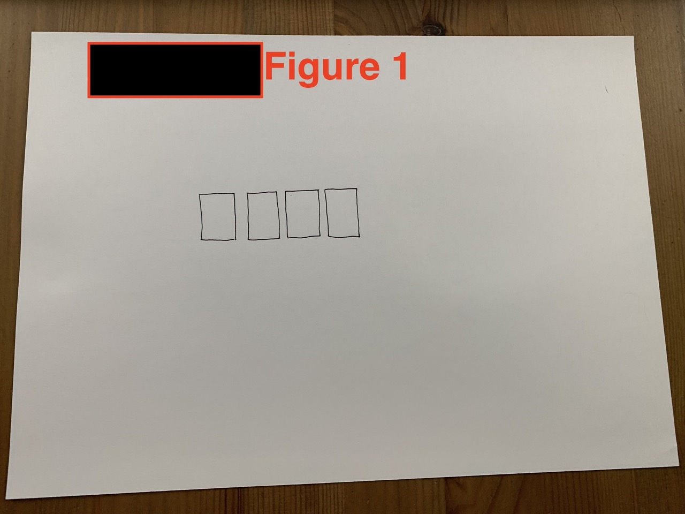

(1127)&emsp;

(1128)&emsp;Given that McDonald's advertised a "1 in 4" chance of an instant win, this unequivocally suggests that, in every quartet of game stamps, exactly one is designated a winner. Hence, inscribe the word "(INSTANT) WIN" within one of the rectangles and "OTHER" in the remaining rectangles **(see Figure 2 below for a visual aid).**

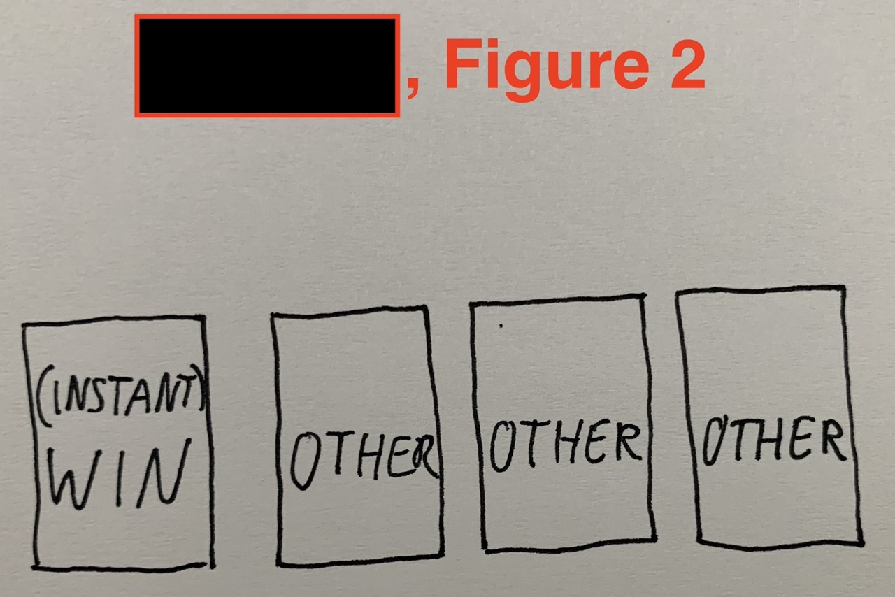

(1129)&emsp;

(1130)&emsp;Proceed to cut out each of the four rectangles using scissors **(see Figure 3 below for a visual aid)**.

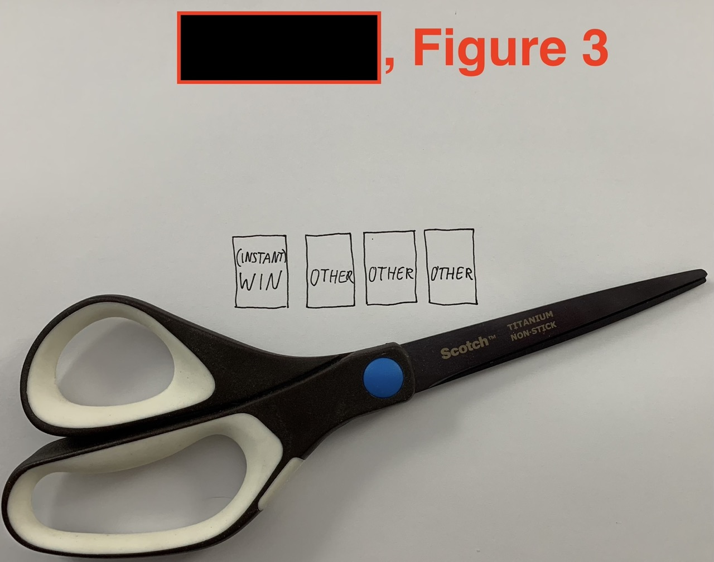

(1131)&emsp;

(1132)&emsp;As you hold these cut-outs in your hand, reflect on the probability presented before you. Pose the question to yourself: when selecting a piece at random, what is the probability of drawing the winning stamp? **(see Figure 4 below for a visual aid)**.

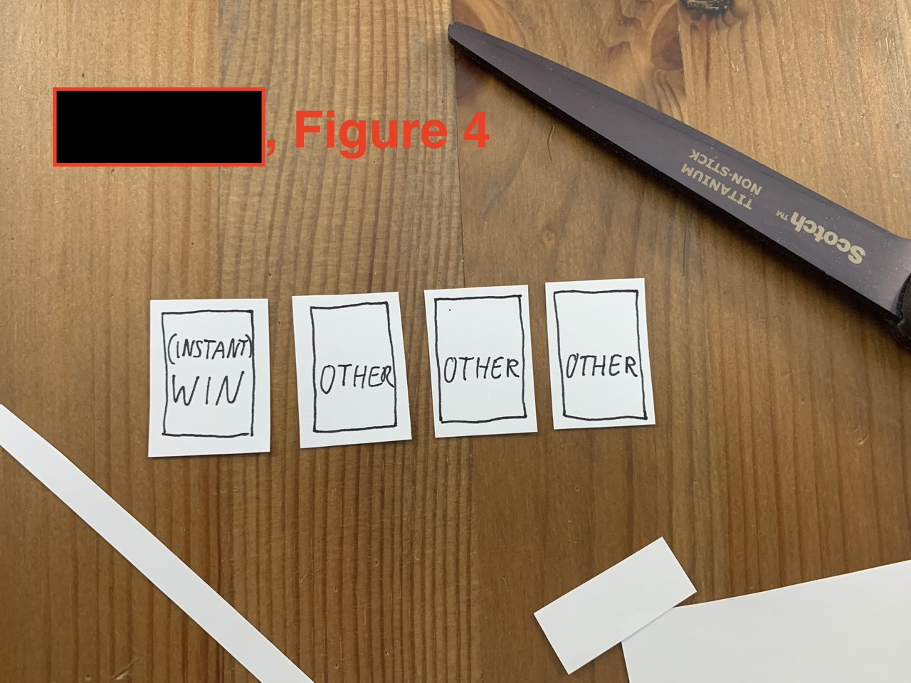

(1133)&emsp;

(1134)&emsp;To enhance your understanding even further, if you have drawing balls and an urn at hand, place each of the four cut-outs into separate drawing balls. Now, place all four drawing balls into the urn. As you mix them and ponder over the configuration, ask yourself once more: what's the probability of drawing the ball containing the winning game stamp? **(See Figures 5, 6, 7 and 8 below for a visual aid)**.

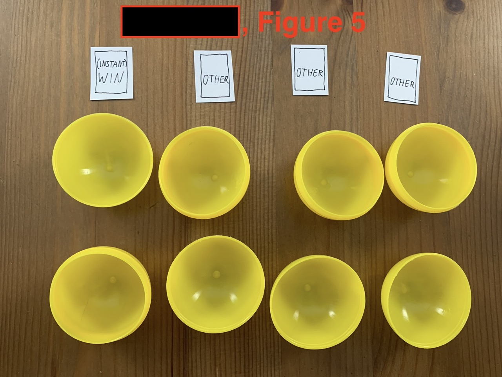

(1135)&emsp;

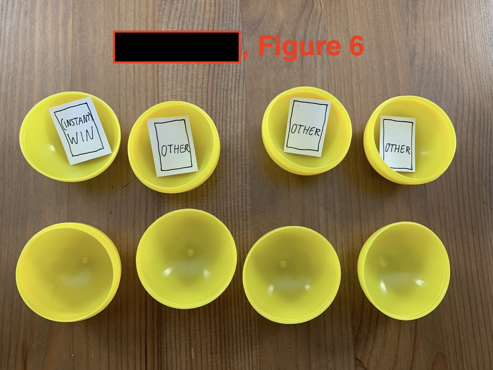

(1136)&emsp;

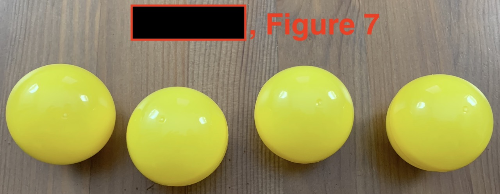

(1137)&emsp;

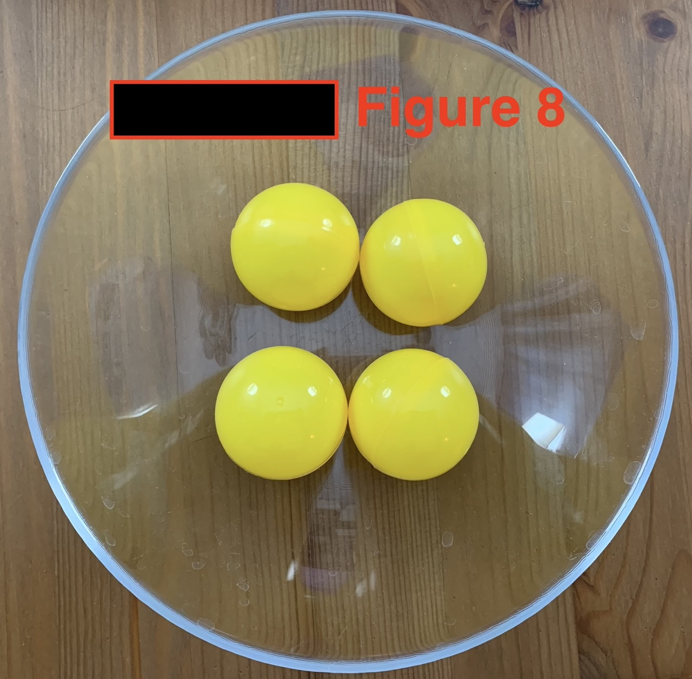

(1138)&emsp;

(1139)&emsp;

(1140)&emsp;===============

(1141)&emsp;In the key witness, analyst, whistleblower

(1142)&emsp;[TO IMPROVE] I feel truly grateful and blessed for the support I've received from some insiders

(1143)&emsp;[TO IMPROVE] That's how I can assert, beyond a reasonable doubt, that the U.S. Department of Justice knew, or ought to have known, since the summer/fall of 2019, that McDonald's Corporation and its accomplices were engaging in global criminal activities.

(1144)&emsp;=========================

(1145)&emsp;Yours sincerely,

(1146)&emsp;Vincent B. Le Corre

(1147)&emsp;Taiyuan, Shanxi Province, China

(1148)&emsp;September 14, 2023, 11:34 +0800 (China Standard Time) (note: a few corrections made on February 18, 2026)

[Return to the Table of Contents ↩︎](#table-of-contents)

[^TLDR-1-open-letter-Romney]: https://web.archive.org/web/20251119052801/https://www.usa-v-mcdonalds.org/open-letters/formal-notice-sent-to-senator-mitt-romney-2024-03-08/
[^TLDR-2-open-letter-Grassley]: https://web.archive.org/web/20251230070707/https://www.usa-v-mcdonalds.org/open-letters/formal-notice-sent-to-senator-chuck-grassley-2024-03-08/
[^Preamble-1-Money-Laundering]: https://www.ojp.gov/pdffiles1/Digitization/155129NCJRS.pdf
[^IB8]: https://www.ecthrwatch.org/timeline/ecthr-request-for-interim-measures-fax-submission-2023-12-15/
[^I-C-a-3]: https://www.whistleblowers.org/what-is-a-whistleblower/
[^4]: https://news.mit.edu/2015/volkswagen-emissions-cheat-cause-60-premature-deaths-1029
[^5]: https://news.mit.edu/2017/volkswagen-emissions-premature-deaths-europe-0303 
[^6]: https://www.theguardian.com/business/2019/mar/17/tom-watson-urges-mcdonalds-cancel-unhealthy-campaign-promotion
[^7]: https://www.linkedin.com/posts/acsoklahoma_colorectalcancer-everycancereverylife-activity-7173350818153218048-ags4
[^7-bis]: https://web.archive.org/web/20241203160759/https://www.linkedin.com/posts/acsoklahoma_colorectalcancer-everycancereverylife-activity-7173350818153218048-ags4
[^8]: https://www.justice.gov/opa/pr/volkswagen-ag-agrees-plead-guilty-and-pay-43-billion-criminal-and-civil-penalties-six
[^IV-E-2]: https://archive20210730.francoismolins.fr/fr/lettres-ouvertes/1/escroquerie-mcdonalds-1-chance-sur-4-faux-1-chance-sur-8-en-realite.html
[^IV-E-5]: https://www.securities-and-exchange-commission.com/open-letters/sec-complaint-office-of-the-whistleblower-2022-11-15/
[^IV-E-6]: https://archive20210730.francoismolins.fr/fr/lettres-ouvertes/1/introduction-francois-molins-criminalite-financiere-et-conflit-dinterets.html
[^IV-F-4]: https://www.justice.gov/archives/jm/criminal-resource-manual-1007-fraud
[^IV-F-10]: https://twitter.com/ECtHRwatch/status/1503378499008180226
[^IV-F-12-a]: https://davidmorin.physics.fas.harvard.edu/books/probability/
[^IV-F-12-b]: https://davidmorin.physics.fas.harvard.edu

{/*  <Original lang="en" type="doc" file="xxxxxxxxxxxxx.pdf" />  */}

To gain a clearer understanding of the sequence of events in this case, I invite you to view a detailed timeline at the following link: 
[https://www.ECTHRwatch.org/timeline/mcdonalds/](https://www.ecthrwatch.org/timeline/mcdonalds/) 
This timeline provides a comprehensive overview of the key milestones and developments.

{/* version-notice */}

